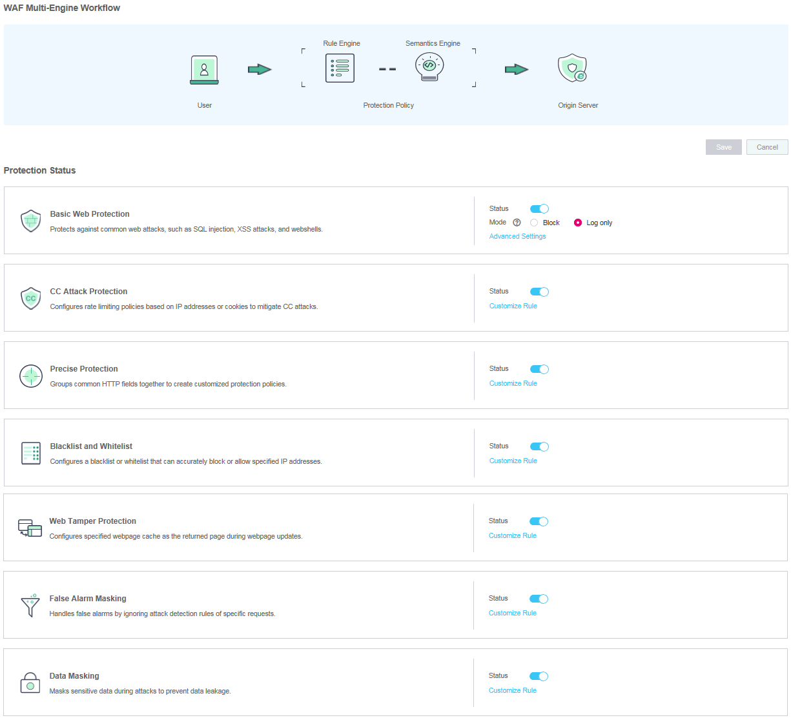

# Enabling Basic Web Protection

This section describes how to enable  basic web protection.

Basic web protection defends against common web attacks, such as SQL injection, XSS attacks, remote buffer overflow attacks, file inclusion, Bash vulnerability exploits, remote command execution, directory traversal, sensitive file access, and command and code injections, and detects webshells, robots \(search engine, scanner, and script tool\), and other crawlers.

## Prerequisites

-   Login credentials have been obtained.
-   The domain name to be protected has been created.

## Procedure

1.  Log in to the management console.
2.  Click    in the upper left corner of the management console and select a region or project.
3.  Click  **Service List**  at the top of the page and choose  **Security**  \>  **Web Application Firewall**. In the navigation pane, choose  **Domains**. The  **Domains**  page is displayed, as shown in  [Figure 1](#fig164792010154510).

    **Figure  1**  Entrance to the domain configuration page  
    

4.  In the  **Operation**  column of the row containing the target domain name, click  **Configure Policy**. The protection configuration page is displayed, as shown in  [Figure 2](#fig16197124372015).

    **Figure  2**  Protection configuration page  
    

5.  In the  **Basic Web Protection**  configuration area, change  **Status**  and  **Mode**  as needed by referring to  [Table 1](#table42360431192825)  and then click  **Save**  in the upper right corner of the  **Protection Status**  list. In the dialog box displayed, click  **Yes**  to save the settings. Otherwise, click  **Cancel**. See  [Figure 3](#fig193788379).

    **Figure  3**  Basic Web Protection configuration area  
    

    **Table  1**  Parameter description

    
    <table><thead align="left"><tr id="row66262481192825"><th class="cellrowborder" valign="top" width="36.28%" id="mcps1.2.3.1.1">
Parameter

    </th>
    <th class="cellrowborder" valign="top" width="63.72%" id="mcps1.2.3.1.2">
Description

    </th>
    </tr>
    </thead>
    <tbody><tr id="row8899732153112"><td class="cellrowborder" valign="top" width="36.28%" headers="mcps1.2.3.1.1 ">
Status

    </td>
    <td class="cellrowborder" valign="top" width="63.72%" headers="mcps1.2.3.1.2 ">
Status of Basic Web Protection

    <ul id="ul115452316468"><li>: enabled.</li><li>: disabled.</li></ul>
    </td>
    </tr>
    <tr id="row28096830192825"><td class="cellrowborder" valign="top" width="36.28%" headers="mcps1.2.3.1.1 ">
Mode

    </td>
    <td class="cellrowborder" valign="top" width="63.72%" headers="mcps1.2.3.1.2 "><ul id="ul946621183715"><li><strong id="b842352706204429">Block</strong>: WAF blocks and logs detected attacks.</li><li><strong id="b842352706204532">Log only</strong>: WAF logs detected attacks only.</li></ul>
    </td>
    </tr>
    </tbody>
    </table>

6.  In the  **Basic Web Protection**  configuration area, click  **Advanced Settings**. Enable the protection type that best fits your needs \(see  [Figure 4](#fig185482343414)\).

    > **NOTE:**   
    >If you do not click  **Save**  after changing  **Status**  and  **Mode**  in  [step 5](#li133562015102112), the  **Warning**  dialog box is displayed when you click  **Advanced Settings**.  
    >-   Click  **Yes**  to cancel the previous settings.  
    >-   Click  **No**  and then  **Save**  to save the settings.  

    **Figure  4**  Basic web protection  
    

    **Table  2**  Protection types

    
    <table><thead align="left"><tr id="en-us_topic_0110861309_row25491137297"><th class="cellrowborder" valign="top" width="40.04%" id="mcps1.2.3.1.1">
Type

    </th>
    <th class="cellrowborder" valign="top" width="59.96%" id="mcps1.2.3.1.2">
Description

    </th>
    </tr>
    </thead>
    <tbody><tr id="en-us_topic_0110861309_row354983713918"><td class="cellrowborder" valign="top" width="40.04%" headers="mcps1.2.3.1.1 ">
General Check

    </td>
    <td class="cellrowborder" valign="top" width="59.96%" headers="mcps1.2.3.1.2 ">
Defends against attacks, such as SQL injection, XSS, remote overflow vulnerability, file inclusion, Bash vulnerabilities, remote command execution, directory traversal, sensitive file access, and command/code injection.

    </td>
    </tr>
    <tr id="en-us_topic_0110861309_row5549123715914"><td class="cellrowborder" valign="top" width="40.04%" headers="mcps1.2.3.1.1 ">
Webshell Detection

    </td>
    <td class="cellrowborder" valign="top" width="59.96%" headers="mcps1.2.3.1.2 ">
Protects against webshells from upload interface.

    </td>
    </tr>
    <tr id="en-us_topic_0110861309_row85491637993"><td class="cellrowborder" valign="top" width="40.04%" headers="mcps1.2.3.1.1 ">
Search Engine

    </td>
    <td class="cellrowborder" valign="top" width="59.96%" headers="mcps1.2.3.1.2 ">
Uses web crawlers to find pages for search engines, such as Googlebot and Baiduspider.

    </td>
    </tr>
    <tr id="en-us_topic_0110861309_row2549203710913"><td class="cellrowborder" valign="top" width="40.04%" headers="mcps1.2.3.1.1 ">
Scanner

    </td>
    <td class="cellrowborder" valign="top" width="59.96%" headers="mcps1.2.3.1.2 ">
Scans for vulnerabilities, viruses, and performs other types of web scans, such as OpenVAS and Nmap.

    </td>
    </tr>
    <tr id="en-us_topic_0110861309_row165491737295"><td class="cellrowborder" valign="top" width="40.04%" headers="mcps1.2.3.1.1 ">
Script Tool

    </td>
    <td class="cellrowborder" valign="top" width="59.96%" headers="mcps1.2.3.1.2 ">
Executes automatic tasks and program scripts, such as HttpClient, OkHttp, and Python programs.

    
 NOTE: 

If your application uses scripts such as httpclient, okhttp, and python, disable <strong id="b6559139155311">Script Tool</strong>. Otherwise, WAF will identify such script tools as crawlers and block the application.

    

    </td>
    </tr>
    <tr id="en-us_topic_0110861309_row155491737693"><td class="cellrowborder" valign="top" width="40.04%" headers="mcps1.2.3.1.1 ">
Other

    </td>
    <td class="cellrowborder" valign="top" width="59.96%" headers="mcps1.2.3.1.2 ">
Crawlers for other purposes, such as site monitoring, access proxy, and webpage analysis.

    </td>
    </tr>
    </tbody>
    </table>

    1.  Set the protection level.

        In the upper part of the page, select a protection level:  **Low**,  **Medium**, or  **High**. The default value is  **Medium**.

        **Table  3**  Protection levels

        
        <table><thead align="left"><tr id="en-us_topic_0110861309_en-us_topic_0165951356_row257619443717"><th class="cellrowborder" valign="top" width="28.849999999999998%" id="mcps1.2.3.1.1">
Protection Level

        </th>
        <th class="cellrowborder" valign="top" width="71.15%" id="mcps1.2.3.1.2">
Description

        </th>
        </tr>
        </thead>
        <tbody><tr id="en-us_topic_0110861309_en-us_topic_0165951356_row2576644570"><td class="cellrowborder" valign="top" width="28.849999999999998%" headers="mcps1.2.3.1.1 ">
Low

        </td>
        <td class="cellrowborder" valign="top" width="71.15%" headers="mcps1.2.3.1.2 ">
WAF only blocks the requests with obvious attack signatures.

        
If a large number of false alarms are reported, <strong id="b199281723155420">Low</strong> is recommended.

        </td>
        </tr>
        <tr id="en-us_topic_0110861309_en-us_topic_0165951356_row18576344378"><td class="cellrowborder" valign="top" width="28.849999999999998%" headers="mcps1.2.3.1.1 ">
Medium

        </td>
        <td class="cellrowborder" valign="top" width="71.15%" headers="mcps1.2.3.1.2 ">
The default level is <strong id="b112991290543">Medium</strong>, which meets a majority of web protection requirements.

        </td>
        </tr>
        <tr id="en-us_topic_0110861309_en-us_topic_0165951356_row857616441575"><td class="cellrowborder" valign="top" width="28.849999999999998%" headers="mcps1.2.3.1.1 ">
High

        </td>
        <td class="cellrowborder" valign="top" width="71.15%" headers="mcps1.2.3.1.2 ">
WAF blocks the requests with no attack signature but have specific attack patterns.

        
<strong id="b12101397549">High</strong> is recommended if you want to block SQL injection, XSS, and command injection attacks.

        </td>
        </tr>
        </tbody>
        </table>

    2.  Set the protection type.

        By default,  **General Check**  and  **Scanner**  are enabled. Click    to enable other protection types if needed.

    3.  Click  **Save**  in the upper right of the page to save the settings. Otherwise, click  **Cancel**.

