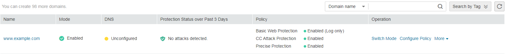
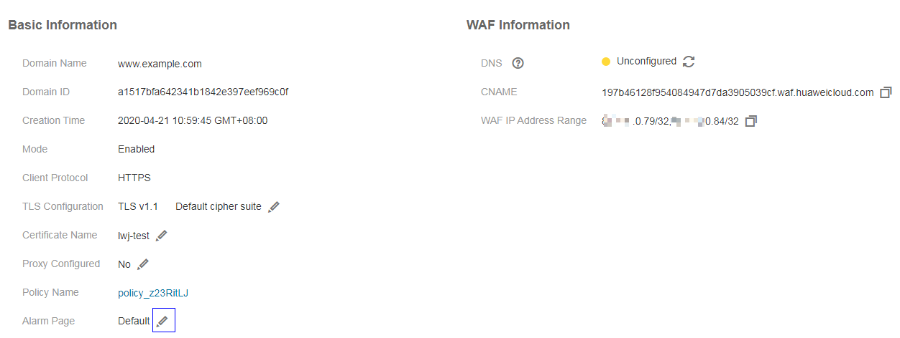
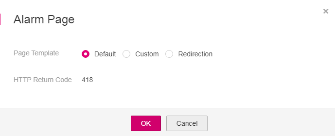
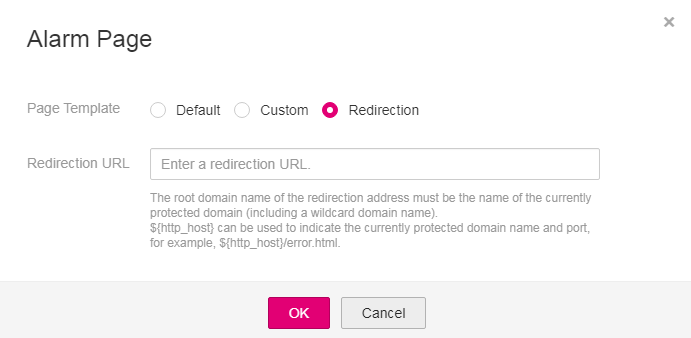

# Modifying the Alarm Page

If a visitor triggers block by WAF, the  **Default**  block page of WAF is returned by default. You can also configure  **Custom**  or  **Redirection**  for the block page to be returned as required.

-   **Custom**: The content of the text/html, text/xml, and application/json pages can be configured on the custom block page to be returned.
-   **Redirection**: The root domain name of the redirection address must be the same as the currently protected domain name, including a wildcard domain name. Examples:
    -   If the protected domain name is  **www.example.com**  and the port number is  **8080**, the redirection URL can be set to  **http://www.example.com:8080/error.html**.
    -   If the protected wildcard domain name is  **\*.example.com**  and the port number is  **8080**, the redirection URL can be set to  **http://\*.example.com:8080/error.html**.

## Prerequisites

-   Login credentials have been obtained.
-   The domain name to be protected has been added.

## Procedure

1.  Log in to the management console.
2.  Click    in the upper left corner of the management console and select a region or project.
3.  Click  **Service List**  in the upper right corner of the page and choose  **Security**  \>  **Web Application Firewall**  \>  **Domains**.

    **Figure  1**  Entrance to  **Domains**  
    

4.  In the  **Name**  column, click the target domain name to go to the basic information page.
5.  Click    next to the template name in the row where  **Alarm Page**  locates.

    **Figure  2**  Modifying Alarm Page  
    

6.  In the  **Alarm Page**  dialog box, select a template in the  **Page Template**  field.
    -   If  **Default**  is selected for  **Page Template**, the block page with the built-in HTTP return code 418 is returned by default.

        **Figure  3**  Default alarm page  
        

    -   If  **Custom**  is selected for  **Page Template**, configure the parameters as needed.  [Table 1](#table292835123913)  describes the parameters.

        **Figure  4**  Custom alarm page  
        

        **Table  1**  Parameters for the custom alarm page

        
        <table><thead align="left"><tr id="row99363543912"><th class="cellrowborder" valign="top" width="25.1%" id="mcps1.2.3.1.1">
Parameter

        </th>
        <th class="cellrowborder" valign="top" width="74.9%" id="mcps1.2.3.1.2">
Description

        </th>
        </tr>
        </thead>
        <tbody><tr id="row393153518398"><td class="cellrowborder" valign="top" width="25.1%" headers="mcps1.2.3.1.1 ">
HTTP Return Code

        </td>
        <td class="cellrowborder" valign="top" width="74.9%" headers="mcps1.2.3.1.2 ">
Return code configured on a custom page

        </td>
        </tr>
        <tr id="row79333533913"><td class="cellrowborder" valign="top" width="25.1%" headers="mcps1.2.3.1.1 ">
Block Page Type

        </td>
        <td class="cellrowborder" valign="top" width="74.9%" headers="mcps1.2.3.1.2 ">
The options are <strong id="b1564017280298">text/html</strong>, <strong id="b13641152815295">text/xml</strong>, and <strong id="b15641102852912">application/json</strong>.

        </td>
        </tr>
        <tr id="row1993143514399"><td class="cellrowborder" valign="top" width="25.1%" headers="mcps1.2.3.1.1 ">
Page Content

        </td>
        <td class="cellrowborder" valign="top" width="74.9%" headers="mcps1.2.3.1.2 ">
Configure the page content based on the page type specified in <strong id="b1733203308">Block Page Type</strong>.

        </td>
        </tr>
        </tbody>
        </table>

    -   If  **Redirection**  is selected for  **Page Template**, configure the redirection URL as prompted.

        The root domain name of the redirection URL must be the same as the currently protected domain name, including a wildcard domain name. Examples:

        -   If the protected domain name is  **www.example.com**  and the port number is  **8080**, the redirection URL can be set to  **http://www.example.com:8080/error.html**.
        -   If the protected wildcard domain name is  **\*.example.com**  and the port number is  **8080**, the redirection URL can be set to  **http://\*.example.com:8080/error.html**.

        **Figure  5**  Redirection alarm page  
        

7.  Click  **OK**.

