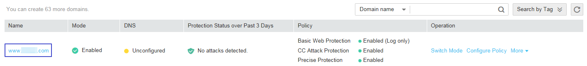

# Testing WAF

This section describes how to connect your domain to WAF on a local PC and then access the site to verify whether WAF works properly.

Before testing WAF, ensure that the protocol, address, and port number used by the origin server of the domain name \(for example,  **www.test.com**\), and uploaded certificate content and private key if  **Client Protocol**  is  **HTTPS**  are correct.

## Prerequisites

-   Login credentials have been obtained.
-   A domain name without using any other proxy has been created.

## Connecting Your Domain to WAF Locally

1.  Obtain the CNMAE value.
    1.  Log in to the management console.
    2.  Click    in the upper left corner of the management console and select a region or project.
    3.  Choose  **Security**  \>  **Web Application Firewall**  \>  **Domains**. The  **Domains**  page is displayed, as shown in  [Figure 1](#ff59c2762c2454fa8813e73da78489fd1).

        **Figure  1**  Domains page  
        

    4.  In the  **Name**  column, click the target domain name to go to the basic information page.

        **Figure  2**  Copying the CNAME value  
        

    5.  In the  **CNAME**  row, click    to copy the CNAME value.

2.  Ping the CNAME value and record the corresponding IP address \(for example,  **192.168.0.1**\).
3.  Add the domain name and WAF IP address to the  **hosts**  file.
    1.  Use a text editor, such as Notepad or Notepad++, to open the  **hosts**  file. Generally, the  **hosts**  file is stored in the  **C:\\Windows\\System32\\drivers\\etc\\**  directory.
    2.  Add the back-to-source IP address of WAF obtained in  [step 2](#li132916207364)  and protected domain name to the  **hosts**  file. See  [Figure 3](#fig934381520563).

        **Figure  3**  Adding a record  
        

    3.  Save the  **hosts**  file and ping the protected domain name on the local PC.

        It is expected that the resolved IP address is the back-to-source IP address of WAF obtained in  [Step 2](#li4860411142315). If the resolved IP address is the origin server address, run the  **ipconfig/flushdns**  command in the Windows operating system to refresh the DNS cache.

## Verifying Whether WAF Forwarding Is Normal

1.  Clear the browser cache and enter the domain name in the address box of a browser to check whether the website can be accessed.

    If the domain name resolves to the back-to-source IP address of WAF and WAF configurations are correct, the website can be accessed.

    **Figure  4**  Normal access  
    

2.  Simulate simple web attack commands.
    1.  Set the mode of Basic Web Protection to  **Block**. For details, see  [Enabling Basic Web Protection](enabling-basic-web-protection.md).
    2.  Clear the browser cache, enter  **http://www.test.com?id=1%20or%201%20=1**  in the address box of the browser to simulate an SQL injection attack, and check whether WAF blocks the attack. See  [Figure 5](#fig1713141245913).

        **Figure  5**  Request blocked  
        

    3.  Choose  **Security**  \>  **Web Application Firewall**  \>  **Events**  to view test data. See  [Figure 6](#fig1413231215916).

        **Figure  6**  Viewing test data  
        

