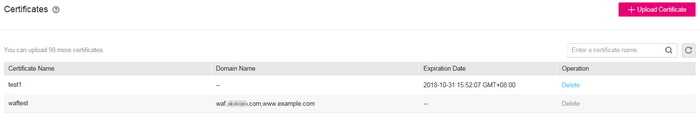
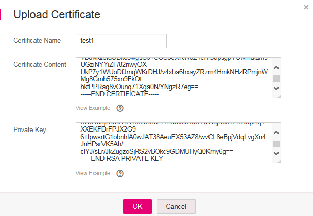

# Uploading a Certificate

This section describes how to upload a certificate.

## Prerequisites

Login credentials have been obtained.

## Procedure

1.  Log in to the management console.
2.  Click    in the upper left corner of the management console and select a region or project.
3.  Choose  **Security**  \>  **Web Application Firewall**.
4.  In the navigation pane, choose  **Certificates**. The  **Certificates**  page is displayed, as shown in  [Figure 1](#fig29851531163210).

    **Figure  1**  Certificates  
    

5.  In the upper right corner of the page, click  **Upload Certificate**. The  **Upload Certificate**  dialog box is displayed. Enter the certificate name, and copy and paste the certificate content and private key to the corresponding text boxes. See  [Figure 2](#fig682518517383).

    **Figure  2**  Uploading a certificate  
    

    > **NOTE:**   
    >WAF encrypts and saves the private key to keep it safe.  

    Currently, only .pem certificates are supported. If the certificate is not in .pem format, convert it into a .pem certificate by referring to  [Table 1](#waf_01_0002_table1184924815910)  before uploading.

    **Table  1**  Certificate conversion commands

    
    <table><thead align="left"><tr id="waf_01_0002_row2847448797"><th class="cellrowborder" valign="top" width="21.990000000000002%" id="mcps1.2.3.1.1">
Format

    </th>
    <th class="cellrowborder" valign="top" width="78.01%" id="mcps1.2.3.1.2">
How to Convert (In Linux OSs)

    </th>
    </tr>
    </thead>
    <tbody><tr id="waf_01_0002_row1784719481093"><td class="cellrowborder" valign="top" width="21.990000000000002%" headers="mcps1.2.3.1.1 ">
CER/CRT

    </td>
    <td class="cellrowborder" valign="top" width="78.01%" headers="mcps1.2.3.1.2 ">
Rename the <strong id="waf_01_0002_b84235270691740">cert.crt</strong> certificate file to <strong id="waf_01_0002_b84235270691747">cert.pem</strong>.

    </td>
    </tr>
    <tr id="waf_01_0002_row1484714481196"><td class="cellrowborder" valign="top" width="21.990000000000002%" headers="mcps1.2.3.1.1 ">
PFX

    </td>
    <td class="cellrowborder" valign="top" width="78.01%" headers="mcps1.2.3.1.2 "><ol id="waf_01_0002_ol178472048299"><li>Run the following command to obtain a private key. For example, to convert <strong id="waf_01_0002_b124221289249">cert.pfx</strong> into <strong id="waf_01_0002_b1423152892418">cert.key</strong>, run:
<strong id="waf_01_0002_b78471748295">openssl pkcs12 -in cert.pfx -nocerts -out cert.key -nodes</strong>

    </li><li>Run the following command to obtain a certificate. For example, to convert <strong id="waf_01_0002_b15328203542412">cert.pfx</strong> into <strong id="waf_01_0002_b4329335122416">cert.pem</strong>, run:
<strong id="waf_01_0002_b10847164818913">openssl pkcs12 -in cert.pfx -nokeys -out cert.pem</strong>

    </li></ol>
    </td>
    </tr>
    <tr id="waf_01_0002_row15847548495"><td class="cellrowborder" valign="top" width="21.990000000000002%" headers="mcps1.2.3.1.1 ">
P7B

    </td>
    <td class="cellrowborder" valign="top" width="78.01%" headers="mcps1.2.3.1.2 ">
Run the following command to convert a certificate. For example, to convert <strong id="waf_01_0002_b1992263817248">cert.p7b</strong> into <strong id="waf_01_0002_b1922113812413">cert.pem</strong>, run:

    
<strong id="waf_01_0002_b884754812912">openssl pkcs7 -print_certs -in cert.p7b -out cert.pem</strong>

    </td>
    </tr>
    <tr id="waf_01_0002_row12849154819915"><td class="cellrowborder" valign="top" width="21.990000000000002%" headers="mcps1.2.3.1.1 ">
DER

    </td>
    <td class="cellrowborder" valign="top" width="78.01%" headers="mcps1.2.3.1.2 ">
Run the following command to obtain a certificate. For example, to convert <strong id="waf_01_0002_b1580714614246">privatekey.der</strong> into <strong id="waf_01_0002_b58072461245">cert.key</strong>, run:

    
<strong id="waf_01_0002_b118494481997">openssl rsa -inform DER -outform PEM -in privatekey.der -out cert.key</strong>

    </td>
    </tr>
    </tbody>
    </table>

6.  Click  **OK**.

    > **NOTE:**   
    >-   If the number of uploaded certificates reaches the upper limit, refer to  [Deleting a Certificate](deleting-a-certificate.md)  to delete a certificate that is not associated with any domain name and then upload a certificate again.  
    >-   To modify a certificate name, click    next to the target certificate name in the  **Certificate Name**  column.  

