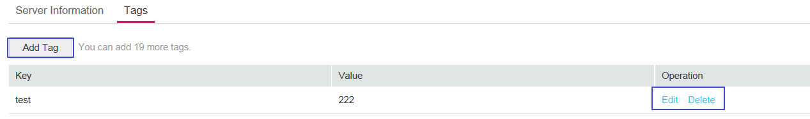
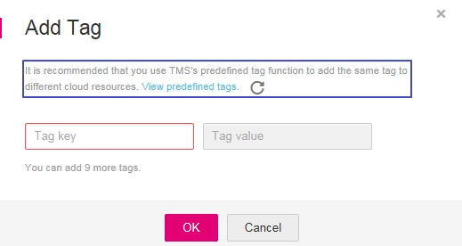

# Viewing Basic Information

This section describes how to view domain information and edit server information.

## Prerequisites

Login credentials have been obtained.

## Procedure

1.  Log in to the management console.
2.  Click    in the upper left corner of the management console and select a region or project.
3.  Click  **Service List**  at the top of the page and choose  **Security**  \>  **Web Application Firewall**. In the navigation pane, choose  **Domains**. The  **Domains**  page is displayed, as shown in  [Figure 1](#fig1378145118527).  [Table 1](#table147842051135211)  describes the parameters.

    In the upper right corner of the list, query domain information by domain name, policy name, or tag.

    **Figure  1**  Domains page  
    

    **Table  1**  Parameter description

    
    <table><thead align="left"><tr id="row7782051165217"><th class="cellrowborder" valign="top" width="37.11%" id="mcps1.2.3.1.1">
Parameter

    </th>
    <th class="cellrowborder" valign="top" width="62.89%" id="mcps1.2.3.1.2">
Description

    </th>
    </tr>
    </thead>
    <tbody><tr id="row15782195116525"><td class="cellrowborder" valign="top" width="37.11%" headers="mcps1.2.3.1.1 ">
Name

    </td>
    <td class="cellrowborder" valign="top" width="62.89%" headers="mcps1.2.3.1.2 ">
Protected domain name

    </td>
    </tr>
    <tr id="row107831051145219"><td class="cellrowborder" valign="top" width="37.11%" headers="mcps1.2.3.1.1 ">
Mode

    </td>
    <td class="cellrowborder" valign="top" width="62.89%" headers="mcps1.2.3.1.2 ">
WAF mode of the protected domain name

    <ul id="ul87831351155214"><li><b>Enabled</b>: WAF is enabled.</li><li><b>Disabled</b>: WAF is disabled.</li><li><b>Bypassed</b>: In this mode, requests are directly sent to the backend server without passing through WAF.</li></ul>
    </td>
    </tr>
    <tr id="row478315116526"><td class="cellrowborder" valign="top" width="37.11%" headers="mcps1.2.3.1.1 ">
DNS

    </td>
    <td class="cellrowborder" valign="top" width="62.89%" headers="mcps1.2.3.1.2 ">
DNS resolution status

    <ul id="ul478345116523"><li><strong id="b33911916711">Unconfigured</strong>: The domain name is not connected to WAF or domain connection fails. Refer to <a href="what-should-i-do-if-the-dns-status-is-unconfigured.md">What Should I Do If the DNS Status Is Unconfigured?</a> to solve the problem.</li><li><strong id="b61076368385">Normal</strong>: The domain name is connected to WAF.</li></ul>
    </td>
    </tr>
    <tr id="row1378315513523"><td class="cellrowborder" valign="top" width="37.11%" headers="mcps1.2.3.1.1 ">
Protection Status over Past 3 Days

    </td>
    <td class="cellrowborder" valign="top" width="62.89%" headers="mcps1.2.3.1.2 ">
Protection status of the domain name over the past three days. Choose <strong id="b62357357308">More &gt;View Attack</strong> in the <strong id="b79611239203020">Operation</strong> column to view specific protection logs.

    </td>
    </tr>
    <tr id="row137841551105220"><td class="cellrowborder" valign="top" width="37.11%" headers="mcps1.2.3.1.1 ">
Policy

    </td>
    <td class="cellrowborder" valign="top" width="62.89%" headers="mcps1.2.3.1.2 ">
Policy configuration of the domain name. Click <strong id="b18736245174219">Configure Policy</strong> to configure rules. For details, see <a href="rule_configurations.rst">Rule Configurations</a>.

    </td>
    </tr>
    </tbody>
    </table>

4.  In the  **Name**  column, click the target domain name to go to the basic information page.
5.  View domain information.
    1.  View  **Basic Information**  and  **WAF Information**. See  [Figure 2](#fig1902122615546)  and  [Figure 3](#fig16903112618542).

        In the upper right corner of the domain information page, click    to refresh the page.

        **Figure  2**  Viewing basic information \(with a proxy\)  
        .png "viewing-basic-information-(with-a-proxy)")

        > **NOTE:**   
        >-   **Domain ID**: unique ID of a domain name that is generated randomly  
        >-   **Creation Time**: time when a domain name is created  
        >-   Click    in the  **Access Address**,  **Subdomain Name**,  **TXT Record**, or  **WAF IP Address Range**  row to copy the required value.  
        >-   To update a certificate if  **Client Protocol**  is  **HTTPS**, click    next to the value of  **Certificate Name**. In the dialog box displayed, select an existing certificate.  
        >-   If your web server stops using a proxy, click    next to the value of  **Proxy Configured**. In the dialog box displayed, select  **No**.  

        **Figure  3**  Viewing basic information \(without a proxy\)  
        .png "viewing-basic-information-(without-a-proxy)")

        > **NOTE:**   
        >-   **Domain ID**: unique ID of a domain name that is generated randomly  
        >-   **Creation Time**: time when a domain name is created  
        >-   Click    in the target row to copy the value of  **CNAME**  or  **WAF IP Address Range**.  
        >-   To update a certificate if  **Client Protocol**  is  **HTTPS**, click    next to the value of  **Certificate Name**. In the dialog box displayed, select an existing certificate.  
        >-   If your web server starts using a proxy, click    next to the value of  **Proxy Configured**. In the dialog box displayed, select  **Yes**.  

    2.  View  **Server Information**.

        **Figure  4**  Server Information  
        

        Click  **Edit Server Information**. On the  **Edit Server Information**  page shown in  [Figure 5](#fig3368635172714), edit server configurations \(such as client protocol and associated certificate\).

        **Figure  5**  Editing server information  
        

        > **NOTE:**   
        >Web Application Firewall \(WAF\) does not support health check. If you want to use health check, use WAF along with Elastic Load Balancing \(ELB\). For details about how to configure ELB, see  [Backend Server \(Enhanced Load Balancer\)](https://docs.otc.t-systems.com/en-us/usermanual/elb/en-us_topic_0052569729.html). After ELB is configured, the elastic IP address \(EIP\) of ELB is used as the value of  **Server Address**  to connect to WAF for health check.  

    3.  Click the  **Tags**  tab and view the tags, as shown in  [Figure 6](#fig1814661617294).

        **Figure  6**  Tags  
        

        -   In the  **Operation**  column of the tag list, click  **Edit**  to change the value.
        -   Click  **Delete**  to delete a tag. A deleted tag cannot be restored. Exercise caution when performing this operation.
        -   In the upper left corner of the tag list, click  **Add Tag**  to add one. See  [Figure 7](#fig0811031133312).

            You can select an existing tag key and tag value from the  **Tag key**  and  **Tag value**  drop-down lists or click  **View predefined tags**  to create a tag on the TMS console.

            **Figure  7**  Add Tag  
            

## Related Operations

In the  **Operation**  column of the domain list

-   Click  **Switch Mode**  to switch the WAF mode.
-   Click  **Configure Policy**  to configure WAF protection rules.
-   Choose  **More**  \>  **Check DNS**  to check the DNS resolution status.
-   Choose  **More**  \>  **View Attack**  to view WAF protection logs.
-   Choose  **More**  \>  **View Metric**  to view WAF monitoring logs. For details, see the  _Cloud Eye User Guide_.
-   Choose  **More**  \>  **Delete**  to delete a domain name.

