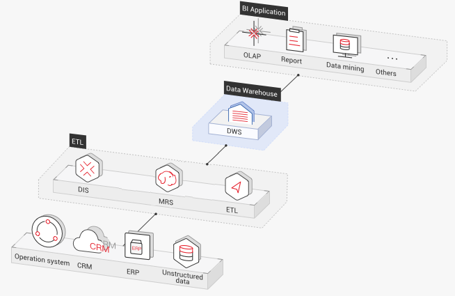
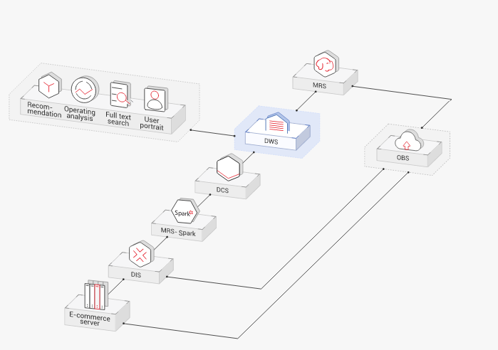

# Application Scenarios

-   Enhanced ETL + Real-time BI analysis

    **Figure  1**  ETL + BI analysis  
    

    The data warehouse is the pillar of the Business Intelligence \(BI\) system for collecting, storing, and analyzing massive amounts of data. It provides powerful business analysis support for IoT, mobile Internet, gaming, and Online to Offline \(O2O\) industries.

    Advantages of DWS are as follows:

    -   **Data migration**: efficient and real-time data import in batches from multiple data sources
    -   **High performance**: cost-effective PB-level data storage and second-level response to correlation analysis of trillions of data records
    -   **Real-time**: real-time consolidation of service data for timely optimization and adjustment of operation decision-making

-   **E-commerce**

    **Figure  2**  E-commerce  
    

    Data of online retailers is mainly used for marketing recommendation, operating and customer analysis, and full text search.

    Advantages of DWS are as follows:

    -   **Multi-dimensional analysis**: analysis from commodities, users, operation, and regions
    -   **Scale-out as the business grows**: on-demand cluster scale-out as the business grows
    -   **High reliability**: long-term stable running of the e-commerce system

-   **IoT**

    **Figure  3**  IoT  
    

    DWS helps you analyze massive amounts of data from Internet of Things \(IoT\) in real time and perform optimization based on the results. It is widely used in industrial IoT, O2O service system, and IoV solutions.

    Advantages of DWS are as follows:

    -   **Real-time archiving of stream data**: importing stream data from IoT devices and the gateway to DWS using DIS
    -   **Device monitoring and prediction**: device monitoring, control, optimization, supply, self-diagnosis, and self-healing based on data analysis and prediction
    -   **Information recommendation**: tailed recommendation based on data of users' connected devices

