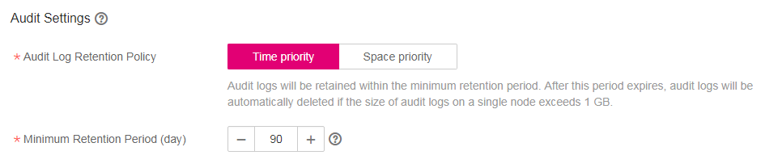
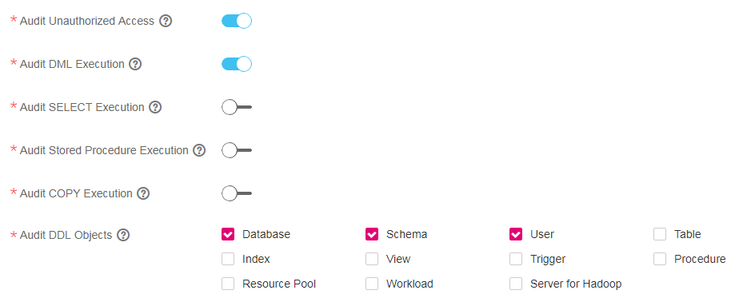

# Configuring the Database Audit Log

## Scenario

DWS allows you to record the audit log of specific operations, involving audit log retention policy, unauthorized access and DML, SELECT COPY, and DDL operations performed on the stored procedures and database objects.

After configuring the audit log, you can query the audit information to locate the fault cause or the historical operation record as needed when a data warehouse cluster is abnormal.

For details about how to view the audit log information, see section  **Database Security Management \> Viewing the Auditing Information**  in the  _Data Warehouse Service Database Developer Guide_.

## Prerequisites

You can change security settings only when  **Cluster Status**  is  **Available**  and  **Low performance**  and  **Task Information**  cannot be  **Creating snapshot**,  **Scaling out**,  **Configuring**, or  **Restarting**.

## Procedure

1.  Log in to the DWS management console.
2.  Click  **Cluster Management**.
3.  In the cluster list, click the name of a cluster. On the page that is displayed, click  **Security Settings**.

    By default,  **Configuration Status**  is  **Synchronized**, which indicates that the latest database result is displayed.

4.  In the  **Audit Settings**  area, set the audit log retention policy.

    **Figure  1**  Audit log retention policy  
    

    [Table 1](#table6661375615299)  describes the detailed information.

    **Table  1**  Audit log retention policy

    
    <table><thead align="left"><tr id="row1350660815299"><th class="cellrowborder" valign="top" width="30%" id="mcps1.2.3.1.1">
<strong id="b84235270692541_1">Parameter</strong>

    </th>
    <th class="cellrowborder" valign="top" width="70%" id="mcps1.2.3.1.2">
<strong id="b842352706191716_1">Description</strong>

    </th>
    </tr>
    </thead>
    <tbody><tr id="row136071215299"><td class="cellrowborder" valign="top" width="30%" headers="mcps1.2.3.1.1 ">
<strong id="b172633267343">Audit Log Retention Policy</strong>

    </td>
    <td class="cellrowborder" valign="top" width="70%" headers="mcps1.2.3.1.2 ">
Specifies the audit log retention policy. Possible values are:

    <ul id="ul1940693315299"><li><b>Space priority</b>: Audit logs will be automatically deleted if the size of audit logs on a single node exceeds 1 GB.</li><li><b>Time priority</b>: Audit logs will be retained within the minimum retention period. After this period expires, audit logs will be automatically deleted if the size of audit logs on a single node exceeds 1 GB.</li></ul>
    
<b>Space priority</b> is preferred.

    
 NOTE: 

Clusters 1.0.0 and 1.1.0 do not support the audit log retention policy.

    

    </td>
    </tr>
    <tr id="row5752884715299"><td class="cellrowborder" valign="top" width="30%" headers="mcps1.2.3.1.1 ">
<strong id="b139252053181518">Minimum Retention Period (Day)</strong>

    </td>
    <td class="cellrowborder" valign="top" width="70%" headers="mcps1.2.3.1.2 ">
This parameter is valid when <b>Audit Log Retention Policy</b> is set to <b>Time priority</b>.

    
The value ranges from 0 to 730 days. The default value is <strong id="b842352706102151">90</strong> days.

    </td>
    </tr>
    </tbody>
    </table>

5.  Enable the audit function for the following operations if necessary.

      indicates that the audit function is enabled.    indicates that the audit function is disabled.

    **Figure  2**  Audit items  
    

    [Table 2](#table48954270153356)  describes the detailed information about the audit items.

    **Table  2**  Audit items

    
    <table><thead align="left"><tr id="row11786533153356"><th class="cellrowborder" valign="top" width="30%" id="mcps1.2.3.1.1">
<strong id="b84235270692541_3">Parameter</strong>

    </th>
    <th class="cellrowborder" valign="top" width="70%" id="mcps1.2.3.1.2">
<strong id="b842352706191716_3">Description</strong>

    </th>
    </tr>
    </thead>
    <tbody><tr id="row40202069153356"><td class="cellrowborder" valign="top" width="30%" headers="mcps1.2.3.1.1 ">
<strong id="b20858182043518">Audit Unauthorized Access</strong>

    </td>
    <td class="cellrowborder" valign="top" width="70%" headers="mcps1.2.3.1.2 ">
Specifies whether to record unauthorized operations. This parameter is disabled by default.

    </td>
    </tr>
    <tr id="row48931238153356"><td class="cellrowborder" valign="top" width="30%" headers="mcps1.2.3.1.1 ">
<strong id="b13708516151710">Audit DML Execution</strong>

    </td>
    <td class="cellrowborder" valign="top" width="70%" headers="mcps1.2.3.1.2 ">
Specifies whether to record <strong id="b115161075393652">INSERT</strong>, <strong id="b7000329193652">UPDATE</strong>, and <strong id="b16768784293652">DELETE</strong> operations on tables. This parameter is disabled by default.

    </td>
    </tr>
    <tr id="row15098169153356"><td class="cellrowborder" valign="top" width="30%" headers="mcps1.2.3.1.1 ">
<strong id="b14991153916171">Audit SELECT Execution</strong>

    </td>
    <td class="cellrowborder" valign="top" width="70%" headers="mcps1.2.3.1.2 ">
Specifies whether to record the <strong id="b151641596594749">SELECT</strong> operation. This parameter is disabled by default.

    </td>
    </tr>
    <tr id="row41792394153356"><td class="cellrowborder" valign="top" width="30%" headers="mcps1.2.3.1.1 ">
<strong id="b1079743214362">Audit Stored Procedure Execution</strong>

    </td>
    <td class="cellrowborder" valign="top" width="70%" headers="mcps1.2.3.1.2 ">
Specifies whether to record operations when executing the stored procedure or user-defined functions. This parameter is disabled by default.

    </td>
    </tr>
    <tr id="row43739917153356"><td class="cellrowborder" valign="top" width="30%" headers="mcps1.2.3.1.1 ">
<strong id="b695333783619">Audit COPY Execution</strong>

    </td>
    <td class="cellrowborder" valign="top" width="70%" headers="mcps1.2.3.1.2 ">
Specifies whether to record the <strong id="b46630216153356">COPY</strong> operation. This parameter is disabled by default.

    </td>
    </tr>
    <tr id="row18951113153356"><td class="cellrowborder" valign="top" width="30%" headers="mcps1.2.3.1.1 ">
<strong id="b153698461817">Audit DDL Objects</strong>

    </td>
    <td class="cellrowborder" valign="top" width="70%" headers="mcps1.2.3.1.2 ">
Specifies whether to record the <strong id="b84235270695347">CREATE</strong>, <strong id="b84235270695352">DROP</strong>, and <strong id="b84235270695356">ALTER</strong> operations of specified database objects. <b>Database</b>, <b>Schema</b>, and <b>User</b> are selected by default. Other objects are not selected by default.

    </td>
    </tr>
    </tbody>
    </table>

    Except audit items listed in  [Table 2](#table48954270153356), key audit items in  [Table 3](#table24262392153654)  are enabled by default in DWS.

    **Table  3**  Key audit items

    
    <table><thead align="left"><tr id="row1697543153654"><th class="cellrowborder" valign="top" width="30%" id="mcps1.2.3.1.1">
<strong id="b84235270692541_5">Parameter</strong>

    </th>
    <th class="cellrowborder" valign="top" width="70%" id="mcps1.2.3.1.2">
<strong id="b842352706191716_5">Description</strong>

    </th>
    </tr>
    </thead>
    <tbody><tr id="row66708561153654"><td class="cellrowborder" rowspan="5" valign="top" width="30%" headers="mcps1.2.3.1.1 ">
Key audit items

    </td>
    <td class="cellrowborder" valign="top" width="70%" headers="mcps1.2.3.1.2 ">
Records successful and failed login and deregistration information.

    </td>
    </tr>
    <tr id="row65272081153654"><td class="cellrowborder" valign="top" headers="mcps1.2.3.1.1 ">
Records database startup, stop, recovery, and failover audit information.

    </td>
    </tr>
    <tr id="row3162576153654"><td class="cellrowborder" valign="top" headers="mcps1.2.3.1.1 ">
Records a user's lock and unlock information.

    </td>
    </tr>
    <tr id="row23817212153654"><td class="cellrowborder" valign="top" headers="mcps1.2.3.1.1 ">
Records the grants and reclaims of a user's permission.

    </td>
    </tr>
    <tr id="row48661263153654"><td class="cellrowborder" valign="top" headers="mcps1.2.3.1.1 ">
Records the audit function of the SET operation.

    </td>
    </tr>
    </tbody>
    </table>

6.  Click  **Apply**.

    On the  **Security Settings**  page, click  . If  **Configuration Status**  is  **Applying**, the system is saving the settings.

    Wait for a moment and then refresh  **Configuration Status**. When  **Configuration Status**  is  **Synchronized**, the configuration is saved and takes effect.

