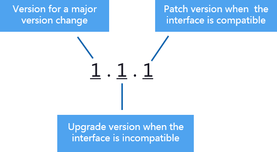

# How Can I Upgrade or Downgrade DWS?

You do not need to perform DWS cluster patching or upgrading because DWS will handle version upgrade automatically.

For service patching:

-   Duration: The whole process will take less than 10 minutes.
-   Impact on services: During this period, services will be interrupted for 1 to 3 minutes.

For service upgrading:

-   Duration: The whole process will take less than 30 minutes.
-   Impact on services: During this period, the database cannot be accessed.

Downgrade is not supported.

> **NOTE:**   
>The following figure describes the database version.  
>  
>-   During service patch upgrade, the last digit of database version  _X.X.X_  is changed, for example, the database is upgraded from 1.1.0 to 1.1.1.  
>-   During service upgrade, the first two digits of database version  _X.X.X_  are changed, for example, the database is upgraded from 1.1.0 to 1.2.0.  

