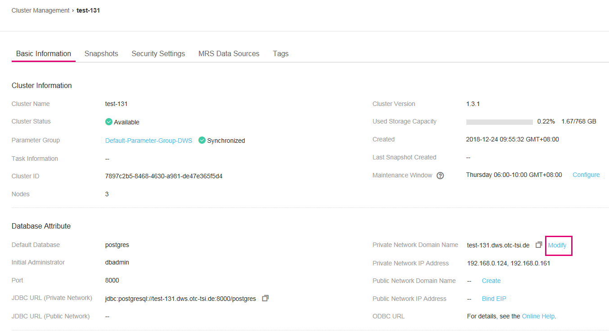
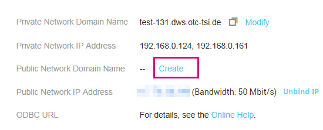

# Managing Access Domain Names

## Overview

A domain name is a string of characters separated by dots to identify the location of a computer or a computer group on the Internet, for example, www.example.com. You can enter a domain name in the address box of the web browser to access a website or web application.

On DWS, you can access clusters using the private network domain name or the public network domain name.

Private network domain name: Name of the domain for accessing the database in the cluster through the private network. The private network domain name is automatically generated when you create a cluster. The default naming rule is as follows: cluster name.dws.otc-tsi.de If the cluster name does not comply with the domain name standards, the prefix of the default access domain name will be adjusted accordingly.

Public network domain name: Name of the domain for accessing the database in the cluster through the public network. If a cluster is not bound to an EIP, it cannot be accessed using the  **Public Network Domain Name**. If you bind an EIP during cluster creation, the public network domain name is automatically generated. The default naming rule is as follows: cluster name.dws.t-systems.com

After a cluster is created, you can set private and public domain names for accessing the cluster as required. The operations are as follows:

-   [Modifying a Private Network Domain Name](#section1443581220337)
-   [Creating a Public Network Domain Name](#section14447182917335)
-   [Modifying a Public Network Domain Name](#section220113419330)
-   [Releasing a Public Network Domain Name](#section1267743817334)

## Modifying a Private Network Domain Name

The private network domain name is automatically generated during cluster creation. After the cluster is created, you can modify the default domain name based on site requirements.

To modify the private network domain name, perform the following steps:

1.  Log in to the management console at  [https://console.otc.t-systems.com/dws/](https://console.otc.t-systems.com/dws/).
2.  In the navigation tree on the left, click  **Cluster Management**.
3.  In the cluster list, find the target cluster and click the cluster name. The  **Basic Information**  page is displayed.
4.  Click  **Modify**  next to the automatically generated private network domain name in the  **Database Attribute**  area.

      

    **Figure  1**  Viewing the private network domain name  
    

5.  In the  **Modify Private Network Domain Name**  dialog box, enter the target domain name.

    The private network domain name contains 4 to 63 characters, which consist of letters, digits, and hyphens \(-\). It must start with a letter.

    Click the  **Copy**  icon to copy the domain name.

## Creating a Public Network Domain Name

A cluster is not bound to an EIP by default during cluster creation. That is, cluster access using the public network is disabled. After a cluster is created, if you want to access it through the public network, bind an EIP to the cluster and create a public network domain name.

To create a public network domain name, perform the following steps:

1.  Log in to the management console at  [https://console.otc.t-systems.com/dws/](https://console.otc.t-systems.com/dws/).
2.  In the navigation tree on the left, click  **Cluster Management**.
3.  In the cluster list, find the target cluster and click the cluster name. The  **Basic Information**  page is displayed.
4.  In the  **Database Attribute**  area,  **Public Network Domain Name**  and  **Public Network IP Address**  are empty. Click  **Bind EIP**  to bind the cluster with an EIP.

    **Figure  2**  View of basic cluster information  
    

5.  Select an EIP from the drop-down list in the  **Bind EIP**  dialog box.

    If no available EIPs are displayed, click  **View EIP**  to go to the  **Elastic IP**  page and create an EIP that satisfies your needs. After the new EIP is created, click the refresh icon next to the drop-down list. The newly created EIP will be displayed in the  **EIP**  drop-down list.

    After the EIP is bound successfully, the specific public network IP address is displayed in the  **Database Attribute**  area.

6.  In the  **Database Attribute**  area, click  **Create**  next to  **Public Network Domain Name**  to create a public network domain name for the cluster.

    **Figure  3**  Creating a public network domain name  
    

7.  In the  **Apply for Public Network Domain Name**  dialog box, enter the target domain name and click  **OK**.

    The public network domain name contains 4 to 63 characters, which consist of letters, digits, and hyphens \(-\). It must start with a letter.

    The specific public network domain name is displayed in the  **Database Attribute**  area after being created.

    Click the  **Copy**  icon to copy the domain name.

## Modifying a Public Network Domain Name

If you bind an EIP during cluster creation, the public network domain name is automatically generated. After a cluster is created, you can modify the public network domain name as required.

To modify the public network domain name, perform the following steps:

1.  Log in to the management console at  [https://console.otc.t-systems.com/dws/](https://console.otc.t-systems.com/dws/).
2.  In the navigation tree on the left, click  **Cluster Management**.
3.  In the cluster list, find the target cluster and click the cluster name. The  **Basic Information**  page is displayed.
4.  Click  **Modify**  next to the  **Public Network Domain Name**  in the  **Database Attribute**  area.

    **Figure  4**  Modifying the public network domain name  
    

5.  In the  **Modify Public Network Domain Name**  dialog box, enter the target domain name and click  **OK**.

## Releasing a Public Network Domain Name

After a cluster is created, you can release unnecessary public network domain names.

To do so, perform the following steps:

1.  Log in to the management console at  [https://console.otc.t-systems.com/dws/](https://console.otc.t-systems.com/dws/).
2.  In the navigation tree on the left, click  **Cluster Management**.
3.  In the cluster list, find the target cluster and click the cluster name. The  **Basic Information**  page is displayed.
4.  Click  **Release**  next to the  **Public Network Domain Name**  in the  **Database Attribute**  area.
5.  In the  **Release Domain Name**  dialog box, click  **Yes**.

