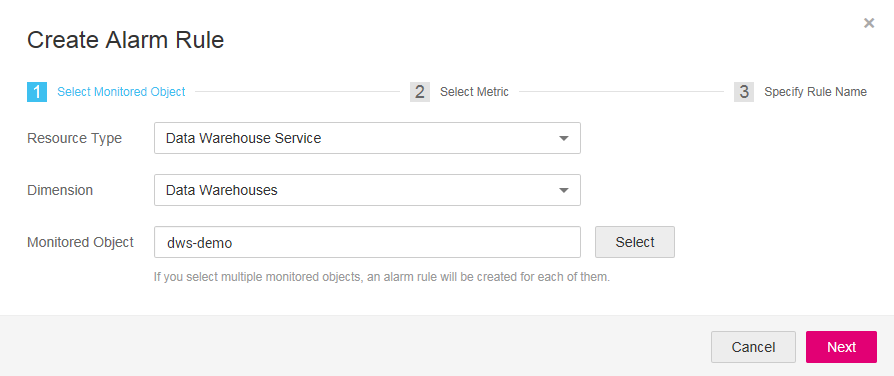

# Monitoring a Cluster

## Function

This section describes how to check cluster metrics on Cloud Eye. By monitoring cluster running metrics, you can identify the time when the database cluster is abnormal and analyze potential activity problems based on the database logs, improving database performance. This section describes the metrics that can be monitored by Cloud Eye as well as their namespaces and dimensions. You can use the management console or APIs provided by Cloud Eye to query the metrics of the monitored objects and alarms generated for DWS. For details, see the user guide and API reference of .

This section is organized as follows:

-   [Namespace](#section54481685355)
-   [Monitoring Metrics of a Cluster](#section185715586432)
-   [Dimension](#section6596194111819)
-   [Viewing Monitoring Information of a Cluster](#section26007147165750)
-   [Comparing the Monitoring Metrics of Multiple Nodes](#section20548025153518)
-   [Creating Alarm Rules](#section76461040113)

## Namespace

SYS.DWS

## Monitoring Metrics of a Cluster

With the DWS monitoring metrics provided by Cloud Eye, you can obtain information about the cluster running status and performance. This information will provide a better understanding of the node-level information.

[Table 1](#table1114714531724)  describes DWS monitoring metrics.

**Table  1**  DWS monitoring metrics

<table><thead align="left"><tr id="row01475535216"><th class="cellrowborder" valign="top" width="19.56%" id="mcps1.2.7.1.1">
<strong id="b229978125117">Metric ID</strong>

</th>
<th class="cellrowborder" valign="top" width="15.9%" id="mcps1.2.7.1.2">
<strong id="b3200496162920">Name</strong>

</th>
<th class="cellrowborder" valign="top" width="28.46%" id="mcps1.2.7.1.3">
<strong id="b691751211511">Description</strong>

</th>
<th class="cellrowborder" valign="top" width="11.709999999999999%" id="mcps1.2.7.1.4">
<strong id="b25306395184919_1">Value Range</strong>

</th>
<th class="cellrowborder" valign="top" width="15.790000000000001%" id="mcps1.2.7.1.5">
<strong id="b1611641615511">Measurement Object &amp; Dimension</strong>

</th>
<th class="cellrowborder" valign="top" width="8.58%" id="mcps1.2.7.1.6">
<strong id="b18672111711518">Monitoring Period (Raw Data)</strong>

</th>
</tr>
</thead>
<tbody><tr id="row111489531726"><td class="cellrowborder" valign="top" width="19.56%" headers="mcps1.2.7.1.1 ">
dws001_shared_buffer_hit_ratio

</td>
<td class="cellrowborder" valign="top" width="15.9%" headers="mcps1.2.7.1.2 ">
Shared Memory Hit Ratio

</td>
<td class="cellrowborder" valign="top" width="28.46%" headers="mcps1.2.7.1.3 ">
Percentage of data volume obtained from memory, expressed in percentage

</td>
<td class="cellrowborder" valign="top" width="11.709999999999999%" headers="mcps1.2.7.1.4 ">
0% to 100%

</td>
<td class="cellrowborder" valign="top" width="15.790000000000001%" headers="mcps1.2.7.1.5 ">
Monitored object: data warehouse cluster

Dimension: datastore_id

</td>
<td class="cellrowborder" valign="top" width="8.58%" headers="mcps1.2.7.1.6 ">
4 minutes

</td>
</tr>
<tr id="row1114816533218"><td class="cellrowborder" valign="top" width="19.56%" headers="mcps1.2.7.1.1 ">
dws002_in_memory_sort_ratio

</td>
<td class="cellrowborder" valign="top" width="15.9%" headers="mcps1.2.7.1.2 ">
In-memory Sort Ratio

</td>
<td class="cellrowborder" valign="top" width="28.46%" headers="mcps1.2.7.1.3 ">
Percentage of data volume that is sorted in memory, expressed in percentage

</td>
<td class="cellrowborder" valign="top" width="11.709999999999999%" headers="mcps1.2.7.1.4 ">
0% to 100%

</td>
<td class="cellrowborder" valign="top" width="15.790000000000001%" headers="mcps1.2.7.1.5 ">
Monitored object: data warehouse cluster

Dimension: datastore_id

</td>
<td class="cellrowborder" valign="top" width="8.58%" headers="mcps1.2.7.1.6 ">
4 minutes

</td>
</tr>
<tr id="row51481953625"><td class="cellrowborder" valign="top" width="19.56%" headers="mcps1.2.7.1.1 ">
dws003_physical_reads

</td>
<td class="cellrowborder" valign="top" width="15.9%" headers="mcps1.2.7.1.2 ">
File Reads

</td>
<td class="cellrowborder" valign="top" width="28.46%" headers="mcps1.2.7.1.3 ">
Total number of database file reads

</td>
<td class="cellrowborder" valign="top" width="11.709999999999999%" headers="mcps1.2.7.1.4 ">
&gt; 0

</td>
<td class="cellrowborder" valign="top" width="15.790000000000001%" headers="mcps1.2.7.1.5 ">
Monitored object: data warehouse cluster

Dimension: datastore_id

</td>
<td class="cellrowborder" valign="top" width="8.58%" headers="mcps1.2.7.1.6 ">
4 minutes

</td>
</tr>
<tr id="row8149353321"><td class="cellrowborder" valign="top" width="19.56%" headers="mcps1.2.7.1.1 ">
dws004_physical_writes

</td>
<td class="cellrowborder" valign="top" width="15.9%" headers="mcps1.2.7.1.2 ">
File Writes

</td>
<td class="cellrowborder" valign="top" width="28.46%" headers="mcps1.2.7.1.3 ">
Total number of database file writes

</td>
<td class="cellrowborder" valign="top" width="11.709999999999999%" headers="mcps1.2.7.1.4 ">
&gt; 0

</td>
<td class="cellrowborder" valign="top" width="15.790000000000001%" headers="mcps1.2.7.1.5 ">
Monitored object: data warehouse cluster

Dimension: datastore_id

</td>
<td class="cellrowborder" valign="top" width="8.58%" headers="mcps1.2.7.1.6 ">
4 minutes

</td>
</tr>
<tr id="row131496531423"><td class="cellrowborder" valign="top" width="19.56%" headers="mcps1.2.7.1.1 ">
dws006_physical_writes_per_second

</td>
<td class="cellrowborder" valign="top" width="15.9%" headers="mcps1.2.7.1.2 ">
File Reads per Second

</td>
<td class="cellrowborder" valign="top" width="28.46%" headers="mcps1.2.7.1.3 ">
Number of database file reads per second

</td>
<td class="cellrowborder" valign="top" width="11.709999999999999%" headers="mcps1.2.7.1.4 ">
≥ 0

</td>
<td class="cellrowborder" valign="top" width="15.790000000000001%" headers="mcps1.2.7.1.5 ">
Monitored object: data warehouse cluster

Dimension: datastore_id

</td>
<td class="cellrowborder" valign="top" width="8.58%" headers="mcps1.2.7.1.6 ">
4 minutes

</td>
</tr>
<tr id="row1814917531022"><td class="cellrowborder" valign="top" width="19.56%" headers="mcps1.2.7.1.1 ">
dws005_physical_reads_per_second

</td>
<td class="cellrowborder" valign="top" width="15.9%" headers="mcps1.2.7.1.2 ">
File Writes per Second

</td>
<td class="cellrowborder" valign="top" width="28.46%" headers="mcps1.2.7.1.3 ">
Number of database file writes per second

</td>
<td class="cellrowborder" valign="top" width="11.709999999999999%" headers="mcps1.2.7.1.4 ">
≥ 0

</td>
<td class="cellrowborder" valign="top" width="15.790000000000001%" headers="mcps1.2.7.1.5 ">
Monitored object: data warehouse cluster

Dimension: datastore_id

</td>
<td class="cellrowborder" valign="top" width="8.58%" headers="mcps1.2.7.1.6 ">
4 minutes

</td>
</tr>
<tr id="row181502531526"><td class="cellrowborder" valign="top" width="19.56%" headers="mcps1.2.7.1.1 ">
dws007_db_size

</td>
<td class="cellrowborder" valign="top" width="15.9%" headers="mcps1.2.7.1.2 ">
Data Volume

</td>
<td class="cellrowborder" valign="top" width="28.46%" headers="mcps1.2.7.1.3 ">
Total data volume of the database

Unit: MB

</td>
<td class="cellrowborder" valign="top" width="11.709999999999999%" headers="mcps1.2.7.1.4 ">
0 to 36,000 MB

</td>
<td class="cellrowborder" valign="top" width="15.790000000000001%" headers="mcps1.2.7.1.5 ">
Monitored object: data warehouse cluster

Dimension: datastore_id

</td>
<td class="cellrowborder" valign="top" width="8.58%" headers="mcps1.2.7.1.6 ">
4 minutes

</td>
</tr>
<tr id="row2150753720"><td class="cellrowborder" valign="top" width="19.56%" headers="mcps1.2.7.1.1 ">
dws008_active_sql_count

</td>
<td class="cellrowborder" valign="top" width="15.9%" headers="mcps1.2.7.1.2 ">
Active SQL Count

</td>
<td class="cellrowborder" valign="top" width="28.46%" headers="mcps1.2.7.1.3 ">
Number of active SQLs in the database

</td>
<td class="cellrowborder" valign="top" width="11.709999999999999%" headers="mcps1.2.7.1.4 ">
≥ 0

</td>
<td class="cellrowborder" valign="top" width="15.790000000000001%" headers="mcps1.2.7.1.5 ">
Monitored object: data warehouse cluster

Dimension: datastore_id

</td>
<td class="cellrowborder" valign="top" width="8.58%" headers="mcps1.2.7.1.6 ">
4 minutes

</td>
</tr>
<tr id="row151508531125"><td class="cellrowborder" valign="top" width="19.56%" headers="mcps1.2.7.1.1 ">
dws009_session_count

</td>
<td class="cellrowborder" valign="top" width="15.9%" headers="mcps1.2.7.1.2 ">
Session Count

</td>
<td class="cellrowborder" valign="top" width="28.46%" headers="mcps1.2.7.1.3 ">
Number of sessions that access the database

</td>
<td class="cellrowborder" valign="top" width="11.709999999999999%" headers="mcps1.2.7.1.4 ">
≥ 0

</td>
<td class="cellrowborder" valign="top" width="15.790000000000001%" headers="mcps1.2.7.1.5 ">
Monitored object: data warehouse cluster

Dimension: datastore_id

</td>
<td class="cellrowborder" valign="top" width="8.58%" headers="mcps1.2.7.1.6 ">
4 minutes

</td>
</tr>
<tr id="row131519538215"><td class="cellrowborder" valign="top" width="19.56%" headers="mcps1.2.7.1.1 ">
dws010_cpu_usage

</td>
<td class="cellrowborder" valign="top" width="15.9%" headers="mcps1.2.7.1.2 ">
CPU Usage

</td>
<td class="cellrowborder" valign="top" width="28.46%" headers="mcps1.2.7.1.3 ">
CPU usages of each node in the cluster, expressed in percentage

</td>
<td class="cellrowborder" valign="top" width="11.709999999999999%" headers="mcps1.2.7.1.4 ">
0% to 100%

</td>
<td class="cellrowborder" valign="top" width="15.790000000000001%" headers="mcps1.2.7.1.5 ">
Monitored object: data warehouse

Dimension: dws_instance_id

</td>
<td class="cellrowborder" valign="top" width="8.58%" headers="mcps1.2.7.1.6 ">
1 minute

</td>
</tr>
<tr id="row101511653827"><td class="cellrowborder" valign="top" width="19.56%" headers="mcps1.2.7.1.1 ">
dws011_mem_usage

</td>
<td class="cellrowborder" valign="top" width="15.9%" headers="mcps1.2.7.1.2 ">
Memory Usage

</td>
<td class="cellrowborder" valign="top" width="28.46%" headers="mcps1.2.7.1.3 ">
Memory usages of each node in the cluster, expressed in percentage

</td>
<td class="cellrowborder" valign="top" width="11.709999999999999%" headers="mcps1.2.7.1.4 ">
0% to 100%

</td>
<td class="cellrowborder" valign="top" width="15.790000000000001%" headers="mcps1.2.7.1.5 ">
Monitored object: data warehouse

Dimension: dws_instance_id

</td>
<td class="cellrowborder" valign="top" width="8.58%" headers="mcps1.2.7.1.6 ">
1 minute

</td>
</tr>
<tr id="row215212532022"><td class="cellrowborder" valign="top" width="19.56%" headers="mcps1.2.7.1.1 ">
dws012_iops

</td>
<td class="cellrowborder" valign="top" width="15.9%" headers="mcps1.2.7.1.2 ">
IOPS

</td>
<td class="cellrowborder" valign="top" width="28.46%" headers="mcps1.2.7.1.3 ">
Number of I/O requests processed by each node in the cluster per second

</td>
<td class="cellrowborder" valign="top" width="11.709999999999999%" headers="mcps1.2.7.1.4 ">
≥ 0

</td>
<td class="cellrowborder" valign="top" width="15.790000000000001%" headers="mcps1.2.7.1.5 ">
Monitored object: data warehouse

Dimension: dws_instance_id

</td>
<td class="cellrowborder" valign="top" width="8.58%" headers="mcps1.2.7.1.6 ">
1 minute

</td>
</tr>
<tr id="row131521053028"><td class="cellrowborder" valign="top" width="19.56%" headers="mcps1.2.7.1.1 ">
dws013_bytes_in

</td>
<td class="cellrowborder" valign="top" width="15.9%" headers="mcps1.2.7.1.2 ">
Network Input Throughput

</td>
<td class="cellrowborder" valign="top" width="28.46%" headers="mcps1.2.7.1.3 ">
Data input to each node in the cluster per second over the network

Unit: byte/s

</td>
<td class="cellrowborder" valign="top" width="11.709999999999999%" headers="mcps1.2.7.1.4 ">
≥ 0 bytes/s

</td>
<td class="cellrowborder" valign="top" width="15.790000000000001%" headers="mcps1.2.7.1.5 ">
Monitored object: data warehouse

Dimension: dws_instance_id

</td>
<td class="cellrowborder" valign="top" width="8.58%" headers="mcps1.2.7.1.6 ">
1 minute

</td>
</tr>
<tr id="row51530538211"><td class="cellrowborder" valign="top" width="19.56%" headers="mcps1.2.7.1.1 ">
dws014_bytes_out

</td>
<td class="cellrowborder" valign="top" width="15.9%" headers="mcps1.2.7.1.2 ">
Network Output Throughput

</td>
<td class="cellrowborder" valign="top" width="28.46%" headers="mcps1.2.7.1.3 ">
Data sent to the network per second from each node in the cluster

Unit: byte/s

</td>
<td class="cellrowborder" valign="top" width="11.709999999999999%" headers="mcps1.2.7.1.4 ">
≥ 0 bytes/s

</td>
<td class="cellrowborder" valign="top" width="15.790000000000001%" headers="mcps1.2.7.1.5 ">
Monitored object: data warehouse

Dimension: dws_instance_id

</td>
<td class="cellrowborder" valign="top" width="8.58%" headers="mcps1.2.7.1.6 ">
1 minute

</td>
</tr>
<tr id="row715325310220"><td class="cellrowborder" valign="top" width="19.56%" headers="mcps1.2.7.1.1 ">
dws015_disk_usage

</td>
<td class="cellrowborder" valign="top" width="15.9%" headers="mcps1.2.7.1.2 ">
Disk Usage

</td>
<td class="cellrowborder" valign="top" width="28.46%" headers="mcps1.2.7.1.3 ">
Disk usages of each node in the cluster, expressed in percentage

</td>
<td class="cellrowborder" valign="top" width="11.709999999999999%" headers="mcps1.2.7.1.4 ">
0% to 100%

</td>
<td class="cellrowborder" valign="top" width="15.790000000000001%" headers="mcps1.2.7.1.5 ">
Monitored object: data warehouse

Dimension: dws_instance_id

</td>
<td class="cellrowborder" valign="top" width="8.58%" headers="mcps1.2.7.1.6 ">
1 minute

</td>
</tr>
<tr id="row31530531621"><td class="cellrowborder" valign="top" width="19.56%" headers="mcps1.2.7.1.1 ">
dws016_disk_total_size

</td>
<td class="cellrowborder" valign="top" width="15.9%" headers="mcps1.2.7.1.2 ">
Total Disk Size

</td>
<td class="cellrowborder" valign="top" width="28.46%" headers="mcps1.2.7.1.3 ">
Total disk space of each node in the cluster

Unit: GB

</td>
<td class="cellrowborder" valign="top" width="11.709999999999999%" headers="mcps1.2.7.1.4 ">
100 to 2,000 GB

</td>
<td class="cellrowborder" valign="top" width="15.790000000000001%" headers="mcps1.2.7.1.5 ">
Monitored object: data warehouse

Dimension: dws_instance_id

</td>
<td class="cellrowborder" valign="top" width="8.58%" headers="mcps1.2.7.1.6 ">
1 minute

</td>
</tr>
<tr id="row71541531227"><td class="cellrowborder" valign="top" width="19.56%" headers="mcps1.2.7.1.1 ">
dws017_disk_used_size

</td>
<td class="cellrowborder" valign="top" width="15.9%" headers="mcps1.2.7.1.2 ">
Used Disk Space

</td>
<td class="cellrowborder" valign="top" width="28.46%" headers="mcps1.2.7.1.3 ">
Used disk space of each node in the cluster

Unit: GB

</td>
<td class="cellrowborder" valign="top" width="11.709999999999999%" headers="mcps1.2.7.1.4 ">
0 to 3,600 GB

</td>
<td class="cellrowborder" valign="top" width="15.790000000000001%" headers="mcps1.2.7.1.5 ">
Monitored object: data warehouse

Dimension: dws_instance_id

</td>
<td class="cellrowborder" valign="top" width="8.58%" headers="mcps1.2.7.1.6 ">
1 minute

</td>
</tr>
<tr id="row11541531526"><td class="cellrowborder" valign="top" width="19.56%" headers="mcps1.2.7.1.1 ">
dws018_disk_read_throughput

</td>
<td class="cellrowborder" valign="top" width="15.9%" headers="mcps1.2.7.1.2 ">
Disk Read Throughput

</td>
<td class="cellrowborder" valign="top" width="28.46%" headers="mcps1.2.7.1.3 ">
Data volume read from each disk in the cluster per second

Unit: byte/s

</td>
<td class="cellrowborder" valign="top" width="11.709999999999999%" headers="mcps1.2.7.1.4 ">
≥ 0 bytes/s

</td>
<td class="cellrowborder" valign="top" width="15.790000000000001%" headers="mcps1.2.7.1.5 ">
Monitored object: data warehouse

Dimension: dws_instance_id

</td>
<td class="cellrowborder" valign="top" width="8.58%" headers="mcps1.2.7.1.6 ">
1 minute

</td>
</tr>
<tr id="row1715418531426"><td class="cellrowborder" valign="top" width="19.56%" headers="mcps1.2.7.1.1 ">
dws019_disk_write_throughput

</td>
<td class="cellrowborder" valign="top" width="15.9%" headers="mcps1.2.7.1.2 ">
Disk Write Throughput

</td>
<td class="cellrowborder" valign="top" width="28.46%" headers="mcps1.2.7.1.3 ">
Data volume written to each disk in the cluster per second

Unit: byte/s

</td>
<td class="cellrowborder" valign="top" width="11.709999999999999%" headers="mcps1.2.7.1.4 ">
≥ 0 bytes/s

</td>
<td class="cellrowborder" valign="top" width="15.790000000000001%" headers="mcps1.2.7.1.5 ">
Monitored object: data warehouse

Dimension: dws_instance_id

</td>
<td class="cellrowborder" valign="top" width="8.58%" headers="mcps1.2.7.1.6 ">
1 minute

</td>
</tr>
<tr id="row91551539210"><td class="cellrowborder" valign="top" width="19.56%" headers="mcps1.2.7.1.1 ">
dws020_avg_disk_sec_per_read

</td>
<td class="cellrowborder" valign="top" width="15.9%" headers="mcps1.2.7.1.2 ">
Average Time per Disk Read

</td>
<td class="cellrowborder" valign="top" width="28.46%" headers="mcps1.2.7.1.3 ">
Average time used each time when a disk reads data

Unit: second

</td>
<td class="cellrowborder" valign="top" width="11.709999999999999%" headers="mcps1.2.7.1.4 ">
&gt; 0s

</td>
<td class="cellrowborder" valign="top" width="15.790000000000001%" headers="mcps1.2.7.1.5 ">
Monitored object: data warehouse

Dimension: dws_instance_id

</td>
<td class="cellrowborder" valign="top" width="8.58%" headers="mcps1.2.7.1.6 ">
1 minute

</td>
</tr>
<tr id="row161552053528"><td class="cellrowborder" valign="top" width="19.56%" headers="mcps1.2.7.1.1 ">
dws021_avg_disk_sec_per_write

</td>
<td class="cellrowborder" valign="top" width="15.9%" headers="mcps1.2.7.1.2 ">
Average Time per Disk Write

</td>
<td class="cellrowborder" valign="top" width="28.46%" headers="mcps1.2.7.1.3 ">
Average time used each time when data is written to a disk

Unit: second

</td>
<td class="cellrowborder" valign="top" width="11.709999999999999%" headers="mcps1.2.7.1.4 ">
&gt; 0s

</td>
<td class="cellrowborder" valign="top" width="15.790000000000001%" headers="mcps1.2.7.1.5 ">
Monitored object: data warehouse

Dimension: dws_instance_id

</td>
<td class="cellrowborder" valign="top" width="8.58%" headers="mcps1.2.7.1.6 ">
1 minute

</td>
</tr>
<tr id="row3155353624"><td class="cellrowborder" valign="top" width="19.56%" headers="mcps1.2.7.1.1 ">
dws022_avg_disk_queue_length

</td>
<td class="cellrowborder" valign="top" width="15.9%" headers="mcps1.2.7.1.2 ">
Average Disk Queue Length

</td>
<td class="cellrowborder" valign="top" width="28.46%" headers="mcps1.2.7.1.3 ">
Average I/O queue length of a disk

</td>
<td class="cellrowborder" valign="top" width="11.709999999999999%" headers="mcps1.2.7.1.4 ">
≥ 0

</td>
<td class="cellrowborder" valign="top" width="15.790000000000001%" headers="mcps1.2.7.1.5 ">
Monitored object: data warehouse

Dimension: dws_instance_id

</td>
<td class="cellrowborder" valign="top" width="8.58%" headers="mcps1.2.7.1.6 ">
1 minute

</td>
</tr>
</tbody>
</table>

## Dimension

<table><thead align="left"><tr id="row15596641121813"><th class="cellrowborder" valign="top" width="45.22%" id="mcps1.1.3.1.1">
Key

</th>
<th class="cellrowborder" valign="top" width="54.779999999999994%" id="mcps1.1.3.1.2">
Value

</th>
</tr>
</thead>
<tbody><tr id="row1359614113186"><td class="cellrowborder" valign="top" width="45.22%" headers="mcps1.1.3.1.1 ">
datastore_id

</td>
<td class="cellrowborder" valign="top" width="54.779999999999994%" headers="mcps1.1.3.1.2 ">
Data warehouse cluster

</td>
</tr>
<tr id="row165971241201816"><td class="cellrowborder" valign="top" width="45.22%" headers="mcps1.1.3.1.1 ">
dws_instance_id

</td>
<td class="cellrowborder" valign="top" width="54.779999999999994%" headers="mcps1.1.3.1.2 ">
Data warehouse node

</td>
</tr>
</tbody>
</table>

## Viewing Monitoring Information of a Cluster

1.  Log in to the DWS management console.
2.  Click  **Cluster Management**.
3.  In the cluster list, click  **View Metric**  in the  **Operation**  column where a specific cluster resides. The Cloud Eye management console is displayed.

    On Cloud Eye, you can view monitoring metrics of data warehouse clusters and monitoring information about each node in the cluster. Additionally, you can specify a specific monitoring metric and the time range to view the performance curve.

    Cloud Eye also supports the ability to compare the monitoring metrics of multiple nodes. For details, see  [Comparing the Monitoring Metrics of Multiple Nodes](#section20548025153518).

## Comparing the Monitoring Metrics of Multiple Nodes

1.  In the navigation tree on the left of the Cloud Eye management console, choose  **Dashboard**  \>  **Monitoring Panels**.
2.  On the  **Monitoring Panels**  page, click  **Create Panel**. In the displayed dialog box, enter the  **Name**  and click  **OK**.
3.  On the  **Monitoring Panels**  page, click  **Add Graph**  in the upper right corner.
4.  In the  **Add Graph**  window, configure the title and monitoring metrics.

    > **NOTE:**   
    >You can add multiple monitoring metrics by clicking  **Add Metric**.  

    The following describes how to set parameters if you want to compare CPU usage of two nodes.

    **Figure  1**  Add Graph  
    

    **Table  2**  Configuration example

    
    <table><thead align="left"><tr id="row4060451616736"><th class="cellrowborder" valign="top" width="50%" id="mcps1.2.3.1.1">
<strong id="b84235270692541">Parameter</strong>

    </th>
    <th class="cellrowborder" valign="top" width="50%" id="mcps1.2.3.1.2">
<strong id="b60793810112357_1">Example Value</strong>

    </th>
    </tr>
    </thead>
    <tbody><tr id="row4982610116736"><td class="cellrowborder" valign="top" width="50%" headers="mcps1.2.3.1.1 ">
Resource Type

    </td>
    <td class="cellrowborder" valign="top" width="50%" headers="mcps1.2.3.1.2 ">
DWS

    </td>
    </tr>
    <tr id="row6173605316736"><td class="cellrowborder" valign="top" width="50%" headers="mcps1.2.3.1.1 ">
Dimension

    </td>
    <td class="cellrowborder" valign="top" width="50%" headers="mcps1.2.3.1.2 ">
Data Warehouse Node

    </td>
    </tr>
    <tr id="row3162373816736"><td class="cellrowborder" valign="top" width="50%" headers="mcps1.2.3.1.1 ">
Monitored Object

    </td>
    <td class="cellrowborder" valign="top" width="50%" headers="mcps1.2.3.1.2 ">
dws-64a3-dws-dn-1-1

    
dws-64a3-dws-cn-cn-1-1

    </td>
    </tr>
    <tr id="row4150216216921"><td class="cellrowborder" valign="top" width="50%" headers="mcps1.2.3.1.1 ">
Metric

    </td>
    <td class="cellrowborder" valign="top" width="50%" headers="mcps1.2.3.1.2 ">
CPU Usage

    </td>
    </tr>
    </tbody>
    </table>

5.  Click  **OK**.

    After the monitoring metrics are added successfully, you can view the corresponding monitoring graph on the  **Monitoring Panels**  page. Move the cursor to the graph and click    in the upper right corner to zoom in the graph and view detailed metric comparison data.

## Creating Alarm Rules

Setting DWS alarm rules allows you to customize the monitored objects and notification policies and determine the running status of your DWS at any time.

A DWS alarm rule includes the alarm rule name, monitored object, metric, threshold, monitoring interval, and whether to send a notification. This section describes how to set DWS alarm rules.

1.  Log in to the management console at  [https://console.otc.t-systems.com/dws/](https://console.otc.t-systems.com/dws/).
2.  In the navigation tree on the left, click  **Cluster Management**.
3.  Locate the row containing the target cluster, click  **View Metric**  in the  **Operation**  column to enter the Cloud Eye management console and view the DWS monitoring information.

    The status of the target cluster must be  **Available**. Otherwise, you cannot create alarm rules.

4.  In the left navigation pane of the Cloud Eye management console, choose  **Alarm Management**  \>  **Alarm Rules**.
5.  On the  **Alarm Rules**  page, click  **Create Alarm Rule**  in the upper right corner.
6.  On the  **Create Alarm Rule**  page, set parameters as prompted.
    1.  Select the object to be monitored, set the parameters, and click  **Next**.

        **Figure  2**  Selecting the object to be monitored  
        

        **Table  3**  Selecting the object to be monitored

        
        <table><thead align="left"><tr id="row191782040141114"><th class="cellrowborder" valign="top" width="16.36163616361636%" id="mcps1.2.4.1.1">
<strong id="b1993131717811">Parameter</strong>

        </th>
        <th class="cellrowborder" valign="top" width="50.305030503050304%" id="mcps1.2.4.1.2">
<strong id="b972392910133">Description</strong>

        </th>
        <th class="cellrowborder" valign="top" width="33.33333333333333%" id="mcps1.2.4.1.3">
<strong id="b3176675391910">Example Value</strong>

        </th>
        </tr>
        </thead>
        <tbody><tr id="row10178144021113"><td class="cellrowborder" valign="top" width="16.36163616361636%" headers="mcps1.2.4.1.1 ">
Resource Type

        </td>
        <td class="cellrowborder" valign="top" width="50.305030503050304%" headers="mcps1.2.4.1.2 ">
Name of the cloud service resource for which the alarm rule is configured

        </td>
        <td class="cellrowborder" valign="top" width="33.33333333333333%" headers="mcps1.2.4.1.3 ">
Data Warehouse Service

        </td>
        </tr>
        <tr id="row17179184031110"><td class="cellrowborder" valign="top" width="16.36163616361636%" headers="mcps1.2.4.1.1 ">
Dimension

        </td>
        <td class="cellrowborder" valign="top" width="50.305030503050304%" headers="mcps1.2.4.1.2 ">
Metric dimension of the alarm rule. You can select <strong id="b484222919369">Data Warehouse Nodes</strong> or <strong id="b18842122914367">Data Warehouses</strong>.

        </td>
        <td class="cellrowborder" valign="top" width="33.33333333333333%" headers="mcps1.2.4.1.3 ">
Data Warehouses

        </td>
        </tr>
        <tr id="row131791440101112"><td class="cellrowborder" valign="top" width="16.36163616361636%" headers="mcps1.2.4.1.1 ">
Monitored Object

        </td>
        <td class="cellrowborder" valign="top" width="50.305030503050304%" headers="mcps1.2.4.1.2 ">
Specific resources monitored by the alarm rule. You can specify one or more resources for monitoring. Select the ID of the cluster instance or node you have created.

        </td>
        <td class="cellrowborder" valign="top" width="33.33333333333333%" headers="mcps1.2.4.1.3 ">
-

        </td>
        </tr>
        </tbody>
        </table>

    2.  Select the monitoring metric. You can select either of the following methods and set parameters as prompted.
        -   **Create Manually**

            If no alarm template is available, set  **Method**  to  **Create manually**  and configure related parameters to create an alarm rule.

            **Figure  3**  Selecting the metric  
            

              

            **Table  4**  Related parameters

            
            <table><thead align="left"><tr id="row1047141585716"><th class="cellrowborder" valign="top" width="14.881488148814881%" id="mcps1.2.4.1.1">
<strong id="b421211011503">Parameter</strong>

            </th>
            <th class="cellrowborder" valign="top" width="66.07660766076607%" id="mcps1.2.4.1.2">
<strong id="b132755120504">Description</strong>

            </th>
            <th class="cellrowborder" valign="top" width="19.041904190419046%" id="mcps1.2.4.1.3">
<strong id="b9571823508">Example Value</strong>

            </th>
            </tr>
            </thead>
            <tbody><tr id="row13471315145711"><td class="cellrowborder" valign="top" width="14.881488148814881%" headers="mcps1.2.4.1.1 ">
Method

            </td>
            <td class="cellrowborder" valign="top" width="66.07660766076607%" headers="mcps1.2.4.1.2 ">
Select <b>Create manually</b>.

            </td>
            <td class="cellrowborder" valign="top" width="19.041904190419046%" headers="mcps1.2.4.1.3 ">
Create manually

            </td>
            </tr>
            <tr id="row94761525715"><td class="cellrowborder" valign="top" width="14.881488148814881%" headers="mcps1.2.4.1.1 ">
Metric

            </td>
            <td class="cellrowborder" valign="top" width="66.07660766076607%" headers="mcps1.2.4.1.2 ">
Select a metric supported by DWS. For details, see section <a href="#section185715586432">Monitoring Metrics of a Cluster</a>.

            
For example:

            <ul id="ul18921055175712"><li>CPU Usage
CPU usage of the monitored object, expressed in percentage

            </li></ul>
            <ul id="ul18902165575710"><li>Data Volume
Total data volume of the database, expressed in MB

            </li></ul>
            </td>
            <td class="cellrowborder" valign="top" width="19.041904190419046%" headers="mcps1.2.4.1.3 ">
Data Volumn

            </td>
            </tr>
            <tr id="row114771595719"><td class="cellrowborder" valign="top" width="14.881488148814881%" headers="mcps1.2.4.1.1 ">
Alarm Policy

            </td>
            <td class="cellrowborder" valign="top" width="66.07660766076607%" headers="mcps1.2.4.1.2 ">
Policy that triggers an alarm

            
For example, trigger an alarm if the metric raw data equals to or is greater than 80% for 3 consecutive periods of 5 minutes.

            </td>
            <td class="cellrowborder" valign="top" width="19.041904190419046%" headers="mcps1.2.4.1.3 ">
-

            </td>
            </tr>
            <tr id="row14721520572"><td class="cellrowborder" valign="top" width="14.881488148814881%" headers="mcps1.2.4.1.1 ">
Alarm Severity

            </td>
            <td class="cellrowborder" valign="top" width="66.07660766076607%" headers="mcps1.2.4.1.2 ">
Severity of an alarm. Valid values are <strong id="b1178119286141">Critical</strong>, <strong id="b1678162816146">Major</strong>, <strong id="b7781828101419">Minor</strong>, and <strong id="b9781628131415">Informational</strong>.

            </td>
            <td class="cellrowborder" valign="top" width="19.041904190419046%" headers="mcps1.2.4.1.3 ">
Major

            </td>
            </tr>
            <tr id="row194813156573"><td class="cellrowborder" valign="top" width="14.881488148814881%" headers="mcps1.2.4.1.1 ">
Alarm Notification

            </td>
            <td class="cellrowborder" valign="top" width="66.07660766076607%" headers="mcps1.2.4.1.2 ">
Whether to notify users when alarms are triggered. Notifications can be sent as emails or text messages, or HTTP/HTTPS requests sent to the servers.

            
You can enable (recommended) or disable <strong id="b139733275171">Alarm Notification</strong>.

            </td>
            <td class="cellrowborder" valign="top" width="19.041904190419046%" headers="mcps1.2.4.1.3 ">
Enable

            </td>
            </tr>
            <tr id="row6486158574"><td class="cellrowborder" valign="top" width="14.881488148814881%" headers="mcps1.2.4.1.1 ">
Topic

            </td>
            <td class="cellrowborder" valign="top" width="66.07660766076607%" headers="mcps1.2.4.1.2 ">
Name of the topic to which the alarm notification is sent

            
If you enable <strong id="b10718265216">Alarm Notification</strong>, you need to select a topic. If no desired topics are available, create one first, whereupon the SMN service is invoked. For details about how to create a topic, see the <em id="i152117526217">Simple Message Notification User Guide</em>.

            </td>
            <td class="cellrowborder" valign="top" width="19.041904190419046%" headers="mcps1.2.4.1.3 ">
-

            </td>
            </tr>
            <tr id="row19471222155719"><td class="cellrowborder" valign="top" width="14.881488148814881%" headers="mcps1.2.4.1.1 ">
Trigger Condition

            </td>
            <td class="cellrowborder" valign="top" width="66.07660766076607%" headers="mcps1.2.4.1.2 ">
Condition for triggering the alarm. You can select <strong id="b76667522313">Generated alarm</strong>, <strong id="b042810132319">Cleared alarm</strong>, or both.

            </td>
            <td class="cellrowborder" valign="top" width="19.041904190419046%" headers="mcps1.2.4.1.3 ">
-

            </td>
            </tr>
            </tbody>
            </table>

        -   **Use template**

            If you have available alarm rule templates, Set  **Method**  to  **Use Template**, so that you can use a template to quickly create alarm rules.

            **Figure  4**  Using an alarm rule template  
            

            **Table  5**  Related parameters

            
            <table><thead align="left"><tr id="row9292740707"><th class="cellrowborder" valign="top" width="14.879999999999999%" id="mcps1.2.4.1.1">
<strong id="b550713293313">Parameter</strong>

            </th>
            <th class="cellrowborder" valign="top" width="66.08000000000001%" id="mcps1.2.4.1.2">
<strong id="b19413173153319">Description</strong>

            </th>
            <th class="cellrowborder" valign="top" width="19.040000000000003%" id="mcps1.2.4.1.3">
<strong id="b14398115133314">Example Value</strong>

            </th>
            </tr>
            </thead>
            <tbody><tr id="row2030784017018"><td class="cellrowborder" valign="top" width="14.879999999999999%" headers="mcps1.2.4.1.1 ">
Method

            </td>
            <td class="cellrowborder" valign="top" width="66.08000000000001%" headers="mcps1.2.4.1.2 ">
Select <strong id="b112431715183317">Use template</strong>.

            </td>
            <td class="cellrowborder" valign="top" width="19.040000000000003%" headers="mcps1.2.4.1.3 ">
Use template

            </td>
            </tr>
            <tr id="row33219409015"><td class="cellrowborder" valign="top" width="14.879999999999999%" headers="mcps1.2.4.1.1 ">
Template

            </td>
            <td class="cellrowborder" valign="top" width="66.08000000000001%" headers="mcps1.2.4.1.2 ">
Select the template to be imported.

            </td>
            <td class="cellrowborder" valign="top" width="19.040000000000003%" headers="mcps1.2.4.1.3 ">
-

            </td>
            </tr>
            <tr id="row84041340302"><td class="cellrowborder" valign="top" width="14.879999999999999%" headers="mcps1.2.4.1.1 ">
Alarm Notification

            </td>
            <td class="cellrowborder" valign="top" width="66.08000000000001%" headers="mcps1.2.4.1.2 ">
Whether to notify users when alarms are triggered. Notifications can be sent as emails or text messages, or HTTP/HTTPS requests sent to the servers.

            
You can enable (recommended) or disable <strong id="b1338411492332">Alarm Notification</strong>.

            </td>
            <td class="cellrowborder" valign="top" width="19.040000000000003%" headers="mcps1.2.4.1.3 ">
Enable

            </td>
            </tr>
            <tr id="row144335407019"><td class="cellrowborder" valign="top" width="14.879999999999999%" headers="mcps1.2.4.1.1 ">
Topic

            </td>
            <td class="cellrowborder" valign="top" width="66.08000000000001%" headers="mcps1.2.4.1.2 ">
Name of the topic to which the alarm notification is sent

            
If you enable <strong id="b15617186133413">Alarm Notification</strong>, you need to select a topic. If no desired topics are available, create one first, whereupon the SMN service is invoked. For details about how to create a topic, see the <em id="i17617166103414">Simple Message Notification User Guide</em>.

            </td>
            <td class="cellrowborder" valign="top" width="19.040000000000003%" headers="mcps1.2.4.1.3 ">
-

            </td>
            </tr>
            <tr id="row19446740107"><td class="cellrowborder" valign="top" width="14.879999999999999%" headers="mcps1.2.4.1.1 ">
Trigger Condition

            </td>
            <td class="cellrowborder" valign="top" width="66.08000000000001%" headers="mcps1.2.4.1.2 ">
Condition for triggering the alarm. You can select <strong id="b435251313411">Generated alarm</strong>, <strong id="b153524132343">Cleared alarm</strong>, or both.

            </td>
            <td class="cellrowborder" valign="top" width="19.040000000000003%" headers="mcps1.2.4.1.3 ">
-

            </td>
            </tr>
            </tbody>
            </table>

    3.  On the  **Specify Rule Name**  page shown in  [Table 6](#table178061044145), add the alarm rule details. After the configuration is complete, click  **Finish**. The alarm rule is added.

        **Table  6**  Rule details

        
        <table><thead align="left"><tr id="row158061444940"><th class="cellrowborder" valign="top" width="14.941494149414941%" id="mcps1.2.4.1.1">
<strong id="b1887501310388">Parameter</strong>

        </th>
        <th class="cellrowborder" valign="top" width="68.70687068706872%" id="mcps1.2.4.1.2">
<strong id="b142745501728">Description</strong>

        </th>
        <th class="cellrowborder" valign="top" width="16.351635163516352%" id="mcps1.2.4.1.3">
<strong id="b60793810112357_3">Example Value</strong>

        </th>
        </tr>
        </thead>
        <tbody><tr id="row1680714443419"><td class="cellrowborder" valign="top" width="14.941494149414941%" headers="mcps1.2.4.1.1 ">
Name

        </td>
        <td class="cellrowborder" valign="top" width="68.70687068706872%" headers="mcps1.2.4.1.2 ">
Name of the alarm rule. The system generates a name randomly but you can change it.

        </td>
        <td class="cellrowborder" valign="top" width="16.351635163516352%" headers="mcps1.2.4.1.3 ">
alarm-fk0k

        </td>
        </tr>
        <tr id="row1880724410418"><td class="cellrowborder" valign="top" width="14.941494149414941%" headers="mcps1.2.4.1.1 ">
Description

        </td>
        <td class="cellrowborder" valign="top" width="68.70687068706872%" headers="mcps1.2.4.1.2 ">
Alarm rule description. This parameter is optional.

        </td>
        <td class="cellrowborder" valign="top" width="16.351635163516352%" headers="mcps1.2.4.1.3 ">
-

        </td>
        </tr>
        </tbody>
        </table>

