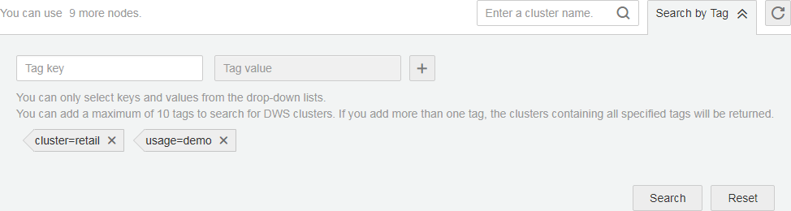
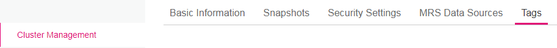
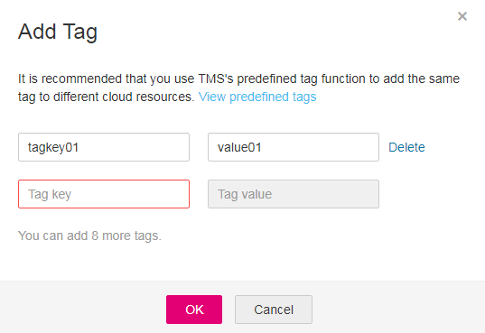
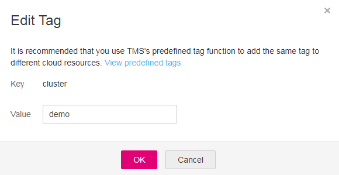
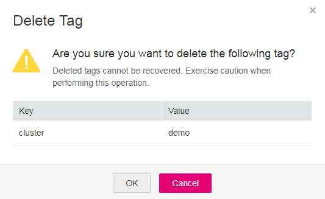

# Tag Management

This section describes how to search for clusters based on tags and how to add, modify, and delete tags for clusters.

## Searching for Clusters Based on Tags

If tags have been added to a cluster, you can search for the cluster by setting tag filtering conditions to quickly find it.

1.  Log in to the management console at  [https://console.otc.t-systems.com/dws/](https://console.otc.t-systems.com/dws/).
2.  Click  **Cluster Management**.
3.  Click  **Search by Tag**  on the right of the current page to expand the tab page.

    **Figure  1**  Search by tag  
    

4.  In the  **Search by Tag**  area, click the  **Tag Key**  text box to select a tag key from the drop-down list and then click the  **Tag Value**  text box to select the corresponding tag value.

    You can only enter a tag key or value that exists in the drop-down list. If no tag key or value is available, create a tag for the cluster. For details, see  [Adding a Tag to a Cluster](#section77515910494).

5.  Click    to add the selected tag to the area under the text boxes.
    -   Select another tag in the text boxes and click    to generate a tag combination for cluster search. You can add a maximum of 10 tags to search for data warehouse clusters. If you specify more than one tag, clusters containing all the specified tags will be displayed.
    -   To delete an existing tag, click    next to the tag.
    -   You can click  **Reset**  to clear all added tags.

        **Figure  2**  Adding the tag key and value  
        

6.  Click  **Search**. The target cluster will be displayed in the cluster list.

## Adding a Tag to a Cluster

1.  On the  **Cluster Management**  page, click the name of the cluster to which a tag is to be added, and click the  **Tags**  tab.

    **Figure  3**  Tags page  
    

2.  Click  **Add Tag**. The  **Add Tag**  dialog box is displayed.
3.  Configure the tag parameters in the  **Add Tag**  dialog box.

    **Figure  4**  Adding a tag to a cluster  
    

    **Table  1**  Tag parameters

    
    <table><thead align="left"><tr id="row17486121763113"><th class="cellrowborder" valign="top" width="15%" id="mcps1.2.4.1.1">
<strong id="b84235270617387">Parameter</strong>

    </th>
    <th class="cellrowborder" valign="top" width="71%" id="mcps1.2.4.1.2">
<strong id="b842352706101627">Description</strong>

    </th>
    <th class="cellrowborder" valign="top" width="14.000000000000002%" id="mcps1.2.4.1.3">
<strong id="b60793810112357">Example Value</strong>

    </th>
    </tr>
    </thead>
    <tbody><tr id="row11486131733111"><td class="cellrowborder" valign="top" width="15%" headers="mcps1.2.4.1.1 ">
Tag key

    </td>
    <td class="cellrowborder" valign="top" width="71%" headers="mcps1.2.4.1.2 ">
You can:

    <ul id="ul149381653121514"><li>Select a predefined tag key or an existing resource tag key from the drop-down list of the text box.
 NOTE: 

To add a predefined tag, you need to create one on TMS and select it from the drop-down list of <b>Tag key</b>. You can click <b>View predefined tags</b> to enter the <b>Predefined Tag</b> page of TMS. Then, click <b>Create Tag</b> to create a predefined tag. For details, see section <b>Creating Predefined Tags</b> in the <em id="i842352697104314">Tag Management Service User Guide</em>.

    

    </li></ul>
    <ul id="ul154819568159"><li>Enter a tag key in the text box. A tag key can contain a maximum of 36 Unicode characters, which cannot be null. The first and last characters cannot be spaces.
Contain only uppercase letters (A to Z), lowercase letters (a to z), digits (0-9), hyphens (-), and underscores (_).

    

 NOTE: 

The key name must be unique in the same cluster.

    

    

    </li></ul>
    </td>
    <td class="cellrowborder" valign="top" width="14.000000000000002%" headers="mcps1.2.4.1.3 ">
tagkey01

    </td>
    </tr>
    <tr id="row19486151715318"><td class="cellrowborder" valign="top" width="15%" headers="mcps1.2.4.1.1 ">
Tag value

    </td>
    <td class="cellrowborder" valign="top" width="71%" headers="mcps1.2.4.1.2 ">
You can:

    <ul id="ul12885203215142"><li>Select a predefined tag value or resource tag value from the drop-down list of the text box.</li><li>Enter a tag value in the text box. A tag key can contain a maximum of 43 Unicode characters, which can be null. The first and last characters cannot be spaces.
Contain only uppercase letters (A to Z), lowercase letters (a to z), digits (0-9), hyphens (-), and underscores (_).

    </li></ul>
    </td>
    <td class="cellrowborder" valign="top" width="14.000000000000002%" headers="mcps1.2.4.1.3 ">
value01

    </td>
    </tr>
    </tbody>
    </table>

4.  Click  **OK**.

## Modifying a Tag

1.  On the  **Cluster Management**  page, click the name of the cluster to which a tag is to be modified, and click the  **Tags**  tab.
2.  Locate the row that contains the tag to be modified, click  **Edit**  in the  **Operation**  column. The  **Edit Tag**  dialog box is displayed.

    **Figure  5**  Editing a tag  
    

3.  Enter the new key value in the  **Value**  text box.
4.  Click  **OK**.

## Deleting a Tag

1.  On the  **Cluster Management**  page, click the name of the cluster to which a tag is to be deleted, and click the  **Tags**  tab.
2.  Locate the row that contains the tag to be deleted, click  **Delete**  in the  **Operation**  column. The  **Delete Tag**  dialog box is displayed.

    **Figure  6**  Deleting a tag  
    

3.  Click  **OK**  to delete the tag.

