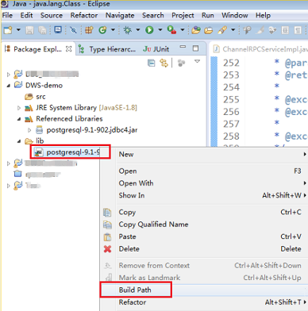

# Using a JDBC Driver to Connect to the Database<a name="dws_01_0077"></a>

In DWS, you can use a JDBC driver to connect to database on Linux or Windows. The drivers can connect to the database through the ECS in the public cloud or over the Internet.

When using the JDBC driver to connect to the data warehouse cluster, determine whether to enable SSL authentication. SSL authentication is used to encrypt communication data between the client and the server. It safeguards sensitive data transmitted over the Internet. You can download a self-signed certificate file on the DWS management console. To make the certificate take effect, you must configure the client program using the OpenSSL tool and the Java keytool.

> **NOTE:**   
>The SSL connection mode delivers higher security than the common mode. You are advised to use SSL connection when using JDBC to connect to the cluster.  

For details about how to use the JDBC interface, see the official document. 

## Prerequisites<a name="section1584133941514"></a>

-   You have installed JDK 1.6 or later and configured environment variables.
-   You have downloaded the JDBC driver. For details, see section  [Downloading the JDBC or ODBC Driver](downloading-the-jdbc-or-odbc-driver.md).

    DWS also supports open-source JDBC driver: PostgreSQL JDBC 9.3-1103 or later.

-   You have downloaded the SSL certificate file. For details, see section  [Downloading the SSL Certificate File](downloading-the-ssl-certificate-file.md).

## Using a JDBC Driver to Connect to the Database<a name="section2993721114437"></a>

The procedure for connecting to the database using a JDBC driver in a Linux environment is similar to that in a Windows environment. The following describes the connection procedure in a Windows environment.

1.  Determine whether you want to use the SSL mode to connect to the data warehouse cluster.
    -   If you use the SSL mode:
        1.  Enable SSL connection for the data warehouse cluster. SSL connection is enabled by default. For details, see section  [Configuring SSL Connection](configuring-ssl-connection.md).
        2.  Determine whether you want to perform authentication using a certificate or password.
            -   If certificate authentication is configured, go to  [2](#li55435426144245).
            -   If password authentication is configured, go to  [4](#li19649431459).

    -   If you do not use the SSL mode:
        1.  Disable SSL connection for the data warehouse cluster. SSL connection is enabled by default. For details, see section  [Configuring SSL Connection](configuring-ssl-connection.md).
        2.  Go to  [4](#li19649431459).

2.  <a name="li55435426144245"></a>If the Linux environment is used, use WinSCP to upload the downloaded SSL certificate file to the Linux environment.
3.  Configure the certificate to enable Secure Sockets Layer \(SSL\) connection.
    1.  Decompress the package to obtain the certificate file. Assume that the decompression path is  **$SSL\_PATH**.

        You are advised to store the certificate file in a path of the English version and can specify the actual path when configuring the certificate. If the path is incorrect, a message stating that the file does not exist will be prompted.

    2.  Open the  **Command Prompt**  program and switch to the  **$SSL\_PATH\\dws\_ssl\_cert\\sslcert**  path. Run the following commands to import the root license to the TrustStore:

        **openssl** **x509** **-in** _cacert.pem_ **-out** _cacert.crt.der_ **-outform** _der_

        **keytool** **-keystore** _mytruststore_ **-alias** _cacert_ **-import** **-file** _cacert.crt.der_

        -   **cacert.pem**  indicates the root certificate obtained after decompression.
        -   **cacert.crt.der**  indicates the generated intermediate file. You can store the file to another path and change the file name to your desired one.
        -   **mytruststore**  indicates the generated TrustStore name and  **cacert**  indicates an alias user. You can change the values of  **mytruststore**  and  **cacert**  as needed.

        Enter the TrustStore password that you set as prompted and type  **y**  to confirm the password. For example, after entering password  **truststore123**, type  **y**.

    3.  Run the following command to convert the format of the client private key:

        **openssl** **pkcs12** **-export** **-out** _client.pkcs12_ **-in** _client.crt_ **-inkey** _client.key_

        Enter the private key password of the client, for example,  **Gauss@MppDB**. Then enter your self-defined private key password, for example,  **key123**  and confirm it.

    4.  Run the following command to import the private key to KeyStore:

        **keytool** **-importkeystore** **-deststorepass** _Gauss@MppDB_ **-destkeystore** _client.jks_ **-srckeystore** _client.pkcs12_ **-srcstorepass** _key123_ **-srcstoretype** _PKCS12_ **-alias** _1_

4.  <a name="li19649431459"></a>Decompress the downloaded JDBC driver to obtain  **gsjdbc4.jar**.
5.  Add the JAR file to the application project so that applications can reference the JAR file.

    Take the Eclipse project as an example. Store the JAR file to the project directory, for example, the  **lib**  directory in the project directory. In the Eclipse project, right-click the JAR file in the  **lib**  directory and select  **Build Path**  to reference the JAR file.

    **Figure  1**  Referencing a JAR file<a name="fig18599113514410"></a>  
    

6.  Load the driver.

    The following methods are available:

    -   Using a code:  **Class.forName\("org.postgresql.Driver"\);**
    -   Using a parameter during the JVM startup:  **java -Djdbc.drivers=org.postgresql.Driver jdbctest**

7.  Use the DriverManager.getConnection\(\) method to connect to the database through the JDBC driver.

    The following reloading methods are supported:

    -   DriverManager.getConnection\(String url\);
    -   DriverManager.getConnection\(String url, Properties info\);
    -   DriverManager.getConnection\(String url, String user, String password\);

    **Table  1**  Database connection parameters

    <a name="en-us_topic_0004406724_table51197761"></a>
    <table><thead align="left"><tr id="en-us_topic_0004406724_row61561215"><th class="cellrowborder" valign="top" width="35.23%" id="mcps1.2.3.1.1"><p id="en-us_topic_0004406724_p2535073"><a name="en-us_topic_0004406724_p2535073"></a><a name="en-us_topic_0004406724_p2535073"></a><strong id="b50623360142047"><a name="b50623360142047"></a><a name="b50623360142047"></a>Parameter</strong></p>
    </th>
    <th class="cellrowborder" valign="top" width="64.77000000000001%" id="mcps1.2.3.1.2"><p id="en-us_topic_0004406724_p33599649"><a name="en-us_topic_0004406724_p33599649"></a><a name="en-us_topic_0004406724_p33599649"></a><strong id="b6851456142047"><a name="b6851456142047"></a><a name="b6851456142047"></a>Description</strong></p>
    </th>
    </tr>
    </thead>
    <tbody><tr id="en-us_topic_0004406724_row42455976"><td class="cellrowborder" valign="top" width="35.23%" headers="mcps1.2.3.1.1 "><p id="en-us_topic_0004406724_p57939919"><a name="en-us_topic_0004406724_p57939919"></a><a name="en-us_topic_0004406724_p57939919"></a>url</p>
    </td>
    <td class="cellrowborder" valign="top" width="64.77000000000001%" headers="mcps1.2.3.1.2 "><p id="p61624548134633"><a name="p61624548134633"></a><a name="p61624548134633"></a>Specifies the database connection descriptor, which can be viewed on the management console. For details, see section <a href="obtaining-the-cluster-connection-address.md">Obtaining the Cluster Connection Address</a>.</p>
    <p id="en-us_topic_0004406724_p59332072"><a name="en-us_topic_0004406724_p59332072"></a><a name="en-us_topic_0004406724_p59332072"></a>The formats of URL are as follows:</p>
    <p id="p190710141363"><a name="p190710141363"></a><a name="p190710141363"></a>jdbc:postgresql://host:port/database</p>
    <div class="note" id="en-us_topic_0004406724_note1343464"><a name="en-us_topic_0004406724_note1343464"></a><a name="en-us_topic_0004406724_note1343464"></a><span class="notetitle"> NOTE: </span><div class="notebody"><a name="ul32509781145934"></a><a name="ul32509781145934"></a><ul id="ul32509781145934"><li><strong id="b84235270694539"><a name="b84235270694539"></a><a name="b84235270694539"></a>database</strong> indicates the name of the database to which you want to connect.</li><li><strong id="b8423527069467"><a name="b8423527069467"></a><a name="b8423527069467"></a>host</strong> indicates the name of the database server.</li><li><strong id="b84235270694614"><a name="b84235270694614"></a><a name="b84235270694614"></a>port</strong> indicates the port number of the database server.</li></ul>
    <p id="en-us_topic_0004406724_p45689763"><a name="en-us_topic_0004406724_p45689763"></a><a name="en-us_topic_0004406724_p45689763"></a>By default, the code tries to connect to the database on <strong id="b842352706145051"><a name="b842352706145051"></a><a name="b842352706145051"></a>localhost</strong> through port <strong id="b842352706101813"><a name="b842352706101813"></a><a name="b842352706101813"></a>8000</strong>.</p>
    </div></div>
    </td>
    </tr>
    <tr id="en-us_topic_0004406724_row16695882"><td class="cellrowborder" valign="top" width="35.23%" headers="mcps1.2.3.1.1 "><p id="en-us_topic_0004406724_p14273515"><a name="en-us_topic_0004406724_p14273515"></a><a name="en-us_topic_0004406724_p14273515"></a>info</p>
    </td>
    <td class="cellrowborder" valign="top" width="64.77000000000001%" headers="mcps1.2.3.1.2 "><p id="en-us_topic_0004406724_p35914293"><a name="en-us_topic_0004406724_p35914293"></a><a name="en-us_topic_0004406724_p35914293"></a>Specifies database connection properties. Common properties include the following:</p>
    <a name="en-us_topic_0004406724_ul60523322"></a><a name="en-us_topic_0004406724_ul60523322"></a><ul id="en-us_topic_0004406724_ul60523322"><li><strong id="b84235270610304"><a name="b84235270610304"></a><a name="b84235270610304"></a>user</strong>: a string type. It indicates the database user who creates the connection task.</li><li><strong id="b842352706103312"><a name="b842352706103312"></a><a name="b842352706103312"></a>password</strong>: a string type. It indicates the password of the database user.</li><li><strong id="b842352706103355"><a name="b842352706103355"></a><a name="b842352706103355"></a>ssl</strong>: a Boolean type. It indicates whether the SSL connection is used.</li><li><strong id="b842352706103459"><a name="b842352706103459"></a><a name="b842352706103459"></a>loglevel</strong>: an Integer type. It determines the log volume of the DriverManager class recorded by the LogStream or LogWriter object. Currently, only <span class="parmname" id="parmname769647905105031"><a name="parmname769647905105031"></a><a name="parmname769647905105031"></a><b>com.edb.Driver.DEBUG</b></span> and <span class="parmname" id="parmname769647905105047"><a name="parmname769647905105047"></a><a name="parmname769647905105047"></a><b>com.edb.Driver.INFO</b></span> are supported. If you set <strong id="b842352706104655"><a name="b842352706104655"></a><a name="b842352706104655"></a>loglevel</strong> to <strong id="b84235270610471"><a name="b84235270610471"></a><a name="b84235270610471"></a>INFO</strong>, only a limited amount of log information is recorded. If you set <strong id="b1467438814104831"><a name="b1467438814104831"></a><a name="b1467438814104831"></a>loglevel</strong> to <strong id="b331582914104831"><a name="b331582914104831"></a><a name="b331582914104831"></a>DEBUG</strong>, detailed log information is recorded.</li><li><strong id="b2114927739"><a name="b2114927739"></a><a name="b2114927739"></a>charSet</strong>: a string type. It indicates character sets used when data is sent from the database or the database receives data.</li><li><strong id="b1075701020"><a name="b1075701020"></a><a name="b1075701020"></a>prepareThreshold</strong>: an Integer type. It is used to determine the execution times of PreparedStatement before the information is converted into prepared statements on the server. The default value is <span class="parmvalue" id="parmvalue555125744105735"><a name="parmvalue555125744105735"></a><a name="parmvalue555125744105735"></a><b>5</b></span>.</li></ul>
    </td>
    </tr>
    <tr id="en-us_topic_0004406724_row63199906"><td class="cellrowborder" valign="top" width="35.23%" headers="mcps1.2.3.1.1 "><p id="en-us_topic_0004406724_p5711640"><a name="en-us_topic_0004406724_p5711640"></a><a name="en-us_topic_0004406724_p5711640"></a>user</p>
    </td>
    <td class="cellrowborder" valign="top" width="64.77000000000001%" headers="mcps1.2.3.1.2 "><p id="en-us_topic_0004406724_p4700076"><a name="en-us_topic_0004406724_p4700076"></a><a name="en-us_topic_0004406724_p4700076"></a>Specifies the database user.</p>
    </td>
    </tr>
    <tr id="en-us_topic_0004406724_row58485413"><td class="cellrowborder" valign="top" width="35.23%" headers="mcps1.2.3.1.1 "><p id="en-us_topic_0004406724_p66603434"><a name="en-us_topic_0004406724_p66603434"></a><a name="en-us_topic_0004406724_p66603434"></a>password</p>
    </td>
    <td class="cellrowborder" valign="top" width="64.77000000000001%" headers="mcps1.2.3.1.2 "><p id="en-us_topic_0004406724_p22788321"><a name="en-us_topic_0004406724_p22788321"></a><a name="en-us_topic_0004406724_p22788321"></a>Specifies the password of the database user.</p>
    </td>
    </tr>
    </tbody>
    </table>

    The following describes the sample code used to encrypt the connection using the SSL certificate:

    ```
    // The following code obtains the database SSL connection operation and encapsulates the operation as an interface.
    
    public static Connection GetConnection(String username, String passwd)
        {
            //Define the driver class.
            String driver = "org.postgresql.Driver";
             //Set keyStore.
            System.setProperty("javax.net.ssl.trustStore", "mytruststore");
            System.setProperty("javax.net.ssl.keyStore", "client.jks");
            System.setProperty("javax.net.ssl.trustStorePassword", "password");
            System.setProperty("javax.net.ssl.keyStorePassword", "password");
    
            Properties props = new Properties();
            props.setProperty("user", username);
            props.setProperty("password", passwd);
            props.setProperty("ssl", "true");
    
            String  url = "jdbc:postgresql://" + "10.10.0.13" + ':'
                        + "8000" + '/'
                        + "postgres";
            Connection conn = null;
            
            try
            {
                //Load the driver.
                Class.forName(driver);
            }
            catch( Exception e )
            {
                e.printStackTrace();
                return null;
            }
            
            try
            {
                 //Create a connection.
                conn = DriverManager.getConnection(url, props );
                System.out.println("Connection succeed!");
            }
            catch(Exception e)
            {
                e.printStackTrace();
                return null;
            }
            
            return conn;
        }
    ```

      

    The following describes the sample code used to encrypt the connection using the SSL password:

    ```
    public static Connection GetConnection(String username, String passwd)
        {
            //Define the driver class.
            String driver = "org.postgresql.Driver";
        
            Properties props = new Properties();
            props.setProperty("user", username);
            props.setProperty("password", passwd);
            String  url = "jdbc:postgresql://" + "10.10.0.13" + ':'
                        + "8000" + '/'
                        + "postgres";
            Connection conn = null;
            
            try
            {
                //Load the driver.
                Class.forName(driver);
            }
            catch( Exception e )
            {
                e.printStackTrace();
                return null;
            }
            
            try
            {
                 //Create a connection.
                conn = DriverManager.getConnection(url, props );
                System.out.println("Connection succeed!");
            }
            catch(Exception e)
            {
                e.printStackTrace();
                return null;
            }
            
            return conn;
        }
    ```

8.  Run the following command to execute SQL statements:
    1.  Run the following command to create a statement object:

        ```
        Statement stmt = con.createStatement();
        ```

    2.  Run the following command to execute the statement object:

        ```
        int rc = stmt.executeUpdate("CREATE TABLE tab1(id INTEGER, name VARCHAR(32));");
        ```

    3.  Run the following command to release the statement object:

        ```
        stmt.close();
        ```

9.  Invoke  **close\(\)**  to close the connection.

## Sample Code<a name="section12107104719399"></a>

This sample code illustrates how to develop applications based on the JDBC interface provided by DWS.

```
//DBtest.java
//Demonstrate the main steps for JDBC development, including creating databases, creating tables, and inserting data.

import java.sql.Connection;
import java.sql.DriverManager;
import java.sql.PreparedStatement;
import java.sql.SQLException;
import java.sql.Statement;
import java.sql.CallableStatement;

public class DBTest {

  //Create a database connection.
  public static Connection GetConnection(String username, String passwd) {
    String driver = "org.postgresql.Driver";
    String sourceURL = "jdbc:postgresql://10.10.0.13:8000/postgres";
    Connection conn = null;
    try {
      // Load the database driver.
      Class.forName(driver).newInstance();
    } catch (Exception e) {
      e.printStackTrace();
      return null;
    }

    try {
      //Create a database connection.
      conn = DriverManager.getConnection(sourceURL, username, passwd);
      System.out.println("Connection succeed!");
    } catch (Exception e) {
      e.printStackTrace();
      return null;
    }

    return conn;
  };

  //Run the common SQL statements to create table customer_t1.
  public static void CreateTable(Connection conn) {
    Statement stmt = null;
    try {
      stmt = conn.createStatement();

      //Run the common SQL statements.
      int rc = stmt
          .executeUpdate("CREATE TABLE customer_t1(c_customer_sk INTEGER, c_customer_name VARCHAR(32));");

      stmt.close();
    } catch (SQLException e) {
      if (stmt != null) {
        try {
          stmt.close();
        } catch (SQLException e1) {
          e1.printStackTrace();
        }
      }
      e.printStackTrace();
    }
  }

  //Run the prepared statements and insert data in batches.
  public static void BatchInsertData(Connection conn) {
    PreparedStatement pst = null;

    try {
      //Generate the prepared statements.
      pst = conn.prepareStatement("INSERT INTO customer_t1 VALUES (?,?)");
      for (int i = 0; i < 3; i++) {
        //Add parameters.
        pst.setInt(1, i);
        pst.setString(2, "data " + i);
        pst.addBatch();
      }
      //Execute batch processing.
      pst.executeBatch();
      pst.close();
    } catch (SQLException e) {
      if (pst != null) {
        try {
          pst.close();
        } catch (SQLException e1) {
        e1.printStackTrace();
        }
      }
      e.printStackTrace();
    }
  }

  //Run the precompiled statement to update the data.
  public static void ExecPreparedSQL(Connection conn) {
    PreparedStatement pstmt = null;
    try {
      pstmt = conn
          .prepareStatement("UPDATE customer_t1 SET c_customer_name = ? WHERE c_customer_sk = 1");
      pstmt.setString(1, "new Data");
      int rowcount = pstmt.executeUpdate();
      pstmt.close();
    } catch (SQLException e) {
      if (pstmt != null) {
        try {
          pstmt.close();
        } catch (SQLException e1) {
          e1.printStackTrace();
        }
      }
      e.printStackTrace();
    }
  }


//Execute the storage procedure. 
  public static void ExecCallableSQL(Connection conn) {
    CallableStatement cstmt = null;
    try {
      
      cstmt=conn.prepareCall("{? = CALL TESTPROC(?,?,?)}");
      cstmt.setInt(2, 50); 
      cstmt.setInt(1, 20);
      cstmt.setInt(3, 90);
      cstmt.registerOutParameter(4, Types.INTEGER);  //Register a parameter of the out type. Its value is an integer.
      cstmt.execute();
      int out = cstmt.getInt(4);  //Obtain the out parameter.
      System.out.println("The CallableStatment TESTPROC returns:"+out);
      cstmt.close();
    } catch (SQLException e) {
      if (cstmt != null) {
        try {
          cstmt.close();
        } catch (SQLException e1) {
          e1.printStackTrace();
        }
      }
      e.printStackTrace();
    }
  }
  

  /**
   * Main program, which gradually invokes each static method.
   * @param args
  */
  public static void main(String[] args) {
    //Create a database connection.
    Connection conn = GetConnection("tester", "Password1234");

    //Create a table.
    CreateTable(conn);

    //Insert data in batches.
    BatchInsertData(conn);

    //Run the precompiled statement to update the data.
    ExecPreparedSQL(conn);

    //Execute the storage procedure. 
    ExecCallableSQL(conn);

    //Close the database connection.
    try {
      conn.close();
    } catch (SQLException e) {
      e.printStackTrace();
    }

  }

}
```

