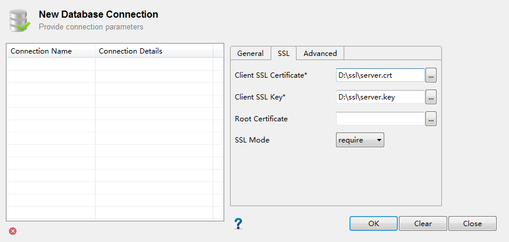
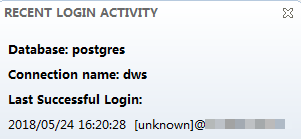

# Using the Data Studio GUI Client to Connect to a Cluster

Data Studio is a SQL client tool running on the Windows OS. It provides various GUIs for you to manage databases and database objects, as well as edit, run, and debug SQL scripts, and view execution plans. Download the Data Studio software package from the DWS management console. The package can be used without installation after being decompressed.

DataStudio versions include  **Windows x86**  \(32-bit Windows system\) and  **Windows x64**  \(64-bit Windows system\).

## Preparations Before Connecting to a Cluster

-   An EIP has been bound to the data warehouse cluster.
-   You have obtained the administrator username and password for logging in to the database in the data warehouse cluster.
-   You have obtained the public network address, including the IP address and port number in the data warehouse cluster. For details, see  [Obtaining the Cluster Connection Address](obtaining-the-cluster-connection-address.md).
-   You have configured the security group to which the data warehouse cluster belongs and added a rule that allows users' IP addresses to access ports using the TCP.

    For details, see section  **Adding a Security Group Rule**  in the  _Virtual Private Cloud User Guide_.

## Using Data Studio to Connect to the Cluster's Database

1.  Log in to the management console at  [https://console.otc.t-systems.com/dws/](https://console.otc.t-systems.com/dws/).
2.  Click  **Connection Management**.
3.  On the  **Download Client and Driver**  page, select the corresponding  **Data Studio GUI Client**. Select  **Microsoft Windows x86**  or  **Microsoft Windows x64**  based on the OS type and click  **Download**.
4.  Decompress the downloaded client software package \(32-bit or 64-bit\) to the installation directory.
5.  Open the installation directory and double-click  **Data Studio.exe**  to start the Data Studio client. See  [Figure 1](#dws_01_0107_fig6324139192412).

    > **NOTE:**   
    >Install Java 1.8.0\_141 or later corresponding to the OS bits. Otherwise, the Data Studio client cannot be started.  

    **Figure  1**  Starting the client  
    

6.  Choose  **File**  \>  **New Connection**  from the main menu. See  [Figure 2](#dws_01_0107_fig14311312192811).

    **Figure  2**  Creating a connection  
    

7.  In the displayed  **New Database Connection**  window, enter the connection parameters. See  [Figure 3](#dws_01_0107_fig27101723910).

    **Figure  3**  Configuring connection parameters  
    

    **Table  1**  Connection parameters

    
    <table><thead align="left"><tr id="dws_01_0107_row88417113910"><th class="cellrowborder" valign="top" width="23.232323232323232%" id="mcps1.2.4.1.1">
<strong id="dws_01_0107_b842352706103219">Field Name</strong>

    </th>
    <th class="cellrowborder" valign="top" width="43.43434343434344%" id="mcps1.2.4.1.2">
<strong id="dws_01_0107_b842352706103223">Description</strong>

    </th>
    <th class="cellrowborder" valign="top" width="33.33333333333333%" id="mcps1.2.4.1.3">
<strong id="dws_01_0107_b842352706103227">Example</strong>

    </th>
    </tr>
    </thead>
    <tbody><tr id="dws_01_0107_row138017153913"><td class="cellrowborder" valign="top" width="23.232323232323232%" headers="mcps1.2.4.1.1 ">
Connection Name

    </td>
    <td class="cellrowborder" valign="top" width="43.43434343434344%" headers="mcps1.2.4.1.2 ">
Connection name

    </td>
    <td class="cellrowborder" valign="top" width="33.33333333333333%" headers="mcps1.2.4.1.3 ">
DWS_DB

    </td>
    </tr>
    <tr id="dws_01_0107_row178141710395"><td class="cellrowborder" valign="top" width="23.232323232323232%" headers="mcps1.2.4.1.1 ">
Host

    </td>
    <td class="cellrowborder" valign="top" width="43.43434343434344%" headers="mcps1.2.4.1.2 ">
IP address (IPv4) or domain name of the cluster to be connected

    </td>
    <td class="cellrowborder" valign="top" width="33.33333333333333%" headers="mcps1.2.4.1.3 ">
-

    </td>
    </tr>
    <tr id="dws_01_0107_row88151717394"><td class="cellrowborder" valign="top" width="23.232323232323232%" headers="mcps1.2.4.1.1 ">
Host Port

    </td>
    <td class="cellrowborder" valign="top" width="43.43434343434344%" headers="mcps1.2.4.1.2 ">
Port address

    </td>
    <td class="cellrowborder" valign="top" width="33.33333333333333%" headers="mcps1.2.4.1.3 ">
8000

    </td>
    </tr>
    <tr id="dws_01_0107_row9881783912"><td class="cellrowborder" valign="top" width="23.232323232323232%" headers="mcps1.2.4.1.1 ">
Database Name

    </td>
    <td class="cellrowborder" valign="top" width="43.43434343434344%" headers="mcps1.2.4.1.2 ">
Database name

    </td>
    <td class="cellrowborder" valign="top" width="33.33333333333333%" headers="mcps1.2.4.1.3 ">
postgres

    </td>
    </tr>
    <tr id="dws_01_0107_row79151714394"><td class="cellrowborder" valign="top" width="23.232323232323232%" headers="mcps1.2.4.1.1 ">
User Name

    </td>
    <td class="cellrowborder" valign="top" width="43.43434343434344%" headers="mcps1.2.4.1.2 ">
Name of the user who wants to connect to the database

    </td>
    <td class="cellrowborder" valign="top" width="33.33333333333333%" headers="mcps1.2.4.1.3 ">
-

    </td>
    </tr>
    <tr id="dws_01_0107_row18961717397"><td class="cellrowborder" valign="top" width="23.232323232323232%" headers="mcps1.2.4.1.1 ">
Password

    </td>
    <td class="cellrowborder" valign="top" width="43.43434343434344%" headers="mcps1.2.4.1.2 ">
Password for logging in to the database to be connected

    </td>
    <td class="cellrowborder" valign="top" width="33.33333333333333%" headers="mcps1.2.4.1.3 ">
-

    </td>
    </tr>
    <tr id="dws_01_0107_row86069127252"><td class="cellrowborder" valign="top" width="23.232323232323232%" headers="mcps1.2.4.1.1 ">
Save Password

    </td>
    <td class="cellrowborder" valign="top" width="43.43434343434344%" headers="mcps1.2.4.1.2 ">
Select an option from the drop-down list:

    <ul id="dws_01_0107_ul37500309263"><li><strong id="dws_01_0107_b477034651103528"><b>Current Session Only</b></strong>: The password is saved only in the current session.</li><li><strong id="dws_01_0107_b209892631103614"><b>Do Not Save</b></strong>: The password is not saved.</li></ul>
    </td>
    <td class="cellrowborder" valign="top" width="33.33333333333333%" headers="mcps1.2.4.1.3 ">
-

    </td>
    </tr>
    </tbody>
    </table>

8.  Determine whether to enable SSL. The SSL mode is more secure than the common mode. You are advised to enable the SSL mode on the client.
    -   To enable SSL, select  **Enable SSL**  on the  **General**  tab and perform  [9](#dws_01_0107_li1286823061917)  to  [11](#dws_01_0107_li1855114111377).
    -   To disable SSL, deselect  **Enable SSL**  on the  **General**  tab and perform  [10](#dws_01_0107_li181020421385).

9.  Enable SSL connection.
    1.  On the  **General**  tab, select  **Enable SSL**.
    2.  Click the  **SSL**  tab.
    3.  On the SSL configuration page, set the following parameters:

        Download the SSL certificate. For details, see section  [Downloading the SSL Certificate File](downloading-the-ssl-certificate-file.md). Then, decompress the certificate file to the specified path.

        -   **Client SSL Certificate**: Click    and select the  **sslcert\\client.crt**  file in the decompressed directory.
        -   **Client SSL Key**: Click    and select the  **sslcert\\client.key**  file in the decompressed directory.
        -   **Root Certificate**: Based on the selected  **SSL Mode**, click    and select the  **sslcert\\cacert.pem**  file in the decompressed directory.
        -   **SSL mode**: Select an SSL mode from the drop-down list. Possible values are  **require**  and  **verify-ca**  \(DWS does not support the  **verify-full**  mode\). If  **SSL Mode**  is set to  **verify-ca**, the root certificate is required.

        **Figure  4**  Configuring SSL parameters  
        

10. Click  **OK**  to establish the database connection.
11. \(Optional\) If SSL is enabled, click  **Continue**  in the displayed  **Connection Security Alert**  dialog box.

    After the login is successful, the  **RECENT LOGIN ACTIVITY**  dialog box is displayed, indicating that the Data Studio is connected to the database. You can run the SQL statement in the  **SQL Terminal**  window on the Data Studio page.

    **Figure  5**  Successful login  
    

12. \(Optional\) For details about how to use other functions of Data Studio, press  **F1**  to view the Data Studio user manual.

