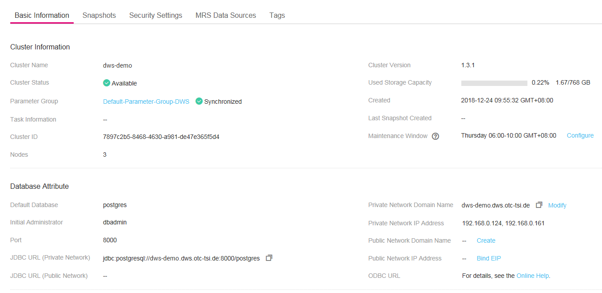

# Viewing Basic Cluster Information

Log in to the DWS management console. In the navigation tree on the left, click  **Cluster Management**. In the cluster list, locate the required cluster and click its name. The  **Basic Information**  page is displayed.

**Figure  1**  Basic cluster information  

On a cluster's  **Basic Information**  page, you can view the following information:

-   **Cluster Information**:  [Table 1](#table275325811213)  lists the related parameters.
-   **Database Attribute**:  [Table 2](#table112851640172712)  lists the related parameters.
-   **Node Configuration**:  [Table 3](#table59611316811)  lists the related parameters.
-   **Network**:  [Table 4](#table1967915191613)  lists the related parameters.

**Table  1**  Cluster information

<table><thead align="left"><tr id="row177611758111216"><th class="cellrowborder" valign="top" width="24%" id="mcps1.2.3.1.1">
<strong id="b32647554222">Parameter</strong>

</th>
<th class="cellrowborder" valign="top" width="76%" id="mcps1.2.3.1.2">
<strong id="b5732185617220">Description</strong>

</th>
</tr>
</thead>
<tbody><tr id="row19768165811213"><td class="cellrowborder" valign="top" width="24%" headers="mcps1.2.3.1.1 ">
Cluster Name

</td>
<td class="cellrowborder" valign="top" width="76%" headers="mcps1.2.3.1.2 ">
Cluster name specified when the cluster is created

</td>
</tr>
<tr id="row4773185820126"><td class="cellrowborder" valign="top" width="24%" headers="mcps1.2.3.1.1 ">
Cluster Status

</td>
<td class="cellrowborder" valign="top" width="76%" headers="mcps1.2.3.1.2 ">
Cluster running status. For details, see <a href="viewing-the-cluster-list.md#table344018476323">Table 2</a>.

</td>
</tr>
<tr id="row1217441612206"><td class="cellrowborder" valign="top" width="24%" headers="mcps1.2.3.1.1 ">
Parameter Group

</td>
<td class="cellrowborder" valign="top" width="76%" headers="mcps1.2.3.1.2 ">
Parameter group associated with the cluster and its configuration status. You can click the parameter group name to view and edit it on the parameter group page.

</td>
</tr>
<tr id="row57772582124"><td class="cellrowborder" valign="top" width="24%" headers="mcps1.2.3.1.1 ">
Task Information

</td>
<td class="cellrowborder" valign="top" width="76%" headers="mcps1.2.3.1.2 ">
Cluster task status. For details, see <a href="viewing-the-cluster-list.md#table14807124711323">Table 3</a>.

</td>
</tr>
<tr id="row19251425132016"><td class="cellrowborder" valign="top" width="24%" headers="mcps1.2.3.1.1 ">
Cluster ID

</td>
<td class="cellrowborder" valign="top" width="76%" headers="mcps1.2.3.1.2 ">
ID of the cluster

</td>
</tr>
<tr id="row382613346206"><td class="cellrowborder" valign="top" width="24%" headers="mcps1.2.3.1.1 ">
Nodes

</td>
<td class="cellrowborder" valign="top" width="76%" headers="mcps1.2.3.1.2 ">
Number of nodes in the cluster

</td>
</tr>
<tr id="row1782195861212"><td class="cellrowborder" valign="top" width="24%" headers="mcps1.2.3.1.1 ">
Cluster Version

</td>
<td class="cellrowborder" valign="top" width="76%" headers="mcps1.2.3.1.2 ">
Cluster version information

</td>
</tr>
<tr id="row12788458111216"><td class="cellrowborder" valign="top" width="24%" headers="mcps1.2.3.1.1 ">
Used Storage Capacity

</td>
<td class="cellrowborder" valign="top" width="76%" headers="mcps1.2.3.1.2 ">
Used storage capacity of the cluster

</td>
</tr>
<tr id="row1148816611224"><td class="cellrowborder" valign="top" width="24%" headers="mcps1.2.3.1.1 ">
Created

</td>
<td class="cellrowborder" valign="top" width="76%" headers="mcps1.2.3.1.2 ">
Time when the cluster was created

</td>
</tr>
<tr id="row7989141510225"><td class="cellrowborder" valign="top" width="24%" headers="mcps1.2.3.1.1 ">
Last Snapshot Created

</td>
<td class="cellrowborder" valign="top" width="76%" headers="mcps1.2.3.1.2 ">
Time when the last snapshot was created

</td>
</tr>
<tr id="row78360355225"><td class="cellrowborder" valign="top" width="24%" headers="mcps1.2.3.1.1 ">
Maintenance Window

</td>
<td class="cellrowborder" valign="top" width="76%" headers="mcps1.2.3.1.2 ">
Maintenance window of the cluster

You can click <b>Configure</b> on the right of <strong id="b1119943613338">Maintenance Window</strong> to configure the maintenance window. For more information, see section <a href="upgrading-a-cluster.md#section1583412504297">Configuring the Maintenance Window</a>.

</td>
</tr>
</tbody>
</table>

**Table  2**  Database attribute parameters

<table><thead align="left"><tr id="dws_01_0033_row107835915393"><th class="cellrowborder" valign="top" width="24%" id="mcps1.2.3.1.1">
<strong id="dws_01_0033_b84235270692541">Parameter</strong>

</th>
<th class="cellrowborder" valign="top" width="76%" id="mcps1.2.3.1.2">
<strong id="dws_01_0033_b842352706181449">Description</strong>

</th>
</tr>
</thead>
<tbody><tr id="dws_01_0033_row11404121572"><td class="cellrowborder" valign="top" width="24%" headers="mcps1.2.3.1.1 ">
Default Database

</td>
<td class="cellrowborder" valign="top" width="76%" headers="mcps1.2.3.1.2 ">
Database that is automatically created during cluster creation. When you connect to the cluster for the first time, you need to connect to the default database.

</td>
</tr>
<tr id="dws_01_0033_row1913311541965"><td class="cellrowborder" valign="top" width="24%" headers="mcps1.2.3.1.1 ">
Initial Administrator

</td>
<td class="cellrowborder" valign="top" width="76%" headers="mcps1.2.3.1.2 ">
Administrator user specified during cluster creation. When you connect to the cluster for the first time, you need to use the initial administrator and password to connect to the default database.

</td>
</tr>
<tr id="dws_01_0033_row1083211501964"><td class="cellrowborder" valign="top" width="24%" headers="mcps1.2.3.1.1 ">
Port

</td>
<td class="cellrowborder" valign="top" width="76%" headers="mcps1.2.3.1.2 ">
Port for accessing the cluster database over the public network or private network. Database port specified during cluster creation. It is used to listen to client connections.

</td>
</tr>
<tr id="dws_01_0033_row129517471462"><td class="cellrowborder" valign="top" width="24%" headers="mcps1.2.3.1.1 ">
JDBC URL (Private Network)

</td>
<td class="cellrowborder" valign="top" width="76%" headers="mcps1.2.3.1.2 ">
In the private network environment, you can use the JDBC URL (private network) to connect to the cluster when developing applications.

</td>
</tr>
<tr id="dws_01_0033_row58581742162"><td class="cellrowborder" valign="top" width="24%" headers="mcps1.2.3.1.1 ">
JDBC URL (Public Network)

</td>
<td class="cellrowborder" valign="top" width="76%" headers="mcps1.2.3.1.2 ">
In the public network environment, you can use the JDBC URL (public network) to connect to the cluster when developing applications.

</td>
</tr>
<tr id="dws_01_0033_row1278775864518"><td class="cellrowborder" valign="top" width="24%" headers="mcps1.2.3.1.1 ">
Private Network Domain Name

</td>
<td class="cellrowborder" valign="top" width="76%" headers="mcps1.2.3.1.2 ">
Name of the domain for accessing the database in the cluster through the private network. The private network domain address is automatically generated when you create a cluster. The default naming rule is as follows: cluster name.dws.otc-tsi.de

 NOTE: 

If the cluster name does not comply with the domain name standards, the prefix of the default access domain name will be adjusted accordingly.

Click <strong id="dws_01_0033_b84235270620162">Modify</strong> to change the private network access domain name. The access domain name contains 4 to 63 characters, which consist of letters, digits, and hyphens (-), and must start with a letter.

For more information, see section <a href="managing-access-domain-names.md">Managing Access Domain Names</a>.

</td>
</tr>
<tr id="dws_01_0033_row197835916390"><td class="cellrowborder" valign="top" width="24%" headers="mcps1.2.3.1.1 ">
Private Network IP Address

</td>
<td class="cellrowborder" valign="top" width="76%" headers="mcps1.2.3.1.2 ">
IP address for accessing the database in the cluster through the private network. The private network address is automatically generated when you create a cluster.

</td>
</tr>
<tr id="dws_01_0033_row16870618204610"><td class="cellrowborder" valign="top" width="24%" headers="mcps1.2.3.1.1 ">
Public Network Domain Name

</td>
<td class="cellrowborder" valign="top" width="76%" headers="mcps1.2.3.1.2 ">
Name of the domain for accessing the database in the cluster through the public network. 

 NOTE: 
<ul id="dws_01_0033_ul4787192618461"><li>If you have not bound an EIP to the cluster, <b>Public Network IP Address</b>, <b>Public Network Port</b>, and <b>Public Network Domain Name</b> are left blank.</li><li>If you bind an EIP during cluster creation, the public network domain name is automatically generated. The default naming rule is as follows: cluster name.dws.t-systems.com</li><li>Bind an EIP to the cluster before binding the public network domain name to the cluster. Click <b>Create</b> to bind the public network domain name to the cluster.</li><li>You can click <b>Modify</b> to modify the public network domain name bound to the cluster. The domain name contains 4 to 63 characters, which consist of letters, digits, and hyphens (-), and must start with a letter.</li><li>You can click <b>Release</b> to release the public network domain name bound to the cluster.</li></ul>

For more information, see section <a href="managing-access-domain-names.md">Managing Access Domain Names</a>.

</td>
</tr>
<tr id="dws_01_0033_row16299125111411"><td class="cellrowborder" valign="top" width="24%" headers="mcps1.2.3.1.1 ">
Public Network IP Address

</td>
<td class="cellrowborder" valign="top" width="76%" headers="mcps1.2.3.1.2 ">
IP address for accessing the database in the cluster through the public network. 

 NOTE: 
<ul id="dws_01_0033_ul198032619509"><li>If no EIP is assigned during cluster creation and <b>Public Network IP Address</b> is empty, click <b>Bind EIP</b> to bind an EIP to the cluster. </li><li>If an EIP is bound during cluster creation, click <b>Unbind EIP</b> to unbind the EIP. </li></ul>

</td>
</tr>
<tr id="dws_01_0033_row1816181020814"><td class="cellrowborder" valign="top" width="24%" headers="mcps1.2.3.1.1 ">
ODBC URL

</td>
<td class="cellrowborder" valign="top" width="76%" headers="mcps1.2.3.1.2 ">
In DWS, you can use an ODBC driver to connect to the database. The drivers can connect to the database through the ECS in the public cloud or over the Internet.

</td>
</tr>
</tbody>
</table>

**Table  3**  Node configuration

<table><thead align="left"><tr id="row169701116516"><th class="cellrowborder" valign="top" width="24%" id="mcps1.2.3.1.1">
<strong id="b2779124255015">Parameter</strong>

</th>
<th class="cellrowborder" valign="top" width="76%" id="mcps1.2.3.1.2">
<strong id="b7817121155116">Description</strong>

</th>
</tr>
</thead>
<tbody><tr id="row1497911615112"><td class="cellrowborder" valign="top" width="24%" headers="mcps1.2.3.1.1 ">
Node Flavor

</td>
<td class="cellrowborder" valign="top" width="76%" headers="mcps1.2.3.1.2 ">
Node flavor of the cluster

</td>
</tr>
<tr id="row1898416161918"><td class="cellrowborder" valign="top" width="24%" headers="mcps1.2.3.1.1 ">
Node Specifications

</td>
<td class="cellrowborder" valign="top" width="76%" headers="mcps1.2.3.1.2 ">
Specifications of the node flavor

</td>
</tr>
</tbody>
</table>

**Table  4**  Network

<table><thead align="left"><tr id="row56881719116"><th class="cellrowborder" valign="top" width="24%" id="mcps1.2.3.1.1">
<strong id="b1218314425217">Parameter</strong>

</th>
<th class="cellrowborder" valign="top" width="76%" id="mcps1.2.3.1.2">
<strong id="b127358527">Description</strong>

</th>
</tr>
</thead>
<tbody><tr id="row96705556313"><td class="cellrowborder" valign="top" width="24%" headers="mcps1.2.3.1.1 ">
Region

</td>
<td class="cellrowborder" valign="top" width="76%" headers="mcps1.2.3.1.2 ">
Current working zone of the cluster

</td>
</tr>
<tr id="row111515118412"><td class="cellrowborder" valign="top" width="24%" headers="mcps1.2.3.1.1 ">
AZ

</td>
<td class="cellrowborder" valign="top" width="76%" headers="mcps1.2.3.1.2 ">
AZ selected during cluster creation

</td>
</tr>
<tr id="row6697519712"><td class="cellrowborder" valign="top" width="24%" headers="mcps1.2.3.1.1 ">
VPC

</td>
<td class="cellrowborder" valign="top" width="76%" headers="mcps1.2.3.1.2 ">
VPC selected during cluster creation

A VPC is a secure, isolated, and logical network environment.

</td>
</tr>
<tr id="row107081519912"><td class="cellrowborder" valign="top" width="24%" headers="mcps1.2.3.1.1 ">
Subnet

</td>
<td class="cellrowborder" valign="top" width="76%" headers="mcps1.2.3.1.2 ">
Subnet selected during cluster creation

A subnet provides dedicated network resources that are isolated from other networks, improving network security.

</td>
</tr>
<tr id="row97181719716"><td class="cellrowborder" valign="top" width="24%" headers="mcps1.2.3.1.1 ">
Security Group

</td>
<td class="cellrowborder" valign="top" width="76%" headers="mcps1.2.3.1.2 ">
Security group selected during cluster creation

</td>
</tr>
</tbody>
</table>

