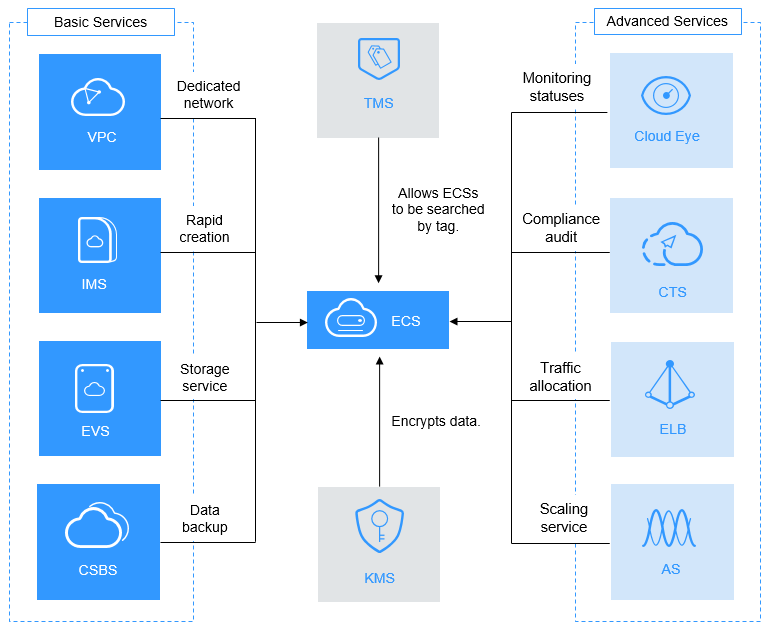

# ECS and Other Services

[Figure 1](#fig0815205719415)  shows the relationships between ECS and other services.

**Figure  1**  Relationships between ECS and other services  

## ECS-related Services

-   Auto Scaling \(AS\)

    Automatically adjusts ECS service resources based on the configured AS policies. This improves resource usage and reduces resource costs.

-   Elastic Load Balancing \(ELB\)

    Automatically distributes traffic to multiple ECSs. This enhances system service and fault tolerance capabilities.

-   Elastic Volume Service \(EVS\)

    Enables you to attach EVS disks to an ECS and expand their capacity.

-   Virtual Private Cloud \(VPC\)

    Enables you to configure internal networks and change network configurations by customizing security groups, VPNs, IP address segments, and bandwidth. This simplifies network management. You can also customize the ECS access rules within a security group and between security groups to improve ECS security.

-   Image Management Service \(IMS\)

    Enables you to create ECSs using images. This improves the efficiency of ECS creation.

-   Cloud Eye

    After obtaining an ECS, you can view ECS statuses on the Cloud Eye management console, without requiring additional plug-ins to be installed. For details about ECS metrics supported by Cloud Eye, see  [Basic ECS Metrics](basic-ecs-metrics.md).

-   Key Management Service \(KMS\)

    The encryption feature relies on KMS. You can use an encrypted image or EVS disks when creating an ECS. In such a case, you are required to use the key provided by KMS to improve data security.

-   Cloud Trace Service \(CTS\)

    Allows you to record ECS-related operations for later query, audit, and backtrack.

-   Cloud Server Backup Service \(CSBS\)

    Protects ECS backups. CSBS backs up all EVS disks of an ECS, including the system disk and data disks, and uses the backup to restore the ECS.

-   Tag Management Service \(TMS\)

    A tag identifies an ECS. Adding tags to an ECS facilitates ECS identification and management.

