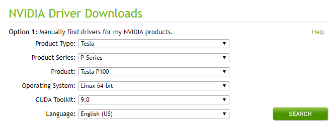

# Installing the NVIDIA GPU Driver and CUDA Toolkit on a P1 ECS<a name="EN-US_TOPIC_0093345963"></a>

## Scenarios<a name="section671317415422"></a>

After a P1 ECS is created, the NVIDIA driver must be installed on it for computing acceleration. For other types of ECSs, determine whether to install a driver according to the notes on using the ECSs in  [ECS Types](ecs-types.md).

The procedure for installing the NVIDIA driver varies according to the OS. For details, see this section.

## Prerequisites<a name="section073732576"></a>

-   The target ECS has had an EIP bound.
-   You have obtained the driver installation package required for an OS. For details, see  [Table 1](#table121731221584).

**Table  1**  NVIDIA drivers

<a name="table121731221584"></a>
<table><thead align="left"><tr id="row1173321281"><th class="cellrowborder" valign="top" width="20%" id="mcps1.2.4.1.1"><p id="p13173621816"><a name="p13173621816"></a><a name="p13173621816"></a>OS</p>
</th>
<th class="cellrowborder" valign="top" width="36%" id="mcps1.2.4.1.2"><p id="p1517317215810"><a name="p1517317215810"></a><a name="p1517317215810"></a>Driver</p>
</th>
<th class="cellrowborder" valign="top" width="44%" id="mcps1.2.4.1.3"><p id="p191731422081"><a name="p191731422081"></a><a name="p191731422081"></a>How to Obtain</p>
</th>
</tr>
</thead>
<tbody><tr id="row111733211812"><td class="cellrowborder" rowspan="2" valign="top" width="20%" headers="mcps1.2.4.1.1 "><p id="p817310213813"><a name="p817310213813"></a><a name="p817310213813"></a>Ubuntu 16.04</p>
</td>
<td class="cellrowborder" valign="top" width="36%" headers="mcps1.2.4.1.2 "><p id="p31731929816"><a name="p31731929816"></a><a name="p31731929816"></a>GPU driver installation package <strong id="b842352706111915"><a name="b842352706111915"></a><a name="b842352706111915"></a>NVIDIA-Linux-x86_64-375.66.run</strong></p>
</td>
<td class="cellrowborder" valign="top" width="44%" headers="mcps1.2.4.1.3 "><p id="p917318216819"><a name="p917318216819"></a><a name="p917318216819"></a><a href="http://www.nvidia.com/download/driverResults.aspx/118955/en-us" target="_blank" rel="noopener noreferrer">http://www.nvidia.com/download/driverResults.aspx/118955/en-us</a></p>
</td>
</tr>
<tr id="row4589124216911"><td class="cellrowborder" valign="top" headers="mcps1.2.4.1.1 "><p id="p859194214910"><a name="p859194214910"></a><a name="p859194214910"></a>CUDA Toolkit installation package <strong id="b842352706111938"><a name="b842352706111938"></a><a name="b842352706111938"></a>cuda_8.0.61_375.26_linux.run</strong></p>
</td>
<td class="cellrowborder" valign="top" headers="mcps1.2.4.1.2 "><p id="p205911142897"><a name="p205911142897"></a><a name="p205911142897"></a><a href="https://developer.nvidia.com/compute/cuda/8.0/Prod2/local_installers/cuda_8.0.61_375.26_linux-run" target="_blank" rel="noopener noreferrer">https://developer.nvidia.com/compute/cuda/8.0/Prod2/local_installers/cuda_8.0.61_375.26_linux-run</a></p>
</td>
</tr>
<tr id="row0173521783"><td class="cellrowborder" rowspan="2" valign="top" width="20%" headers="mcps1.2.4.1.1 "><p id="p16173162288"><a name="p16173162288"></a><a name="p16173162288"></a>CentOS 7.4</p>
</td>
<td class="cellrowborder" valign="top" width="36%" headers="mcps1.2.4.1.2 "><p id="p730815123107"><a name="p730815123107"></a><a name="p730815123107"></a>GPU driver installation package <strong id="b427040171"><a name="b427040171"></a><a name="b427040171"></a>NVIDIA-Linux-x86_64-375.66.run</strong></p>
</td>
<td class="cellrowborder" valign="top" width="44%" headers="mcps1.2.4.1.3 "><p id="p14461202015150"><a name="p14461202015150"></a><a name="p14461202015150"></a><a href="http://www.nvidia.com/download/driverResults.aspx/118955/en-us" target="_blank" rel="noopener noreferrer">http://www.nvidia.com/download/driverResults.aspx/118955/en-us</a></p>
</td>
</tr>
<tr id="row842018532920"><td class="cellrowborder" valign="top" headers="mcps1.2.4.1.1 "><p id="p0308121211107"><a name="p0308121211107"></a><a name="p0308121211107"></a>CUDA Toolkit installation package <strong id="b1857082158"><a name="b1857082158"></a><a name="b1857082158"></a>cuda_8.0.61_375.26_linux.run</strong></p>
</td>
<td class="cellrowborder" valign="top" headers="mcps1.2.4.1.2 "><p id="p2462920141518"><a name="p2462920141518"></a><a name="p2462920141518"></a><a href="https://developer.nvidia.com/compute/cuda/8.0/Prod2/local_installers/cuda_8.0.61_375.26_linux-run" target="_blank" rel="noopener noreferrer">https://developer.nvidia.com/compute/cuda/8.0/Prod2/local_installers/cuda_8.0.61_375.26_linux-run</a></p>
</td>
</tr>
<tr id="row1981748163016"><td class="cellrowborder" rowspan="2" valign="top" width="20%" headers="mcps1.2.4.1.1 "><p id="p13817482306"><a name="p13817482306"></a><a name="p13817482306"></a>Debian 9.0</p>
</td>
<td class="cellrowborder" valign="top" width="36%" headers="mcps1.2.4.1.2 "><p id="p12844883011"><a name="p12844883011"></a><a name="p12844883011"></a>GPU driver installation package <strong id="b301822939"><a name="b301822939"></a><a name="b301822939"></a>NVIDIA-Linux-x86_64-384.81.run</strong></p>
</td>
<td class="cellrowborder" valign="top" width="44%" headers="mcps1.2.4.1.3 "><p id="p2081448153010"><a name="p2081448153010"></a><a name="p2081448153010"></a><a href="http://www.nvidia.com/download/driverResults.aspx/124722/en-us" target="_blank" rel="noopener noreferrer">http://www.nvidia.com/download/driverResults.aspx/124722/en-us</a></p>
</td>
</tr>
<tr id="row1017372982"><td class="cellrowborder" valign="top" headers="mcps1.2.4.1.1 "><p id="p1919002911104"><a name="p1919002911104"></a><a name="p1919002911104"></a>CUDA Toolkit installation package <strong id="b919071598"><a name="b919071598"></a><a name="b919071598"></a>cuda_9.0.176_384.81_linux.run</strong></p>
</td>
<td class="cellrowborder" valign="top" headers="mcps1.2.4.1.2 "><p id="p171735213819"><a name="p171735213819"></a><a name="p171735213819"></a><a href="https://developer.nvidia.com/compute/cuda/9.0/Prod/local_installers/cuda_9.0.176_384.81_linux-run" target="_blank" rel="noopener noreferrer">https://developer.nvidia.com/compute/cuda/9.0/Prod/local_installers/cuda_9.0.176_384.81_linux-run</a></p>
</td>
</tr>
</tbody>
</table>

## Ubuntu 16.04 64bit<a name="section146153428432"></a>

1.  Log in to the target ECS and run the following command to switch to user  **root**:

    **sudo su**

2.  \(Optional\) Install GCC and g++.

    Perform this step only if GCC and g++ have not been installed.

    **apt-get install gcc**

    **apt-get install g++**

    **apt-get install make**

3.  \(Optional\) Disable the Nouveau driver.

    Perform this step if the Nouveau driver has been installed on the target ECS. This prevents conflict with the NVIDIA driver installation.

    1.  Run the following command to check whether the Nouveau driver is running on the target ECS:

        **lsmod | grep nouveau**

        -   If yes, go to  [3.b](#li2691446193813).
        -   If no, go to  [4](#li7971016194610).

    2.  <a name="li2691446193813"></a>Add the following statements to the end of the  **/etc/modprobe.d/blacklist-nouveau.conf**  file \(if the file is unavailable, create one\):

        **blacklist nouveau**

        **options nouveau modeset=0**

    3.  Run the following command to obtain  **initramfs**  again:

        **update-initramfs -u**

    4.  Run the following command to restart the ECS:

        **reboot**

4.  <a name="li7971016194610"></a>\(Optional\) Disable the X service.

    If the ECS has been logged in using the GUI, disable the X service before installing the NVIDIA driver.

    1.  Run the following command to switch to multi-user mode:

        **systemctl set-default multi-user.target**

    2.  Run the following command to restart the ECS:

        **reboot**

5.  \(Optional\) Install the GPU driver.

    You can either use the GPU driver provided in the CUDA Toolkit installation package or download the required GPU driver. Unless otherwise specified, you are advised to install GPU driver  **NVIDIA-Linux-x86\_64-375.66.run**  provided in  [Prerequisites](#section073732576), which has been fully verified.

    The following section describes general operations for downloading and installing the GPU driver.

    1.  Upload the GPU driver installation package  **NVIDIA-Linux-x86\_64-_xxx.yy_.run**  to the  **/tmp**  directory on the ECS.

        To download the GPU driver, log in at  [http://www.nvidia.com/Download/index.aspx?lang=en](http://www.nvidia.com/Download/index.aspx?lang=en).

        **Figure  1**  Downloading the GPU driver<a name="fig3284155103612"></a>  
        

    2.  Run the following command to install the GPU driver:

        **sh ./NVIDIA-Linux-x86\_64-_xxx.yy_.run**

    3.  Run the following command to delete the installation package:

        **rm -f NVIDIA-Linux-x86\_64-_xxx.yy_.run**

6.  Install the CUDA Toolkit.

    Unless otherwise specified, you are advised to install CUDA Toolkit  **cuda\_8.0.61\_375.26\_linux.run**  provided in  [Prerequisites](#section073732576), which has been fully verified.

    The following section describes general operations for downloading and installing the CUDA Toolkit.

    1.  Upload the CUDA Toolkit installation package  **cuda\__a.b.cc_\__xxx.yy_\_linux.run**  to the  **/tmp**  directory on the ECS.

        To download the CUDA Toolkit, log in at  [https://developer.nvidia.com/cuda-downloads](https://developer.nvidia.com/cuda-downloads).

    2.  Run the following command to change the permission:

        **chmod +x cuda\_**_a.b.cc_**\_**_xxx.yy_**\_linux.run**

    3.  Run the following command to install the CUDA Toolkit:

        **./cuda\_**_a.b.cc_**\_**_xxx.yy_**\_linux.run -toolkit -samples -silent -override --tmpdir=/tmp/**

    4.  Run the following command to delete the installation package:

        **rm -f cuda\_**_a.b.cc_**\_**_xxx.yy_**\_linux.run**

    5.  Run the following commands to check whether the installation is successful:

        **cd /usr/local/cuda/samples/1\_Utilities/deviceQueryDrv/**

        **make**

        **./deviceQueryDrv**

        If the terminal display contains "Result = PASS", both CUDA Toolkit and GPU driver have been installed.

        ```
        ./deviceQueryDrv Starting...  
           
         CUDA Device Query (Driver API) statically linked version   
         Detected 1 CUDA Capable device(s)  
           
         Device 0: "Tesla P100-PCIE-16GB"  
           CUDA Driver Version:                           8.0  
           CUDA Capability Major/Minor version number:    6.0  
           Total amount of global memory:                 16276 MBytes (17066885120 bytes)  
           (56) Multiprocessors, ( 64) CUDA Cores/MP:     3584 CUDA Cores  
           GPU Max Clock rate:                            1329 MHz (1.33 GHz)  
           Memory Clock rate:                             715 Mhz  
           Memory Bus Width:                              4096-bit  
           L2 Cache Size:                                 4194304 bytes  
           Max Texture Dimension Sizes                    1D=(131072) 2D=(131072, 65536) 3D=(16384, 16384, 16384)  
           Maximum Layered 1D Texture Size, (num) layers  1D=(32768), 2048 layers  
           Maximum Layered 2D Texture Size, (num) layers  2D=(32768, 32768), 2048 layers  
           Total amount of constant memory:               65536 bytes  
           Total amount of shared memory per block:       49152 bytes  
           Total number of registers available per block: 65536  
           Warp size:                                     32  
           Maximum number of threads per multiprocessor:  2048  
           Maximum number of threads per block:           1024  
           Max dimension size of a thread block (x,y,z): (1024, 1024, 64)  
           Max dimension size of a grid size (x,y,z):    (2147483647, 65535, 65535)  
           Texture alignment:                             512 bytes  
           Maximum memory pitch:                          2147483647 bytes  
           Concurrent copy and kernel execution:          Yes with 2 copy engine(s)  
           Run time limit on kernels:                     No  
           Integrated GPU sharing Host Memory:            No  
           Support host page-locked memory mapping:       Yes  
           Concurrent kernel execution:                   Yes  
           Alignment requirement for Surfaces:            Yes  
           Device has ECC support:                        Enabled  
           Device supports Unified Addressing (UVA):      Yes  
           Device PCI Domain ID / Bus ID / location ID:   0 / 0 / 6  
           Compute Mode:  
              < Default (multiple host threads can use ::cudaSetDevice() with device simultaneously) >  
         Result = PASS 
        ```


## **CentOS 7.4**<a name="section13319930135015"></a>

1.  Log in to the target ECS and run the following command to switch to user  **root**:

    **sudo su**

2.  \(Optional\) Install GCC, g++, and kernel-devel.

    Perform this step only if GCC, g++, and kernel-devel have not been installed.

    **yum install gcc**

    **yum install gcc-c++**

    **yum install make**

    **yum install kernel-devel-\`uname -r\`**

3.  \(Optional\) Disable the Nouveau driver.

    Perform this step if the Nouveau driver has been installed on the target ECS. This prevents conflict with the NVIDIA driver installation.

    1.  Run the following command to check whether the Nouveau driver is running on the target ECS:

        **lsmod | grep nouveau**

        -   If yes, go to  [3.b](#li148971530135015).
        -   If no, go to  [4](#li19897103019507).

    2.  <a name="li148971530135015"></a>Add the following statements to the end of the  **/etc/modprobe.d/blacklist-nouveau.conf**  file \(if the file is unavailable, create one\):

        **blacklist nouveau**

        **options nouveau modeset=0**

    3.  Run the following command to obtain  **initramfs**  again:

        **dracut --force**

    4.  Run the following command to restart the ECS:

        **reboot**

4.  <a name="li19897103019507"></a>\(Optional\) Disable the X service.

    If the ECS has been logged in using the GUI, disable the X service before installing the NVIDIA driver.

    1.  Run the following command to switch to multi-user mode:

        **systemctl set-default multi-user.target**

    2.  Run the following command to restart the ECS:

        **reboot**

5.  \(Optional\) Install the GPU driver.

    You can either use the GPU driver provided in the CUDA Toolkit installation package or download the required GPU driver. Unless otherwise specified, you are advised to install GPU driver  **NVIDIA-Linux-x86\_64-375.66.run**  provided in  [Prerequisites](installing-the-nvidia-gpu-driver-and-cuda-toolkit-on-a-p1-ecs.md#section073732576), which has been fully verified.

    The following section describes general operations for downloading and installing the GPU driver.

    1.  Upload the GPU driver installation package  **NVIDIA-Linux-x86\_64-_xxx.yy_.run**  to the  **/tmp**  directory on the ECS.

        To download the GPU driver, log in at  [http://www.nvidia.com/Download/index.aspx?lang=en](http://www.nvidia.com/Download/index.aspx?lang=en).

        **Figure  2**  Downloading the GPU driver<a name="en-us_topic_0093345963_fig3284155103612"></a>  
        

    2.  Run the following command to install the GPU driver:

        **sh ./NVIDIA-Linux-x86\_64-_xxx.yy_.run**

    3.  Run the following command to delete the installation package:

        **rm -f NVIDIA-Linux-x86\_64-_xxx.yy_.run**

6.  Install the CUDA Toolkit.

    Unless otherwise specified, you are advised to install CUDA Toolkit  **cuda\_8.0.61\_375.26\_linux.run**  provided in  [Prerequisites](installing-the-nvidia-gpu-driver-and-cuda-toolkit-on-a-p1-ecs.md#section073732576), which has been fully verified.

    The following section describes general operations for downloading and installing the CUDA Toolkit.

    1.  Upload the CUDA Toolkit installation package  **cuda\__a.b.cc_\__xxx.yy_\_linux.run**  to the  **/tmp**  directory on the ECS.

        To download the CUDA Toolkit, log in at  [https://developer.nvidia.com/cuda-downloads](https://developer.nvidia.com/cuda-downloads).

    2.  Run the following command to change the permission:

        **chmod +x cuda\_**_a.b.cc_**\_**_xxx.yy_**\_linux.run**

    3.  Run the following command to install the CUDA Toolkit:

        **./cuda\_**_a.b.cc_**\_**_xxx.yy_**\_linux.run -toolkit -samples -silent -override --tmpdir=/tmp/**

    4.  Run the following command to delete the installation package:

        **rm -f cuda\_**_a.b.cc_**\_**_xxx.yy_**\_linux.run**

    5.  Run the following commands to check whether the installation is successful:

        **cd /usr/local/cuda/samples/1\_Utilities/deviceQueryDrv/**

        **make**

        **./deviceQueryDrv**

        If the terminal display contains "Result = PASS", both CUDA Toolkit and GPU driver have been installed.

        ```
        ./deviceQueryDrv Starting...  
           
         CUDA Device Query (Driver API) statically linked version   
         Detected 1 CUDA Capable device(s)  
           
         Device 0: "Tesla P100-PCIE-16GB"  
           CUDA Driver Version:                           8.0  
           CUDA Capability Major/Minor version number:    6.0  
           Total amount of global memory:                 16276 MBytes (17066885120 bytes)  
           (56) Multiprocessors, ( 64) CUDA Cores/MP:     3584 CUDA Cores  
           GPU Max Clock rate:                            1329 MHz (1.33 GHz)  
           Memory Clock rate:                             715 Mhz  
           Memory Bus Width:                              4096-bit  
           L2 Cache Size:                                 4194304 bytes  
           Max Texture Dimension Sizes                    1D=(131072) 2D=(131072, 65536) 3D=(16384, 16384, 16384)  
           Maximum Layered 1D Texture Size, (num) layers  1D=(32768), 2048 layers  
           Maximum Layered 2D Texture Size, (num) layers  2D=(32768, 32768), 2048 layers  
           Total amount of constant memory:               65536 bytes  
           Total amount of shared memory per block:       49152 bytes  
           Total number of registers available per block: 65536  
           Warp size:                                     32  
           Maximum number of threads per multiprocessor:  2048  
           Maximum number of threads per block:           1024  
           Max dimension size of a thread block (x,y,z): (1024, 1024, 64)  
           Max dimension size of a grid size (x,y,z):    (2147483647, 65535, 65535)  
           Texture alignment:                             512 bytes  
           Maximum memory pitch:                          2147483647 bytes  
           Concurrent copy and kernel execution:          Yes with 2 copy engine(s)  
           Run time limit on kernels:                     No  
           Integrated GPU sharing Host Memory:            No  
           Support host page-locked memory mapping:       Yes  
           Concurrent kernel execution:                   Yes  
           Alignment requirement for Surfaces:            Yes  
           Device has ECC support:                        Enabled  
           Device supports Unified Addressing (UVA):      Yes  
           Device PCI Domain ID / Bus ID / location ID:   0 / 0 / 6  
           Compute Mode:  
              < Default (multiple host threads can use ::cudaSetDevice() with device simultaneously) >  
         Result = PASS 
        ```


## **Debian 9.0**<a name="section1886718234515"></a>

1.  Log in to the target ECS and run the following command to switch to user  **root**:

    **sudo su**

2.  \(Optional\) Install the dependency software GCC and g++ of the NVIDIA driver.

    Perform this step only if GCC and g++ have not been installed.

    **apt-get install gcc**

    **apt-get install g++**

    **apt-get install make**

    **apt-get install linux-headers-$\(uname -r\)**

3.  \(Optional\) Disable the Nouveau driver.

    Perform this step if the Nouveau driver has been installed on the target ECS. This prevents conflict with the NVIDIA driver installation.

    1.  Run the following command to check whether the Nouveau driver is running on the target ECS:

        **lsmod | grep nouveau**

        -   If yes, go to  [3.b](#li7897183095011).
        -   If no, go to  [4](#li128971930115019).

    2.  <a name="li7897183095011"></a>Add the following statements to the end of the  **/etc/modprobe.d/blacklist-nouveau.conf**  file \(if the file is unavailable, create one\):

        **blacklist nouveau**

        **options nouveau modeset=0**

    3.  Run the following command to obtain  **initramfs**  again:

        **update-initramfs -u**

    4.  Run the following command to restart the ECS:

        **reboot**

4.  <a name="li128971930115019"></a>\(Optional\) Disable the X service.

    If the ECS has been logged in using the GUI, disable the X service before installing the NVIDIA driver.

    1.  Run the following command to switch to multi-user mode:

        **systemctl set-default multi-user.target**

    2.  Run the following command to restart the ECS:

        **reboot**

5.  \(Optional\) Install the GPU driver.

    You can either use the GPU driver provided in the CUDA Toolkit installation package or download the required GPU driver. Unless otherwise specified, you are advised to install GPU driver  **NVIDIA-Linux-x86\_64-384.81.run**  provided in  [Prerequisites](installing-the-nvidia-gpu-driver-and-cuda-toolkit-on-a-p1-ecs.md#section073732576), which has been fully verified.

    The following section describes general operations for downloading and installing the GPU driver.

    1.  Upload the GPU driver installation package  **NVIDIA-Linux-x86\_64-_xxx.yy_.run**  to the  **/tmp**  directory on the ECS.

        To download the GPU driver, log in at  [http://www.nvidia.com/Download/index.aspx?lang=en](http://www.nvidia.com/Download/index.aspx?lang=en).

        **Figure  3**  Downloading the GPU driver<a name="fig12897930155013"></a>  
        

    2.  Run the following command to install the GPU driver:

        **sh ./NVIDIA-Linux-x86\_64-_xxx.yy_.run**

    3.  Run the following command to delete the installation package:

        **rm -f NVIDIA-Linux-x86\_64-_xxx.yy_.run**

6.  Install the CUDA Toolkit.

    The CUDA Toolkit version required by Debian 9.0 GCC must be 9.0 or later. Unless otherwise specified, you are advised to install CUDA Toolkit  **cuda\_9.0.176\_384.81\_linux.run**  provided in  [Prerequisites](#section073732576), which has been fully verified.

    The following section describes general operations for downloading and installing the CUDA Toolkit.

    1.  Upload the CUDA Toolkit installation package  **cuda\__a.b.cc_\__xxx.yy_\_linux.run**  to the  **/tmp**  directory on the ECS.

        To download the CUDA Toolkit, log in at  [https://developer.nvidia.com/cuda-downloads](https://developer.nvidia.com/cuda-downloads).

    2.  Run the following command to change the permission:

        **chmod +x cuda\_**_a.b.cc_**\_**_xxx.yy_**\_linux.run**

    3.  Run the following command to install the CUDA Toolkit:

        **./cuda\_**_a.b.cc_**\_**_xxx.yy_**\_linux.run -toolkit -samples -silent -override --tmpdir=/tmp/**

    4.  Run the following command to delete the installation package:

        **rm -f cuda\_**_a.b.cc_**\_**_xxx.yy_**\_linux.run**

    5.  Run the following commands to check whether the installation is successful:

        **cd /usr/local/cuda/samples/1\_Utilities/deviceQueryDrv/**

        **make**

        **./deviceQueryDrv**

        If the terminal display contains "Result = PASS", both CUDA Toolkit and GPU driver have been installed.

        ```
        ./deviceQueryDrv Starting...
         
        CUDA Device Query (Driver API) statically linked version 
        Detected 1 CUDA Capable device(s)
         
        Device 0: "Tesla P100-PCIE-16GB"
          CUDA Driver Version:                           9.0
          CUDA Capability Major/Minor version number:    6.0
          Total amount of global memory:                 16276 MBytes (17066885120 bytes)
          (56) Multiprocessors, ( 64) CUDA Cores/MP:     3584 CUDA Cores
          GPU Max Clock rate:                            1329 MHz (1.33 GHz)
          Memory Clock rate:                             715 Mhz
          Memory Bus Width:                              4096-bit
          L2 Cache Size:                                 4194304 bytes
          Max Texture Dimension Sizes                    1D=(131072) 2D=(131072, 65536) 3D=(16384, 16384, 16384)
          Maximum Layered 1D Texture Size, (num) layers  1D=(32768), 2048 layers
          Maximum Layered 2D Texture Size, (num) layers  2D=(32768, 32768), 2048 layers
          Total amount of constant memory:               65536 bytes
          Total amount of shared memory per block:       49152 bytes
          Total number of registers available per block: 65536
          Warp size:                                     32
          Maximum number of threads per multiprocessor:  2048
          Maximum number of threads per block:           1024
          Max dimension size of a thread block (x,y,z): (1024, 1024, 64)
          Max dimension size of a grid size (x,y,z):    (2147483647, 65535, 65535)
          Texture alignment:                             512 bytes
          Maximum memory pitch:                          2147483647 bytes
          Concurrent copy and kernel execution:          Yes with 2 copy engine(s)
          Run time limit on kernels:                     No
          Integrated GPU sharing Host Memory:            No
          Support host page-locked memory mapping:       Yes
          Concurrent kernel execution:                   Yes
          Alignment requirement for Surfaces:            Yes
          Device has ECC support:                        Enabled
          Device supports Unified Addressing (UVA):      Yes
          Supports Cooperative Kernel Launch:            Yes
          Supports MultiDevice Co-op Kernel Launch:      Yes
          Device PCI Domain ID / Bus ID / location ID:   0 / 0 / 6
          Compute Mode:
             < Default (multiple host threads can use ::cudaSetDevice() with device simultaneously) >
        Result = PASS
        ```


