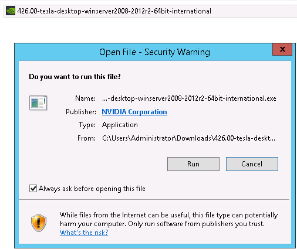
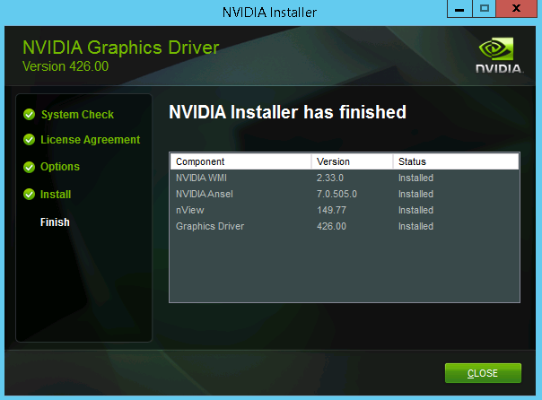
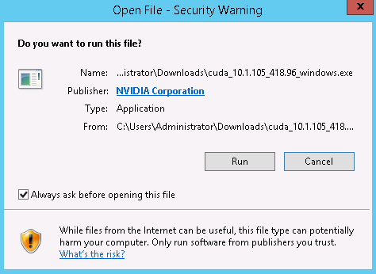
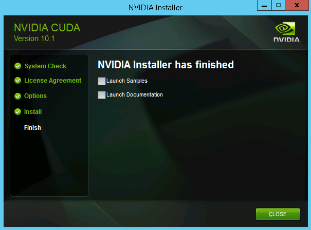

# Installing the NVIDIA GPU Driver and CUDA Toolkit on a P2v ECS<a name="EN-US_TOPIC_0149470468"></a>

## Scenarios<a name="section11831857193910"></a>

When using a GPU-accelerated ECS, make sure that the desired GPU driver and CUDA toolkit have been installed on the ECS. Otherwise, computing acceleration will not take effect. This section describes how to install the NVIDIA GPU driver and CUDA toolkit on a P2v ECS.

## Notes<a name="section14189185733910"></a>

-   The target ECS has had an EIP bound.
-   The GPU driver and CUDA toolkit have not been installed on the ECS.

> **NOTE:**   
>-   Download the CUDA toolkit from the official NVIDIA website and install it. A NVIDIA GPU driver matching the CUDA version will be automatically installed then.  
>-   If the target ECS is to be used for production, download the desired NVIDIA GPU driver from the official NVIDIA website and install it. Then, install the CUDA toolkit.  
>-   If the NVIDIA GPU driver has been installed on the ECS, check the driver version. If a new driver version is required, uninstall the original NVIDIA GPU driver to prevent an installation failure due to driver conflicts.  

Installation process:

-   [Obtaining a NVIDIA GPU Driver and CUDA Toolkit](obtaining-a-nvidia-gpu-driver-and-cuda-toolkit.md)
-   Installing the NVIDIA GPU Driver
    -   [Installing the NVIDIA GPU Driver on a Linux ECS](#section1728514576397)
    -   [Installing the NVIDIA GPU Driver on a Windows ECS](#section244363219171)

-   Installing the CUDA Toolkit
    -   [Installing the CUDA Toolkit on a Linux ECS](#section1034245773916)
    -   [Installing the CUDA Toolkit on a Windows ECS](#section0337133719497)


## Installing the NVIDIA GPU Driver on a Linux ECS<a name="section1728514576397"></a>

The following uses Ubuntu 16.04 64bit as an example to describe how to install the NVIDIA GPU driver matching CUDA 10.1 on a P2v ECS.

> **NOTE:**   
>The Linux kernel version is compatible with the driver version. If installing the driver failed, check the driver installation log, which is generally stored in  **/var/log/nvidia-installer.log**. If the log shows that the failure was caused by a driver compilation error, for example, the  **get\_user\_pages**  parameter setting is incorrect, the kernel version is incompatible with the driver version. In such a case, select the desired kernel version and driver version and reinstall them. It is recommended that the release time of the kernel version and driver version be the same.  

1.  Log in to the ECS.
2.  Update the system software based on the OS.
    -   Ubuntu

        Update the software installation source:  **apt-get -y update**

        Install necessary programs:  **apt-get install gcc g++ make**

    -   CentOS

        Update the kernel version:  **yum install kernel-devel-\`uname -r\`**

        Update the software installation source:  **yum -y update --exclude=kernel\* --exclude=centos-release\* --exclude=initscripts\***

        Install necessary programs:  **yum install -y gcc gcc-c++**

3.  Download the NVIDIA driver package.

    Select a driver version at  [NVIDIA Driver Downloads](https://www.nvidia.com/Download/index.aspx?lang=en-us)  based on the ECS type.

    **Figure  1**  Selecting a NVIDIA driver version<a name="fig545554125711"></a>  
    

4.  Click  **SEARCH**. On the  **TESLA DRIVER FOR LINUX X64**  page that is displayed, click  **DOWNLOAD**.
5.  Click  **Skip & Continue to Download**  to switch to the download page.

    **Figure  2**  Download page<a name="fig637441715578"></a>  
    

6.  Copy the download link.

    **Figure  3**  Copying the download link<a name="fig123801538205720"></a>  
    

7.  Run the following command on the ECS to download the driver:

    **wget** _Copied link_

    For example,  **wget http://us.download.nvidia.com/tesla/418.87/NVIDIA-Linux-x86\_64-418.87.00.run**

    **Figure  4**  Obtaining the installation package<a name="fig187219205141"></a>  
    

8.  Run the following command to install the driver:

    **sh NVIDIA-Linux-x86\_64-418.87.00.run**

9.  \(Optional\) If the following information is displayed after the command for installing the driver is executed, disable the Nouveau driver.

    **Figure  5**  Disabling the Nouveau driver<a name="fig2682182345814"></a>  
    

    1.  Run the following command to check whether the Nouveau driver has been installed:

        **lsmod | grep nouveau**

        -   If the command output contains information about the Nouveau driver, the Nouveau driver has been installed. Then, go to step  [9.b](#li073251517124).
        -   If the command output does not contain information about the Nouveau driver, the Nouveau driver has not been installed. Then, go to step  [9.d](#li9819105753916).

    2.  <a name="li073251517124"></a>Edit the  **blacklist.conf**  file.

        If the  **/etc/modprobe.d/blacklist.conf**  file is unavailable, create it.

        **vi /etc/modprobe.d/blacklist.conf**

        Add the following statement to the end of the file:

        ```
        blacklist nouveau
        options nouveau modeset=0
        ```

    1.  Run the following command to back up and create an initramfs application:
        -   Ubuntu

            **sudo update-initramfs –u**

        -   CentOS:

            **mv /boot/initramfs-$\(uname -r\).img /boot/initramfs-$\(uname -r\).img.bak**

            **dracut -v /boot/initramfs-$\(uname -r\).img $\(uname -r\)**


    1.  <a name="li9819105753916"></a>Restart the ECS.

        **reboot**

10. Select  **OK**  for three consecutive times as prompted to complete the driver installation.

    **Figure  6**  Completing the NVIDIA driver installation<a name="fig1643713142594"></a>  
    

11. Run the following command to set systemd:

    **systemctl set-default multi-user.target**

12. Run the  **reboot**  command to restart the ECS.
13. Log in to the ECS and run the  **nvidia-smi**  command. If the command output contains the installed driver version, the driver has been installed.

    **Figure  7**  Viewing the NVIDIA driver version<a name="fig61971535809"></a>  
    


## Installing the NVIDIA GPU Driver on a Windows ECS<a name="section244363219171"></a>

The following uses Windows Server 2012 R2 Standard 64bit as an example to describe how to install the NVIDIA GPU driver matching CUDA 10.1 on a P2v ECS.

1.  Log in to the ECS.
2.  Download the NVIDIA driver package.

    Select a driver version at  [NVIDIA Driver Downloads](https://www.nvidia.com/Download/index.aspx?lang=en-us)  based on the ECS type.

    **Figure  8**  Selecting a NVIDIA driver version<a name="fig62897581106"></a>  
    

3.  Click  **SEARCH**. On the  **TESLA DRIVER FOR LINUX X64**  page that is displayed, click  **DOWNLOAD**.
4.  Click  **Skip & Continue to Download**  to switch to the download page.

    **Figure  9**  Download<a name="fig1531141918119"></a>  
    

5.  Click  **Agree & Download**  to download the installation package.

    **Figure  10**  Downloading the driver installation package<a name="fig37451434818"></a>  
    

6.  Double-click the driver and click  **Run**.

    **Figure  11**  Running the NVIDIA driver installation program<a name="fig177611624821"></a>  
    

7.  Select an installation path and click  **OK**.

    **Figure  12**  Selecting an installation path<a name="fig1378440121"></a>  
    

8.  Install the NVIDIA program as prompted.

    **Figure  13**  Completing the driver installation<a name="fig46181053128"></a>  
    

9.  Restart the ECS.
10. Check whether the NVIDIA driver has been installed.
    1.  Switch to  **Device Manager**  and click  **Display adapters**.

        **Figure  14**  Display adapters<a name="fig8540781030"></a>  
        

    1.  Open the cmd window of the ECS and run the following commands:

        **cd C:\\Program Files\\NVIDIA Corporation\\NVSMI**

        **nvidia-smi**

        If the command output contains the installed driver version, the driver has been installed.

        **Figure  15**  Viewing the NVIDIA driver version<a name="fig125251621439"></a>  
        


## Installing the CUDA Toolkit on a Linux ECS<a name="section1034245773916"></a>

The following uses Ubuntu 16.04 64bit as an example to describe how to install the CUDA 10.1 toolkit on a P2v ECS.

1.  Log in to the ECS.
2.  On the CUDA download page, set parameters according to the information shown in  [Obtaining a NVIDIA GPU Driver and CUDA Toolkit](obtaining-a-nvidia-gpu-driver-and-cuda-toolkit.md).

    **Figure  16**  Selecting a CUDA version<a name="fig1930101643513"></a>  
    

3.  Find the link for downloading CUDA 10.1 and copy the link.

    **Figure  17**  Copying the link for downloading CUDA<a name="fig970482862918"></a>  
    


1.  Run the following command on the ECS to download the driver:

    **wget** _Copied link_

    For example,  **wget https://developer.nvidia.com/compute/cuda/10.1/Prod/local\_installers/cuda\_10.1.105\_418.39\_linux.run**

    **Figure  18**  Downloading the CUDA installation package<a name="fig8354143184612"></a>  
    


1.  Install CUDA.

    Follow the instructions provided on the official NVIDIA website.

    **Figure  19**  Installation instructions<a name="fig11827757103913"></a>  
    

2.  Run the following command to install CUDA:

    **sh cuda\_10.1.243\_418.87.00\_linux.run**

3.  Select  **accept**  on the installation page and press  **Enter**.

    **Figure  20**  Installing CUDA\_1<a name="fig514958145414"></a>  
    

4.  Select  **Install**  and press  **Enter**  to start the installation.

    **Figure  21**  Installing CUDA\_2<a name="fig20943181255411"></a>  
    

    **Figure  22**  Completing the installation<a name="fig148915619526"></a>  
    

5.  Run the following command to switch to  **/usr/local/cuda-10.1/samples/1\_Utilities/deviceQuery**:

    **cd /usr/local/cuda-10.1/samples/1\_Utilities/deviceQuery**

6.  Run the  **make**  command to automatically compile the deviceQuery program.
7.  Run the following command to check whether CUDA has been installed:

    **./deviceQuery**

    If the command output contains the CUDA version, CUDA has been installed.

    **Figure  23**  deviceQuery common output<a name="fig1282815711392"></a>  
    

8.  Run the following command to enable the persistent mode:

    **sudo nvidia-smi –pm 1**

    Enabling the persistent mode optimizes the GPU performance on Linux ECSs.


## Installing the CUDA Toolkit on a Windows ECS<a name="section0337133719497"></a>

The following uses Windows Server 2012 R2 Standard 64bit as an example to describe how to install the CUDA 10.1 toolkit on a P2v ECS.

1.  Log in to the ECS.
2.  On the CUDA download page, set parameters according to the information shown in  [Downloading the CUDA Toolkit](obtaining-a-nvidia-gpu-driver-and-cuda-toolkit.md#section10203125783920).

    **Figure  24**  Selecting a CUDA version<a name="fig17127316719"></a>  
    

3.  Find the link for downloading CUDA 10.1.

    **Figure  25**  Finding the link for downloading CUDA<a name="fig22798411673"></a>  
    

4.  Click  **Download**  to download the CUDA toolkit.
5.  Double-click the installation file and click  **Run**  to install the CUDA toolkit.

    **Figure  26**  Installing CUDA<a name="fig696324171118"></a>  
    

6.  On the  **CUDA Setup Package**  page, select an installation path and click  **OK**.

    **Figure  27**  Selecting an installation path<a name="fig18644103851215"></a>  
    

7.  Install the CUDA toolkit as prompted.

    **Figure  28**  Completing the installation<a name="fig2266175711165"></a>  
    


1.  Check whether CUDA has been installed

    Open the cmd window and run the following command:

    **nvcc -V**

    If the command output contains the CUDA version, CUDA has been installed.

    **Figure  29**  Successful installation<a name="fig6475101453"></a>  
    


