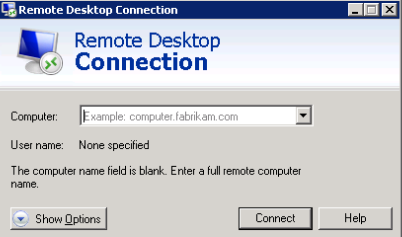
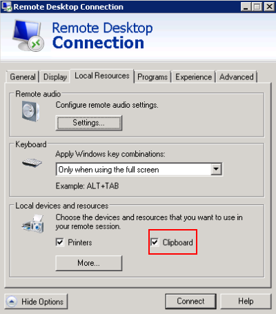
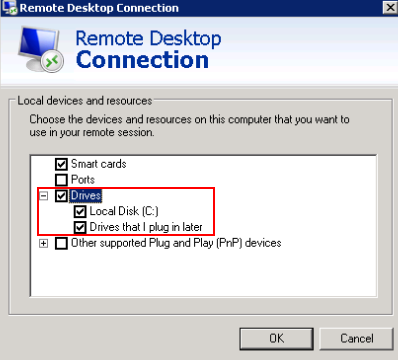
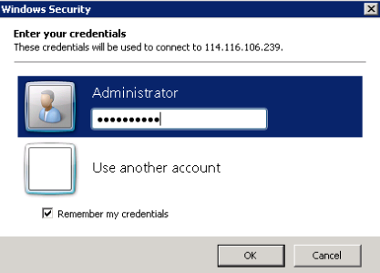

# Login Using MSTSC

## Scenarios

This section describes how to use the remote login tool MSTSC to log in to a Windows ECS from a local computer.

## Prerequisites

-   The target ECS must be in  **Running**  state.
-   You have obtained the password for logging in to the Windows ECS. For details, see  [Obtaining the Password for Logging In to a Windows ECS](obtaining-the-password-for-logging-in-to-a-windows-ecs.md).
-   You have bound an EIP to the ECS. For details, see  [Binding an EIP](binding-an-eip.md).

-   Access to port 3389 is allowed in the inbound direction of the security group to which the ECS belongs. For details, see  [Configuring Security Group Rules](configuring-security-group-rules.md).
-   The network connection between the login tool and the target ECS is normal. For example, the default port 3389 is not blocked by the firewall.
-   Remote Desktop Protocol \(RDP\) has been enabled on the target ECS. By default, RDP has been enabled on the ECSs created using a public image. For instructions about how to enable RDP, see  [Enabling RDP](#section65216898112059).

## Logging In to a Windows ECS Using MSTSC

If your local server runs Windows, you can use the remote desktop connection tool MSTSC delivered with the Windows OS to log in to a Windows ECS.

1.  Click the start menu on the local server.
2.  In the  **Search programs and files**  text box, enter  **mstsc**.
3.  In the  **Remote Desktop Connection**  dialog box, click  **Show Options**.

    **Figure  1**  Show Options  
    

4.  Enter the EIP and username \(**Administrator**  by default\) of the target ECS.

    > **NOTE:**   
    >If you do not want to enter the username and password in follow-up logins, select  **Allow me to save credentials**.  

    **Figure  2**  Remote Desktop Connection  
    

5.  \(Optional\) To use local server resources in a remote session, configure parameters on the  **Local Resources**  tab.
    -   To copy data from the local server to your ECS, select  **Clipboard**.

        **Figure  3**  Clipboard  
        

        -   To copy files from the local server to your ECS, click  **More**  and select  **Drives**  and your desired disks.

            **Figure  4**  Drives  
            

6.  \(Optional\) Click the  **Display**  tab and then adjust the size of the remote desktop.

    **Figure  5**  Adjusting the size of the desktop  
    

7.  Click  **OK**  and enter the login password as prompted to log in to the ECS.

    To ensure system security, change the login password after you log in to the ECS for the first time.

    **Figure  6**  Entering the login password  
    

8.  \(Optional\) After logging in to the ECS using RDP, handle the issue that local files larger than 2 GB cannot be copied to a remote Windows ECS.

    Perform this step only when you need to use RDP clipboard. This issue occurs due to Windows OS limitations. For details about the handling method, see  [https://support.microsoft.com/en-us/help/2258090/copying-files-larger-than-2-gb-over-a-remote-desktop-services-or-terminal-services-session-by-using-clipboard-redirection-copy-and-paste-fails-silently](https://support.microsoft.com/en-us/help/2258090/copying-files-larger-than-2-gb-over-a-remote-desktop-services-or-terminal-services-session-by-using-clipboard-redirection-copy-and-paste-fails-silently).

## Enabling RDP

When you log in to an ECS for the first time, log in to it using VNC, enable RDP, and access the ECS using MSTSC.

> **NOTE:**   
>By default, RDP has been enabled on the ECSs created using a public image.  

1.  Log in to the Windows ECS using VNC.

    For details, see  [Login Using VNC](login-using-vnc-(windows).md).

2.  Click  **Start**  in the task bar and choose  **Control Panel**  \>  **System and Security**  \>  **System**  \>  **Remote settings**.

    The  **System Properties**  dialog box is displayed.

    **Figure  7**  System Properties  
    

3.  Click the  **Remote**  tab and select  **Allow connections from computers running any version of Remote Desktop \(less secure\)**.
4.  Click  **OK**.

