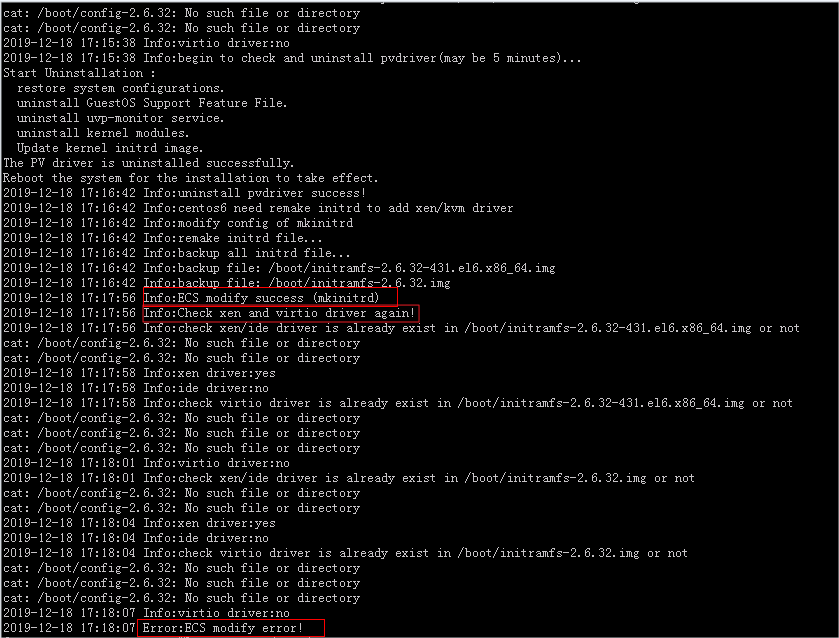

# What Should I Do If Executing a Driver Installation Script Failed When I Attempted to Modify the Specifications of a Linux ECS?<a name="EN-US_TOPIC_0214940104"></a>

## Symptom<a name="section45121128122919"></a>

A script was used to automatically install drivers on a Linux ECS during ECS specifications modification.

During the installation, the following information is displayed, indicating that the script has been executed. However, the installation check failed. The possible cause is that certain drivers were not installed on the ECS.

```
...
Info:ECS modify success (mkinitrd)
Info:Check xen and virtio driver again!
...
Error:ECS modify error!
```

**Figure  1**  Successful driver installation with a failed installation check<a name="fig13439403221"></a>  


## Solution<a name="section18684174110291"></a>

Check whether the desired drivers have been successfully installed by following the instructions provided in "Check Whether the ECS Has Been Configured" in  [Manually Changing a Xen ECS to a KVM ECS \(Linux\)](manually-changing-a-xen-ecs-to-a-kvm-ecs-(linux).md).

If the drivers failed to install, the script may not match the ECS OS. In such a case, manually install the drivers on the Linux ECS by following the instructions provided in  [Manually Changing a Xen ECS to a KVM ECS \(Linux\)](manually-changing-a-xen-ecs-to-a-kvm-ecs-(linux).md).

Certain Linux ECSs do not have the virtio\_scsi driver installed because the kernel version is too early or the kernel has been modified. Such ECSs cannot be attached with SCSI disks. However, this issue will not affect the ECS specifications modification from Xen to KVM. If the ECSs do not use SCSI disks, you can still modify their specifications without the virtio\_scsi driver.

