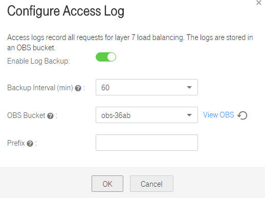

# Access Log

Access logs record HTTP and HTTPS requests for layer-7 load balancing. Only public network classic load balancers have access logs, and these logs are stored in an OBS bucket.

Before configuring access logs, you need to have created a load balancer and have an OBS bucket available when you configure access logs. For details about how to create an OBS bucket, see section "Creating a Bucket" in the  _Object Storage Service User Guide_.

1.  Grant read and write permissions to the ELB administrator.
    1.  Log in to the management console. On the  **Object Storage Service**  page, click the name of the target bucket.
    2.  In the navigation pane on the left, choose  **Permissions**.
    3.  On the displayed page, click  **ACL**.
    4.  Click  **Add**  and set the parameters.

        **Table  1**  Parameter description

        <table><thead align="left"><tr id="row688153202311"><th class="cellrowborder" valign="top" width="23.56%" id="mcps1.2.4.1.1">
<strong id="b842352706114331">Parameter</strong>

        </th>
        <th class="cellrowborder" valign="top" width="47.81%" id="mcps1.2.4.1.2">
<strong id="b8423527061772">Description</strong>

        </th>
        <th class="cellrowborder" valign="top" width="28.63%" id="mcps1.2.4.1.3">
<strong id="b842352706185219">Example Value</strong>

        </th>
        </tr>
        </thead>
        <tbody><tr id="row208811311236"><td class="cellrowborder" valign="top" width="23.56%" headers="mcps1.2.4.1.1 ">
Account

        </td>
        <td class="cellrowborder" valign="top" width="47.81%" headers="mcps1.2.4.1.2 ">
Specifies the domain ID of the ELB administrator.

        </td>
        <td class="cellrowborder" valign="top" width="28.63%" headers="mcps1.2.4.1.3 ">
N/A

        </td>
        </tr>
        <tr id="row3881530237"><td class="cellrowborder" valign="top" width="23.56%" headers="mcps1.2.4.1.1 ">
Bucket Access

        </td>
        <td class="cellrowborder" valign="top" width="47.81%" headers="mcps1.2.4.1.2 ">
Specifies the permissions to read data from or write data to an OBS bucket.

        </td>
        <td class="cellrowborder" valign="top" width="28.63%" headers="mcps1.2.4.1.3 ">
Read/Write

        </td>
        </tr>
        <tr id="row4881733231"><td class="cellrowborder" valign="top" width="23.56%" headers="mcps1.2.4.1.1 ">
Permission Access

        </td>
        <td class="cellrowborder" valign="top" width="47.81%" headers="mcps1.2.4.1.2 ">
Specifies the assigned read and write permissions.

        </td>
        <td class="cellrowborder" valign="top" width="28.63%" headers="mcps1.2.4.1.3 ">
Read/Write

        </td>
        </tr>
        </tbody>
        </table>

    5.  Click  **Save**.
2.  Associate OBS with ELB.
    1.  On the  **Elastic Load Balance** page, locate the row that contains the target load balancer and click **More** in the **Operation**  column.
    2.  Select  **Configure Access Log**.
    3.  In the displayed dialog box, enable log backup.
    4.  Select an OBS bucket and configure log information.

        **Figure  1**  Configuring access logs
        

        **Table  2**  Parameter description

        <table><thead align="left"><tr id="row089593132313"><th class="cellrowborder" valign="top" width="26.94269426942694%" id="mcps1.2.4.1.1">
<strong id="b842352706114331_1">Parameter</strong>

        </th>
        <th class="cellrowborder" valign="top" width="47.24472447244724%" id="mcps1.2.4.1.2">
<strong id="b8423527061772_1">Description</strong>

        </th>
        <th class="cellrowborder" valign="top" width="25.81258125812581%" id="mcps1.2.4.1.3">
<strong id="b842352706194150">Example Value</strong>

        </th>
        </tr>
        </thead>
        <tbody><tr id="row1489583132317"><td class="cellrowborder" valign="top" width="26.94269426942694%" headers="mcps1.2.4.1.1 ">
Backup Interval

        </td>
        <td class="cellrowborder" valign="top" width="47.24472447244724%" headers="mcps1.2.4.1.2 ">
Log backup interval, which is 60 minutes by default.

        </td>
        <td class="cellrowborder" valign="top" width="25.81258125812581%" headers="mcps1.2.4.1.3 ">
60 minutes

        </td>
        </tr>
        <tr id="row10895139239"><td class="cellrowborder" valign="top" width="26.94269426942694%" headers="mcps1.2.4.1.1 ">
OBS Bucket

        </td>
        <td class="cellrowborder" valign="top" width="47.24472447244724%" headers="mcps1.2.4.1.2 ">
OBS bucket with read and write permissions

        </td>
        <td class="cellrowborder" valign="top" width="25.81258125812581%" headers="mcps1.2.4.1.3 ">
obs01

        </td>
        </tr>
        <tr id="row389593132313"><td class="cellrowborder" valign="top" width="26.94269426942694%" headers="mcps1.2.4.1.1 ">
Prefix

        </td>
        <td class="cellrowborder" valign="top" width="47.24472447244724%" headers="mcps1.2.4.1.2 ">
Log storage directory, which is the root directory of the OBS bucket

        </td>
        <td class="cellrowborder" valign="top" width="25.81258125812581%" headers="mcps1.2.4.1.3 ">
log01

        </td>
        </tr>
        </tbody>
        </table>

