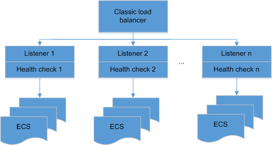

# Classic Load Balancer

-   Load balancer

    A load balancer serves as a single point of contact for clients. It receives incoming traffic from clients and routes requests to its backend ECSs in one or more Availability Zones \(AZs\). It also monitors the health of backend ECSs and ensures that it routes the traffic only to healthy ECSs. To use ELB, you must first create a load balancer and add at least one listener and backend ECS to the load balancer.

-   Listener

    A listener checks for connection requests. It is configured with a protocol and port number for connections from clients to the load balancer and a protocol and port number for connections from the load balancer to backend ECSs. A listener also defines the load balancing algorithm and forwarding policy.

-   Backend ECS

    A backend ECS is a server that receives requests routed by the load balancer. The following figure shows how a classic load balancer works. After the load balancer receives the requests from clients, the associated listener forwards the requests to backend ECSs according to the configured forwarding policy and load balancing algorithm.

    **Figure  1**  Architecture of classic load balancers
    

