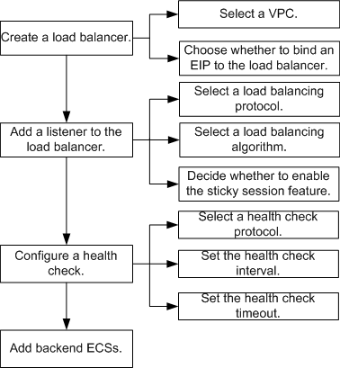

# Configuration Process

To distribute traffic to multiple backend ECSs, you need to create a load balancer, add a listener to the load balancer, configure a health check, and add ECSs to the listener.

[Figure 1](#fig376785516026)  shows the configuration process.

**Figure  1**  Configuration flowchart

