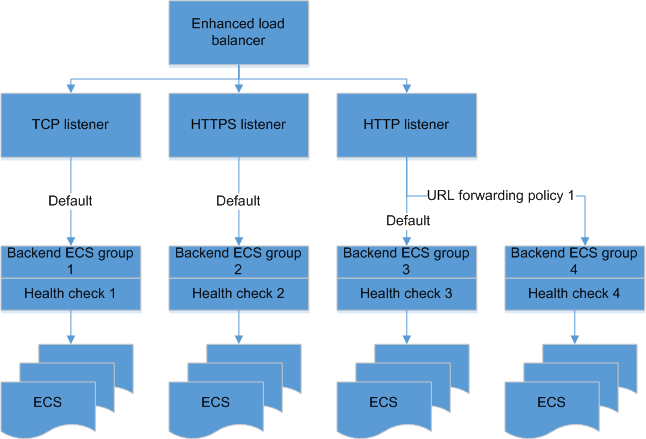

# Enhanced Load Balancer

-   Load balancer

    A load balancer serves as a single point of contact for clients. It receives incoming traffic from clients and routes requests to its backend ECSs in one or more AZs. It also monitors the health of backend ECSs and ensures that it routes the traffic only to healthy ECSs. To use ELB, you must first create a load balancer and add at least one listener and two backend ECSs.

-   Listener

    A listener checks requests from clients and forwards the requests to ECSs in a specific backend ECS group according to the configured forwarding policy. An HTTPS listener can also route the requests to different backend ECS groups according to the configured URL forwarding rules. A listener also defines the listening protocol and port. Currently, supported protocols include HTTP, TCP, and HTTPS, and the port ranges from 1 to 65535.

-   Backend ECS group

    A backend ECS group is a set of ECSs added to a listener. When configuring a backend ECS group, you can select an appropriate algorithm to better fit your requirements.

-   Backend ECS

    A backend ECS is a server that receives requests routed by the load balancer. The following figure shows how an enhanced load balancer works. After the load balancer receives the requests from clients, the associated listener forwards the requests to backend ECSs according to the configured forwarding policy and load balancing algorithm.

    **Figure  1**  Architecture of enhanced load balancers
    

