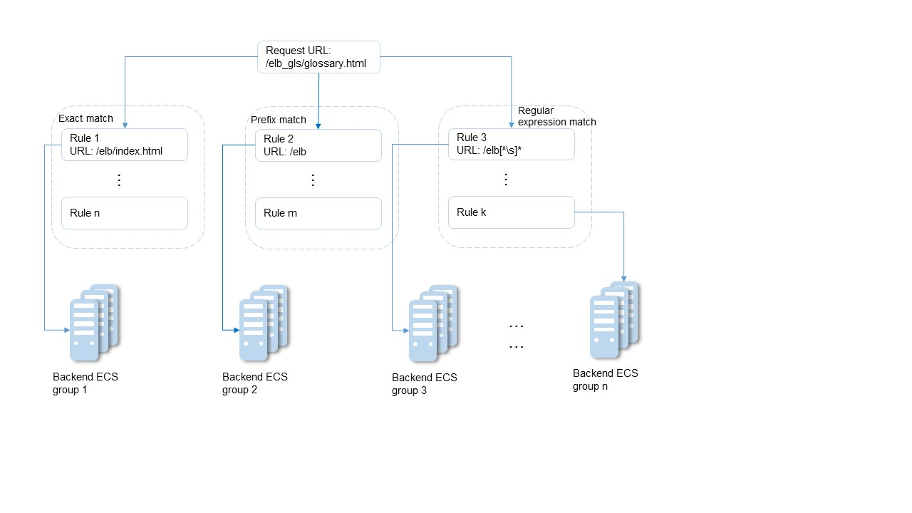

# Forwarding Policy

## Scenarios

Enhanced load balancers allow you to add forwarding policies to forward requests based on domain names or URLs. This function is only supported for HTTP or HTTPS listeners.

A maximum of 500 forwarding policies can be added to a listener. Requests for videos, images, audio, or text are forwarded to different backend server groups, making it easy to allocate resources.

After a forwarding policy is added, the load balancer forwards requests based on the specified domain name or URL:

-   If the domain name or URL in a request matches the forwarding policy, the request is forwarded to the backend server group you configured when adding the forwarding policy.
-   If the domain name or URL in a request does not match the forwarding policy, the request is forwarded to the default backend server group associated with the listener.

## Add a Forwarding Policy

1.  Log in to the management console.
2.  In the upper left corner of the page, click    and select the desired region and project.
3.  Click  **Service List**. Under  **Network**, click  **Elastic Load Balancing**.
4.  Locate the target load balancer and click its name.
5.  Click  **Listeners**, locate the target listener, and click its name.
6.  Click  **Add**  on the right of  **Forwarding Policies**.
7.  In the  **Add Forwarding Policy**  dialog box, specify the parameters by referring to  [Table 1](#table10859681016).
8.  Click  **OK**.

    Alternatively, locate the target load balancer and click its name to switch to the details page. In the  **Listeners**  area, click  **Add**  on the right of  **Forwarding Policies**  and then add a forwarding policy.

**Table  1**  Forwarding policy parameters

<table><thead align="left"><tr id="row109196141011"><th class="cellrowborder" valign="top" width="16.16161616161616%" id="mcps1.2.5.1.1">
<strong id="b84235270615222">Item</strong>

</th>
<th class="cellrowborder" valign="top" width="19.321932193219325%" id="mcps1.2.5.1.2">
<strong>Parameter</strong>

</th>
<th class="cellrowborder" valign="top" width="47.97479747974798%" id="mcps1.2.5.1.3">
<strong id="b501472349">Description</strong>

</th>
<th class="cellrowborder" valign="top" width="16.541654165416542%" id="mcps1.2.5.1.4">
<strong id="b159418934">Example Value</strong>

</th>
</tr>
</thead>
<tbody><tr id="row141006651018"><td class="cellrowborder" rowspan="5" valign="top" width="16.16161616161616%" headers="mcps1.2.5.1.1 ">
Configure Forwarding Policy

</td>
<td class="cellrowborder" valign="top" width="19.321932193219325%" headers="mcps1.2.5.1.2 ">
Name

</td>
<td class="cellrowborder" valign="top" width="47.97479747974798%" headers="mcps1.2.5.1.3 ">
Specifies the forwarding policy name.

</td>
<td class="cellrowborder" valign="top" width="16.541654165416542%" headers="mcps1.2.5.1.4 ">
forwarding_policy-q582

</td>
</tr>
<tr id="row15105761109"><td class="cellrowborder" valign="top" headers="mcps1.2.5.1.1 ">
Domain Name

</td>
<td class="cellrowborder" valign="top" headers="mcps1.2.5.1.2 ">
Specifies the domain name for triggering the forwarding policy. The specified domain name will be exactly matched. Note that either a domain name or URL must be specified.

</td>
<td class="cellrowborder" valign="top" headers="mcps1.2.5.1.3 ">
www.test.com

</td>
</tr>
<tr id="row16108186101017"><td class="cellrowborder" valign="top" headers="mcps1.2.5.1.1 ">
URL

</td>
<td class="cellrowborder" valign="top" headers="mcps1.2.5.1.2 ">
Specifies the URL for triggering the forwarding policy.

</td>
<td class="cellrowborder" valign="top" headers="mcps1.2.5.1.3 ">
/login.php

</td>
</tr>
<tr id="row11113116161018"><td class="cellrowborder" valign="top" headers="mcps1.2.5.1.1 ">
URL Matching Rule

</td>
<td class="cellrowborder" valign="top" headers="mcps1.2.5.1.2 "><ul id="ul141168619107"><li><strong id="b70231846">Exact match</strong>
The request URL is identical to the preset URL.

</li><li><strong id="b215297650">Prefix match</strong>
The requested URL starts with the specified URL string.

</li><li><strong id="b1923641375">Regular expression match</strong>
The requested URL matches the specified URL string based on the regular expression.
 NOTE: 

<strong id="b1280834494519">Exact match</strong> enjoys the highest priority, followed by <strong id="b1886234814455">Prefix match</strong>. <strong id="b18195185313454">Regular expression match</strong> is the last matching rule that will be used.

</li></ul>
</td>
<td class="cellrowborder" valign="top" headers="mcps1.2.5.1.3 ">
Exact match

</td>
</tr>
<tr id="row151292617103"><td class="cellrowborder" valign="top" headers="mcps1.2.5.1.1 ">
Description

</td>
<td class="cellrowborder" valign="top" headers="mcps1.2.5.1.2 ">
Provides supplementary information about the forwarding policy.

</td>
<td class="cellrowborder" valign="top" headers="mcps1.2.5.1.3 ">
N/A

</td>
</tr>
<tr id="row2079614577109"><td class="cellrowborder" valign="top" width="16.16161616161616%" headers="mcps1.2.5.1.1 ">
Add Backend Server Group

</td>
<td class="cellrowborder" valign="top" width="19.321932193219325%" headers="mcps1.2.5.1.2 ">
Backend Server Group

</td>
<td class="cellrowborder" valign="top" width="47.97479747974798%" headers="mcps1.2.5.1.3 ">
Specifies whether a new or existing backend server group will be used. You can select <strong id="b311819527573">Create new</strong> or <strong id="b16118105212572">Use existing</strong>.

If you select <strong id="b9300195912574">Create new</strong>, set parameters by referring to <a href="adding-or-removing-backend-servers-from-an-enhanced-load-balancer.md#en-us_topic_0091131437_table83118104911">Table 1</a> and <a href="adding-or-removing-backend-servers-from-an-enhanced-load-balancer.md#en-us_topic_0091131437_table736610293">Table 2</a>.

 NOTE: 

The backend protocol can only be HTTP.

</td>
<td class="cellrowborder" valign="top" width="16.541654165416542%" headers="mcps1.2.5.1.4 ">
Create new

</td>
</tr>
</tbody>
</table>

## URL Matching Example

The following table lists how a URL is matched, and  [Figure 1](#fig87121434403)  shows how a request is forwarded to a backend server group.

**Table  2**  URL matching

<table><thead align="left"><tr id="row4697541666"><th class="cellrowborder" valign="top" id="mcps1.2.7.1.1">
<strong id="b842352706142041">URL Matching Rule</strong>

</th>
<th class="cellrowborder" valign="top" id="mcps1.2.7.1.2">
<strong id="b8423527069304">URL</strong>

</th>
<th class="cellrowborder" colspan="4" valign="top" id="mcps1.2.7.1.3">
<strong id="b8423527069308">Preset URL</strong>

</th>
</tr>
</thead>
<tbody><tr id="row1289643195912"><td class="cellrowborder" valign="top" width="19.69393878775755%" headers="mcps1.2.7.1.1 ">
-

</td>
<td class="cellrowborder" valign="top" width="15.053010602120423%" headers="mcps1.2.7.1.2 ">
-

</td>
<td class="cellrowborder" valign="top" width="16.313262652530504%" headers="mcps1.2.7.1.3 ">
/elb/index.html

</td>
<td class="cellrowborder" valign="top" width="16.313262652530504%" headers="mcps1.2.7.1.3 ">
/elb

</td>
<td class="cellrowborder" valign="top" width="16.313262652530504%" headers="mcps1.2.7.1.3 ">
/elb[^\s]*

</td>
<td class="cellrowborder" valign="top" width="16.313262652530504%" headers="mcps1.2.7.1.3 ">
/index.html

</td>
</tr>
<tr id="row2896103116597"><td class="cellrowborder" valign="top" width="19.69393878775755%" headers="mcps1.2.7.1.1 ">
Exact match

</td>
<td class="cellrowborder" rowspan="3" valign="top" width="15.053010602120423%" headers="mcps1.2.7.1.2 ">
/elb/index.html

</td>
<td class="cellrowborder" valign="top" width="16.313262652530504%" headers="mcps1.2.7.1.3 ">
√

</td>
<td class="cellrowborder" valign="top" width="16.313262652530504%" headers="mcps1.2.7.1.3 ">
-

</td>
<td class="cellrowborder" valign="top" width="16.313262652530504%" headers="mcps1.2.7.1.3 ">
-

</td>
<td class="cellrowborder" valign="top" width="16.313262652530504%" headers="mcps1.2.7.1.3 ">
-

</td>
</tr>
<tr id="row198979312599"><td class="cellrowborder" valign="top" headers="mcps1.2.7.1.1 ">
Prefix match

</td>
<td class="cellrowborder" valign="top" headers="mcps1.2.7.1.2 ">
√

</td>
<td class="cellrowborder" valign="top" headers="mcps1.2.7.1.3 ">
√

</td>
<td class="cellrowborder" valign="top" headers="mcps1.2.7.1.3 ">
-

</td>
<td class="cellrowborder" valign="top" headers="mcps1.2.7.1.3 ">
-

</td>
</tr>
<tr id="row18971031195914"><td class="cellrowborder" valign="top" headers="mcps1.2.7.1.1 ">
Regular expression match

</td>
<td class="cellrowborder" valign="top" headers="mcps1.2.7.1.2 ">
√

</td>
<td class="cellrowborder" valign="top" headers="mcps1.2.7.1.3 ">
-

</td>
<td class="cellrowborder" valign="top" headers="mcps1.2.7.1.3 ">
√

</td>
<td class="cellrowborder" valign="top" headers="mcps1.2.7.1.3 ">
-

</td>
</tr>
</tbody>
</table>

**Figure  1**  Request forwarding  

In this figure, the system first searches the requested URL \(/elb\_gls/glossary.html\) using the  **Exact match**  rule. If no exactly matched URL is found, the  **Prefix match**  rule is used. If the start string of the requested URL matches that of specified URL, the request is forwarded to backend server group 2. Even if the requested URL also matches rule 3 \(**Regular expression match**\), the request is forwarded to backend server group 2 because  **Prefix match**  takes effect in priority.

## Modify a Forwarding Policy

1.  Log in to the management console.
2.  In the upper left corner of the page, click    and select the desired region and project.
3.  Click  **Service List**. Under  **Network**, click  **Elastic Load Balancing**.
4.  Locate the target load balancer and click its name.
5.  Click  **Listeners**, locate the target listener, and click its name.
6.  Click  **Forwarding Policies**. 
7.  Locate the target forwarding policy and click    on the right of its name.
8.  In the  **Modify Forwarding Policy**  dialog box, modify the parameters and click  **OK**.

## Delete a Forwarding Policy

1.  Log in to the management console.
2.  In the upper left corner of the page, click    and select the desired region and project.
3.  Click  **Service List**. Under  **Network**, click  **Elastic Load Balancing**.
4.  Locate the target load balancer and click its name.
5.  Click  **Listeners**, locate the target listener, and click its name.
6.  Click  **Forwarding Policies**. 
7.  Locate the target forwarding policy and click    on the right of its name.
8.  In the displayed dialog box, click  **Yes**.

