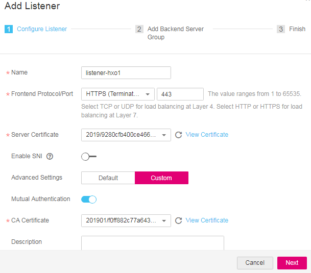

# Mutual Authentication<a name="EN-US_TOPIC_0123385679"></a>

## Scenarios<a name="section1125557164611"></a>

Generally, only the server needs to be authenticated and a certificate must be configured on the server during the establishment of HTTPS connections with the client. However, in some scenarios such as bank payment, both the server and client must be authenticated to ensure security. Therefore, to configure mutual authentication, you must deploy a server certificate and CA certificate on the load balancer.

## Prepare Certificates<a name="section780514219136"></a>

**Server Certificate**

The server certificate can be a CA-signed certificate or a self-signed one. The following steps use a self-signed certificate as an example to describe how to create a server certificate.

1.  Log in to a Linux server with OpenSSL installed.
2.  Run the following commands to create the  **server**  directory and enter the directory:

    **mkdir server**

    **cd server**

3.  Create the  **ca\_cert.conf**  certificate configuration file. The file content is as follows:

    ```
    [req].
    distinguished_name     = req_distinguished_name
    prompt                 = no
    [req_distinguished_name].
     O                      = ELB
    ```

4.  Create the  **server\_cert.conf**  certificate configuration file. The file content is as follows:

    ```
    [req].
    distinguished_name     = req_distinguished_name
    prompt                 = no
    [req_distinguished_name].
     O                      = ELB
     CN                     = www.test.com
    ```

    > **NOTE:**   
    >Set the  **CN**  field to the domain name or IP address of the Linux server.  

5.  Run the following commands to create two private key files,  **ca.key**  and  **server.key**, respectively:

    **openssl genrsa -out ca.key 2048**

    **openssl genrsa -out server.key 2048**

6.  Run the following commands to create two CSR files,  **ca.csr**  and  **server.csr**  respectively:

    **openssl req -out ca.csr -key ca.key -new -config ./ca\_cert.conf**

    **openssl req -out server.csr -key server.key -new -config ./server\_cert.conf**

7.  Run the following commands to create the  **ca.crt**  self-signed certificate and the  **server.crt**  server certificate signed by the self-signed certificate:

    **openssl x509 -req -in ca.csr -out ca.crt -sha1 -days 5000 -signkey ca.key**

    **openssl x509 -req -in server.csr -out server.crt -sha1 -CAcreateserial -days 5000** **-CA ca.crt -CAkey ca.key**


**Client Certificate**

1.  Log in to a Linux server with OpenSSL installed.
2.  Run the following commands to create the  **client**  directory and enter the directory:

    **mkdir client**

    **cd client**

3.  Create the  **ca\_cert.conf**  certificate configuration file. The file content is as follows:

    ```
    [req].
    distinguished_name     = req_distinguished_name
    prompt                 = no
    [req_distinguished_name].
     O                      = ELB
    ```

4.  Create the  **client\_cert.conf**  certificate configuration file. The file content is as follows:

    ```
    [req].
    distinguished_name     = req_distinguished_name
    prompt                 = no
    [req_distinguished_name].
     O                      = ELB
     CN                     = www.test.com
    ```

    > **NOTE:**   
    >Set the  **CN**  field to the domain name or IP address of the Linux server.  

5.  Run the following commands to create two private key files,  **ca.key**  and  **client.key**  respectively:

    **openssl genrsa -out ca.key 2048**

    **openssl genrsa -out client.key 2048**

6.  Run the following commands to create two CSR files,  **ca.csr**  and  **client.csr**, respectively:

    **openssl req -out ca.csr -key ca.key -new -config ./ca\_cert.conf**

    **openssl req -out client.csr -key client.key -new -config ./client\_cert.conf**

7.  Run the following commands to create the  **ca.crt**  certificate and the  **client.crt**  certificate signed by the CA certificate:

    **openssl x509 -req -in ca.csr -out ca.crt -sha1 -days 5000 -signkey ca.key**

    **openssl x509 -req -in client.csr -out client.crt -sha1 -CAcreateserial -days 5000** **-CA ca.crt -CAkey ca.key**

8.  Run the following command to convert the client certificate to a .p12 file that can be identified by the browser:

    **openssl pkcs12 -export -clcerts -in client.crt -inkey client.key -out client.p12**

    > **NOTE:**   
    >A password is required during command execution. Save this password, which is required when the certificate is imported to the browser.  


## Deploy Certificates<a name="section742022961613"></a>

**Server Certificate and Private Key**

1.  Log in to the management console.
2.  In the navigation pane, choose  **Certificates**. On the displayed page, click  **Create Certificate**. In the  **Create Certificate**  dialog box, select  **Server certificate**, copy the content of server certificate  **server.crt**  created in  [Prepare Certificates](#section780514219136)  to the  **Certificate Content**  area and the content of private key file  **server.key**  to the  **Private Key**  area, and click  **OK**.

    **Figure  1**  Create Certificate<a name="fig203611102522"></a>  
    

    > **NOTE:**   
    >The content of the certificate and private key must be PEM-encoded.  


**CA Certificate**

1.  Log in to the management console.
2.  In the navigation pane, choose  **Certificates**. On the displayed page, click  **Create Certificate**. In the  **Create Certificate**  dialog box, select  **CA certificate**, copy the content of CA certificate  **ca.crt**  created in  [Prepare Certificates](#section780514219136)  to the  **Certificate Content**  area, and click  **OK**.

    **Figure  2**  Create Certificate<a name="fig1498179155416"></a>  
    

    > **NOTE:**   
    >The certificate content must be PEM-encoded.  


## Configure the Listener<a name="section1332618585177"></a>

**Bind Certificates**

1.  Log in to the management console.
2.  Locate the target load balancer and click its name. Under  **Listeners**, click  **Add Listener**. In the  **Add Listener**  dialog box, select  **HTTPS**  for  **Frontend Protocol**, enable  **Mutual Authentication**, and select the server certificate and CA certificate.

    **Figure  3**  Add Listener<a name="fig113461439105610"></a>  
    

    > **NOTE:**   
    >Only enhanced load balancer listeners support mutual authentication.  


**Add Backend Servers**

For detailed operations, see  [Add Backend Servers](adding-or-removing-backend-servers-from-an-enhanced-load-balancer.md#section388715404610).

