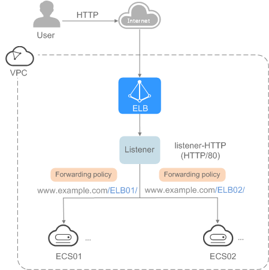

# Overview

Getting Started describes how to quickly create an enhanced load balancer and distribute incoming traffic across two backend servers in a specific scenario.

-   [Entry level](using-enhanced-load-balancers-entry-level.md): A large number of requests need to be routed to backend servers. In addition, health checks are required to monitor the running statuses of backend servers and route incoming traffic only to healthy servers to eliminate SFOPs and improve service availability.

    **Figure  1**  Entry level  
    

    As the incoming traffic increases, you can add more servers to better balance application workloads.

-   [Advanced level](using-enhanced-load-balancers-advanced-level.md): Multiple applications use one domain name to provide services, and requests to a specific application are routed based on URLs. Therefore, URL-based forwarding is required to forward requests from different URLs to the corresponding backend server groups. Currently, only HTTP and HTTPS listeners support this function.

    **Figure  2**  Advanced level  
    

    As the incoming traffic increases, you can add more backend servers to the two backend server groups. In addition, health checks can be configured to monitor the running statuses of backend servers and route incoming traffic only to healthy servers to eliminate SFOPs and improve service availability.

