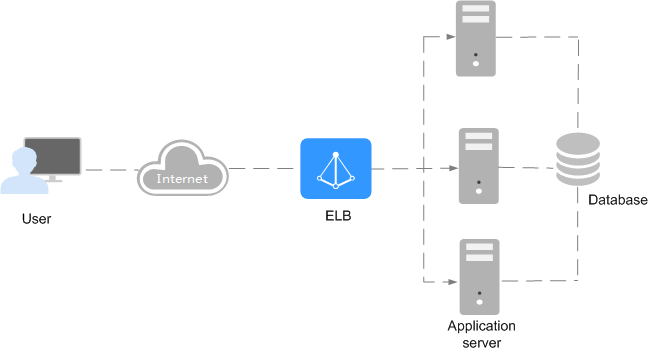

# What Is Elastic Load Balancing?

Elastic Load Balancing \(ELB\) automatically distributes incoming traffic across multiple backend servers based on the rules you configure. ELB expands service capabilities of applications and eliminates single points of failure \(SPOFs\), improving application availability.

## Service Architecture

A load balancer distributes incoming traffic across multiple backend servers that reside in one or more availability zones \(AZs\).

-   Listener: You can add one or more listeners to a load balancer. A listener uses the protocol and port you specify to check for requests from clients and route the requests to associated backend servers based on the rules you define. For an HTTP or HTTPS listener, you can add forwarding policies to forward requests based on the domain name or URL.
-   Backend server group: A backend server group routes requests to one or more backend servers.

    You can configure health checks for each backend server group to check the running status of each backend server. When the health check result of a backend server is  **Unhealthy**, the load balancer automatically stops routing new requests to this server until it recovers.

**Figure  1**  ELB components  

## Load Balancer Type

ELB provides two types of load balancers:

-   Classic load balancer: This type of load balancer can well handle web services with low traffic and simple applications.
-   Enhanced load balancer: This type of load balancer is suitable for web services with high access traffic. Requests are forwarded based on domain names or URLs, making request routing more flexible.

For more information, see  [Differences Between Classic and Enhanced Load Balancers](differences-between-classic-and-enhanced-load-balancers.md).

## Access to ELB

You can use either of the following methods to access ELB:

-   Management console

    A graphical user interface has been provided for you. To access the service, log in to the management console and select  **Elastic Load Balancing**.

-   APIs

    You can make calls to APIs to access ELB. For details, see the  _Elastic Load Balancing API Reference_.

