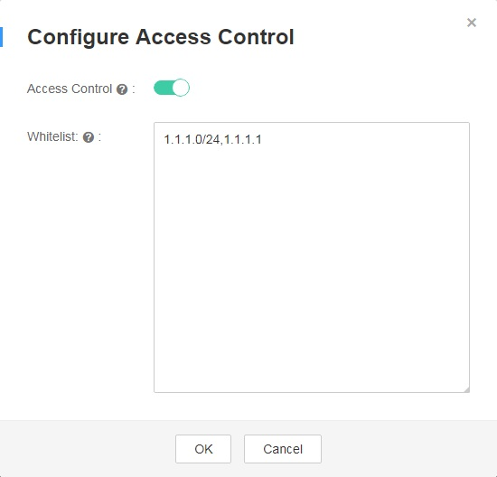

# Whitelist

You can add a whitelist to specify the IP addresses that can access the listener.

>  **NOTICE:** 

> Only enhanced load balancers provide this function. Adding the whitelist may cause service risks. Once the whitelist is set, only the IP addresses specified in the whitelist can access the listener.

> If access control is enabled but no whitelist is added, the listener cannot be accessed.

## Add a Whitelist

1.  Log in to the management console.
2.  In the upper left corner of the page, click    and select the desired region and project.
3.  Under  **Network**, click  **Elastic Load Balance**.

1.  On the  **Elastic Load Balance**  page, locate the row that contains the target load balancer and click its name.
2.  In the  **Listeners**  area, locate the row that contains the target listener, click  **More**  in the  **Operation**  column, and select  **Configure Access Control**  from the drop-down list. In the displayed  **Configure Access Control**  dialog box, enable  **Access Control**  and enter the IP addresses as prompted.

    **Figure  1**  Configuring access control
    

    **Table  1**  Parameter description

    <table><thead align="left"><tr id="row6556870018541"><th class="cellrowborder" valign="top" width="22.81%" id="mcps1.2.4.1.1">
<strong id="b842352706114331">Parameter</strong>

    </th>
    <th class="cellrowborder" valign="top" width="52.129999999999995%" id="mcps1.2.4.1.2">
<strong id="b8423527061772">Description</strong>

    </th>
    <th class="cellrowborder" valign="top" width="25.06%" id="mcps1.2.4.1.3">
<strong id="b842352706194150">Example Value</strong>

    </th>
    </tr>
    </thead>
    <tbody><tr id="row6352683318541"><td class="cellrowborder" valign="top" width="22.81%" headers="mcps1.2.4.1.1 ">
Access Control

    </td>
    <td class="cellrowborder" valign="top" width="52.129999999999995%" headers="mcps1.2.4.1.2 "><ul id="ul25916715105429"><li id="li1083249618957">If access control is enabled but no whitelist is added, no IP address is allowed to access the listener.</li><li id="li28326823181114">If access control is enabled and the whitelist is added, only IP addresses specified in the whitelist can access the listener.</li></ul>
    <ul id="ul32263783105429"><li id="li52501725181052">If access control is disabled, the listener can be accessed from any IP address.</li></ul>
    </td>
    <td class="cellrowborder" valign="top" width="25.06%" headers="mcps1.2.4.1.3 ">
N/A

    </td>
    </tr>
    <tr id="row1987534018541"><td class="cellrowborder" valign="top" width="22.81%" headers="mcps1.2.4.1.1 ">
Whitelist

    </td>
    <td class="cellrowborder" valign="top" width="52.129999999999995%" headers="mcps1.2.4.1.2 ">
Lists the IP addresses or network segments that can access the listener.

    
 NOTE: 

A maximum of 300 IP addresses or network segments can be entered. A comma (,) is used to separate every two IP addresses or network segments.

    

    </td>
    <td class="cellrowborder" valign="top" width="25.06%" headers="mcps1.2.4.1.3 ">
10.168.2.24, 10.168.16.0/24

    </td>
    </tr>
    </tbody>
    </table>

3.  Click  **OK**.

