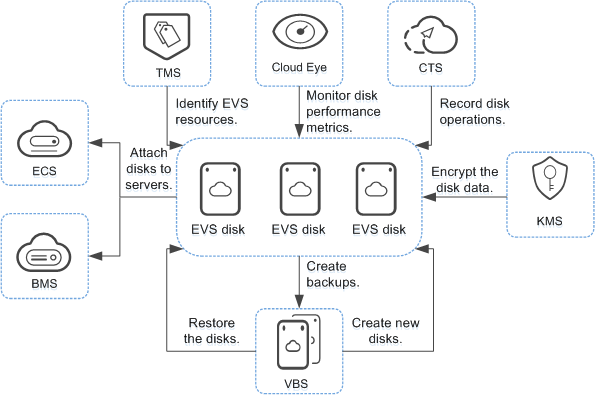

# EVS and Other Services

[Figure 1](#fig94811824147)  shows the relationships between EVS and other services.

**Figure  1**  Relationships between EVS and other services  

-   ECS: EVS disks can be attached to ECSs and used as scalable block storage devices.
-   BMS: SCSI EVS disks can be attached to BMSs and used as scalable block storage devices.
-   VBS: The VBS service can be used to back up EVS disk data to ensure the reliability and security of the server data.
-   KMS: EVS disk encryption depends on the KMS service. You can use the keys provided by KMS to encrypt EVS disks \(including both system and data disks\), thus improving EVS disk data security.
-   Cloud Eye: After enabling EVS, you can view the status of monitored performance metrics through Cloud Eye without installing any additional plug-in. The monitored metrics include Disk Read Rate, Disk Write Rate, Disk Read Requests, and Disk Write Requests.
-   Cloud Trace Service \(CTS\): CTS records operations of EVS resources, facilitating user query, audit, and backtracking.
-   Tag Management Service \(TMS\): Tags are used to identify the EVS resources for purposes of easy categorization and quick search.

