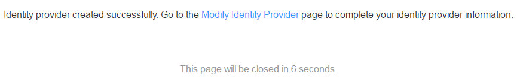

# Creating an IdP

After an IdP is created on IAM and the metadata file of the IdP is configured, users authenticated by the enterprise IdP can access the cloud system directly.

## Context

In IAM, federated identity authentication only supports the SAML 2.0 protocol, so the enterprise IdP must support SAML 2.0 to use federated identity authentication.

Security Assertion Markup Language \(SAML\) is an XML-based open standard for exchanging authentication and authorization data between security domains.

## Prerequisites

A trust relationship has been established between the two systems. For details, see section  [Establishing a Trust Relationship](establishing-a-trust-relationship.md).

## Procedure

1.  In the navigation pane, choose  **Identity Providers**.
2.  On the  **Identity Providers**  page, click  **Create Identity Provider**.
3.  Set  **Name**,  **Status**, and  **Description**  for the IdP.

    > **NOTE:**   
    >Currently, only the SAML protocol is supported.  

4.  Click  **OK**.

    If the information shown in  [Figure 1](#fig24618444143656)  is displayed, the IdP has been created successfully.

    **Figure  1**  IdP created successfully  
    

5.  Configure IdP information by clicking the  **Modify Identity Provider**  link before the IdP list page is displayed. Alternatively, click  **Modify**  in the  **Operation**  column of the row that contains the target IdP after the IdP list page is displayed.
6.  In the  **Metadata Configuration**  area on the  **Modify Identity Provider**  page, configure the metadata using either of the following method:
    -   Use preconfigured metadata

        Only the members of the eduGAIN and ELIXIR organizations can use the preconfigured metadata. If metadata is updated subsequently, the preconfigured metadata can be automatically updated. You do not need to modify metadata.

        1.  Click  **Select**, and select the target IdP.
        2.  Click  **OK**.

    -   Upload metadata

        The system supports uploading and manual configuration of metadata. If the metadata file size exceeds 500 KB, you can click the  **manually configure**  link to configure it. If metadata is updated subsequently, you need to upload or edit metadata. Otherwise, federated users cannot log in to the cloud system.

        -   Upload metadata.
            1.  Upload the metadata file of the enterprise IdP.
            2.  Click  **Upload**.

                A dialog box is displayed, showing the metadata extracted by the system.

            3.  Click  **OK**.
                -   If "The uploaded file contains multiple IdPs. Select an IdP as needed." is displayed, select the desired IdP from the  **Entity ID**  drop-down list box.
                -   If a message is displayed indicating that  **Entity ID**  in the metadata file is empty or that the signature certificate has expired, check whether the metadata file is correct. Then, upload the file again or configure the metadata manually.

            4.  Click  **OK**.

        -   Manually configure metadata.
            1.  Click  **manually configure**.
            2.  On the displayed  **Manually Configure Metadata**  page, enter  **Entity ID**,  **Signature Certificates**,  **SingleSignOnService**, and other parameters.

                
                <table><thead align="left"><tr id="row1184184153526"><th class="cellrowborder" valign="top" width="30.259999999999998%" id="mcps1.1.3.1.1">
<strong id="b37426530113629_1">Parameter</strong>

                </th>
                <th class="cellrowborder" valign="top" width="69.74000000000001%" id="mcps1.1.3.1.2">
<strong id="b18268919151811">Description</strong>

                </th>
                </tr>
                </thead>
                <tbody><tr id="row44602376153526"><td class="cellrowborder" valign="top" width="30.259999999999998%" headers="mcps1.1.3.1.1 ">
Entity ID

                </td>
                <td class="cellrowborder" valign="top" width="69.74000000000001%" headers="mcps1.1.3.1.2 ">
An entity ID uniquely identifies an enterprise IdP. A metadata file can contain multiple IdPs. You need to select your desired IdP.

                </td>
                </tr>
                <tr id="row124968259251"><td class="cellrowborder" valign="top" width="30.259999999999998%" headers="mcps1.1.3.1.1 ">
Supported Protocols

                </td>
                <td class="cellrowborder" valign="top" width="69.74000000000001%" headers="mcps1.1.3.1.2 ">
The SAML protocol is used for federation identity authentication between the enterprise IdP and the SP. IAM only supports SAML 2.0.

                </td>
                </tr>
                <tr id="row38341163153526"><td class="cellrowborder" valign="top" width="30.259999999999998%" headers="mcps1.1.3.1.1 ">
Supported NameIdFormat

                </td>
                <td class="cellrowborder" valign="top" width="69.74000000000001%" headers="mcps1.1.3.1.2 ">
<strong id="b84235270602053_1">Supported NameIdFormat</strong> defines the name identifier formats supported by the IdP. Name identifiers can be used for communication between the IdP and the federated users.

                </td>
                </tr>
                <tr id="row22703734153526"><td class="cellrowborder" valign="top" width="30.259999999999998%" headers="mcps1.1.3.1.1 ">
Signature Certificates

                </td>
                <td class="cellrowborder" valign="top" width="69.74000000000001%" headers="mcps1.1.3.1.2 ">
A signature certificate is used to verify the signatures and contains a public key. For security purposes, a 2048-bit public key is recommended. During federated identity authentication, the system checks the credibility and integrity of an assertion based on the signature certificate in the metadata file.

                </td>
                </tr>
                <tr id="row2778474153711"><td class="cellrowborder" valign="top" width="30.259999999999998%" headers="mcps1.1.3.1.1 ">
SingleSignOnService

                </td>
                <td class="cellrowborder" valign="top" width="69.74000000000001%" headers="mcps1.1.3.1.2 ">
This is how SAML requests are sent during the SSO process. <strong id="b4220131501328_1_1">SingleSignOnService</strong> must support HTTP Redirect or HTTP POST.

                </td>
                </tr>
                <tr id="row61611028153732"><td class="cellrowborder" valign="top" width="30.259999999999998%" headers="mcps1.1.3.1.1 ">
SingleLogoutService

                </td>
                <td class="cellrowborder" valign="top" width="69.74000000000001%" headers="mcps1.1.3.1.2 ">
The SP provides the session logout function. After a federated user logs out of a session from IAM, the user is redirected to the address that was bound to its account. <strong id="b4220131501328_3_1">SingleLogoutService</strong> must support HTTP Redirect or HTTP POST.

                </td>
                </tr>
                </tbody>
                </table>

            3.  Click  **OK**.

7.  Click  **OK**  to save the settings.

## Verification

1.  Click  **View**  in the row that contains the target IdP.
2.  Click  **Copy**  to the right of  **Login link**  to copy the address in  **Login link**, and then open it using a browser.
3.  Check whether the login page provided by the enterprise IdP server is displayed.

    > **NOTE:**   
    >If the redirection fails, check whether the obtained enterprise metadata file and the enterprise IdP server are configured correctly.  

4.  Enter a username and  and check whether you can log in to the cloud system.

## Follow-up Procedure

-   In the  **Identity Conversion Rule**  area, create an identity conversion rule. For details about identity conversion rules, see  [Using Rules to Control Federated User Access to the Cloud System](using-rules-to-control-federated-user-access-to-the-cloud-system.md).
-   Configure SSO in the enterprise management system. For details, see  [Configuring SSO](configuring-sso.md).

## Related Operations

-   Viewing IdP information

    In the IdP list, click  **View**  to query basic information, metadata details, and identity conversion rules for the corresponding IdP.

    > **NOTE:**   
    >You can click  **Modify Identity Provider**  on the  **View Identity Provider Information**  page to enter the  **Modify Identity Provider**  page.  

-   Modifying IdP information

    In the IdP list, click  **Modify**  to enter the  **Modify Identity Provider**  page. You can set  **Status**  \(**Enabled**  or  **Disabled**\),  **Description**,  **Metadata File**, and  **Identity Conversion Rule**.

-   Deleting an IdP

    In the IdP list, click  **Delete**  in the row that contains the target IdP to delete it.

