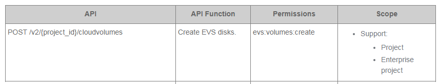

# Creating Custom Policies

If the default policies cannot meet the requirements on fine-grained access control, you can create custom policies and assign the policies to the user group.

## Procedure

1.  In the navigation pane, choose  **Policies**.
2.  On the  **Policies**  page, click  **Create Custom Policy**.
3.  Enter  **Policy Name**.
4.  Set  **Scope**.

    Specify the scope in which the custom policy will take effect. Cloud services are classified into global-level and project-level services based on the locations they are deployed.

    -   **Global-level service**: Deployed globally without differentiating physical areas. When creating custom policies for globally deployed services, specify the scope as  **Global-level service**. Custom policies of this scope must be granted to user groups in the  **Global**  project.
    -   **Project-level service**: Deployed in one or more regions. When creating custom policies for regionally deployed services, specify the scope as  **Project-level service**. Custom policies of this scope must be granted to user groups in the project \(eu-de\) or subproject corresponding to the deployment region.

    For example, when creating a fine-grained policy \("evs:volumes:create"\) for Elastic Volume Service \(EVS\), which is a project-level service, set  **Scope**  to  **Project-level service**. If the policy will take effect for multiple projects, authorization is required for each of the projects.

5.  \(Optional\) Enter  **Description**.
6.  In the  **Policy Information**  area, click  **Select Template**. For example, select  **VPC Admin**  as the template.
7.  Click  **OK**.
8.  Modify  **Effect**  and  **Action**  values in the  **Statement**  field in the template. For details, see section  [Policy Language](policy-language.md).
    -   **Effect**: The value can be  **Allow**  and  **Deny**. If both  **Allow**  and  **Deny**  are found in statements, the policy evaluation starts with  **Deny**.
    -   **Action**: Fill the  **Action**  field with the permissions in the API permissions table \(see the following figure\) of the specific service, for example,  **evs:volumes:create**. IAM then implements fine-grained authorization by calling the corresponding APIs in the table.

        **Figure  1**  API permission  
        

        > **NOTE:**   
        >-   The  **Version**  value of a custom policy must be  **1.1**.  
        >-   A custom policy can contain statements of multiple services that are all global or project-based.  
        >-   Policies support only API-level authorization. You need to fill the  **Action**  field with the permissions in the API permissions table of the specific service. IAM then implements fine-grained authorization by calling the corresponding APIs in the table. If the scope of all permissions in a custom policy includes  **Project**  and  **Enterprise Project**, the custom policy can be granted on IAM.  For details, see: .  
        >    Section  [API Permissions](https://docs.otc.t-systems.com/en-us/api/ecs/en-us_topic_0103071509.html)  in the  _Elastic Cloud Server API Reference_  
        >    Section  [API Permissions](https://docs.otc.t-systems.com/en-us/api/vpc/vpc_permission_0000.html)  in the  _Virtual Private Cloud API Reference_  
        >    Section  [API Permissions](https://docs.otc.t-systems.com/en-us/api/evs/en-us_topic_0103526772.html)  in the  _Elastic Volume Service API Reference_  

9.  Click  **OK**.

    > **NOTE:**   
    >If a message is displayed indicating that the syntax is incorrect, modify policy information according to the policy syntax.  

    The custom policy is created successfully. You can select a custom policy from the user group to implement fine-grained authorization.

## Follow-up Operation

-   Modifying custom policies

    You can modify custom policies if user permissions have changed.

    On the  **Policies**  page, click  **Modify**  in the  **Operation**  column of the target policy, and modify the name, description, and policy information.

-   Deleting custom policies

    You can delete custom policies if they are no longer needed.

    On the  **Policies**  page, click  **Delete**  in the  **Operation**  column of the target policy to delete it.

-   Attaching a custom policy to a user group \(The users in the group have all the permissions defined by the policy.\)
    1.  Click  **Modify**  in the  **Operation**  column of the row that contains the target user group.
    2.  In the  **User Group Permissions**  area, click  **Modify**  in the  **Operation**  column of the row that contains the target project.
    3.  In the  **Available Policies**  area on the  **Modify Policy**  page, select a newly created custom policy.

