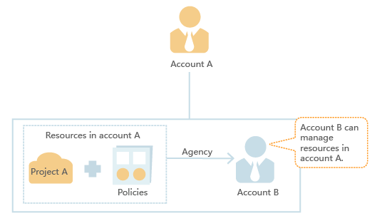

# Delegating Other Accounts to Manage Resources

You can grant your operation permissions to more professional, efficient accounts or cloud services to manage your resources.

This section uses account A and account B as an example to describe how to delegate another account to manage resources under an account.

1.  Account A creates an agency.

    **Figure  1**  Agency creation model  
    

2.  Account B grants user B permissions for managing account A's resources.

    1.  Create a user group \(for example,  **Agency**\), and grant resource management permissions to the user group.
    2.  Add user Job to user group  **Agency**.

    **Figure  2**  Permission granting model  
    

3.  User Job of account B manages the resources in account A.

    1.  Job logs in to the cloud system and switches the role to account A.
    2.  Job switches to project A.
    3.  Job manages the resources in account A based on permissions.

    **Figure  3**  Agency management model  
    

