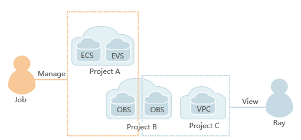

# IAM Features

IAM provides basic functions such as identity authentication and permission management.

-   Refined permission management

    You can control user access permissions to different projects and grant different permissions to users in the same project. For example, you can grant some users the permissions to manage OBS, and grant other users the read-only permission on OBS.

    **Figure  1**  Permission management model  
    

-   Convenient user authorization

    You can use IAM to authorize users in just two steps:

    1.  Plan user groups according to users' responsibilities and grant the corresponding permissions to each user group.
    2.  Add a user to the user group that matches their responsibilities.

-   Federated identity authentication

    With federated identity authentication, users in your identity authentication system can access your resources directly through an SSO.

-   Delegating other cloud services or third-party accounts to manage resources

    You can delegate your operation permissions to another cloud service or a third-party account so that the cloud service or users using the account can help you manage resources under your account efficiently.

-   Providing authentication and authorization to services

    Users who have been authenticated by IAM can access other services \(for example, RDS, CTS, and OBS\) in the cloud system based on the permissions they have been granted.

-   Centralized security policy management

    Users can set policies for login verification and passwords, and configure an ACL to improve the security of user information and system data.

