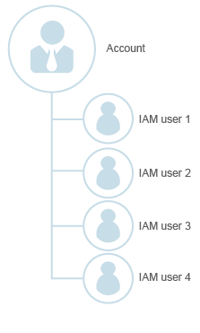

# Identity Management

IAM allows you to manage users in your account and their security credentials. In IAM, federated identity authentication allows users from other systems to access your system through an SSO, simplifying user management.

## Account

An account is created automatically when user registration is successful. An account has full access permissions for all the resources under the account.

As an account is a payment entity, you are advised to create a security administrator, who is granted the  **Security Administrator**  permission to manage the users and their permissions in your account.

**Figure  1**  Account management module  

## IAM User

A user is created by the administrator in IAM. An IAM user uses cloud services and corresponds to an employee, system, or application. IAM users have identity credentials \(passwords and access keys\) and can log in to the management console or access APIs.

**Figure  2**  Relationship between the account and users  

## Federated User

Federated users are users who access the cloud system using federated identity authentication.

With federated identity authentication, the users who have been authenticated by the IdP can access the resources of the SP without being authenticated by the SP.

-   An IdP is a system that provides identity authentication to users. The IdP in federated identity authentication of IAM is the identity authentication system of an enterprise, for example, an enterprise management system.
-   A service provider \(SP\) is a system that provides services to users.

Federated identity authentication allows IdP users to access the cloud system by using the security credentials provided by the IdP. IAM does not need to generate new security credentials for the users. This implements SSO.

