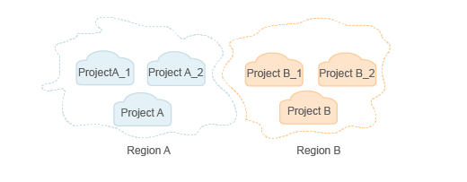
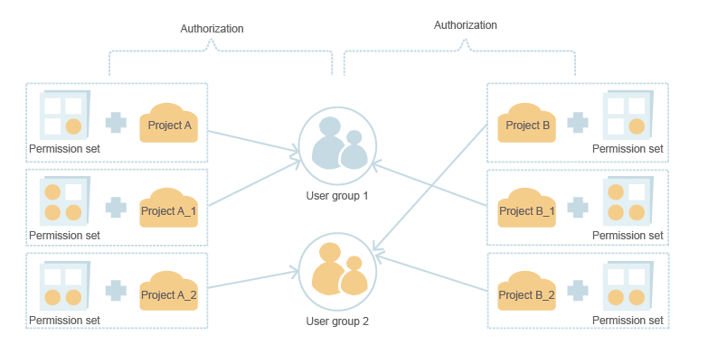

# Managing Users and Their Permissions

You can grant permissions to a user group and add users to it. Any user you add to the user group has all the permissions of the user group in the cloud system.

1.  The security administrator creates projects in a region and the projects are isolated from each other.

    **Figure  1**  Project isolation model  
    

2.  The security administrator plans user groups according to users' responsibilities and grants the corresponding permissions to different user groups.

    **Figure  2**  User group authorization model  
    

3.  The security administrator creates users and adds users to user groups varying by their responsibilities.

    **Figure  3**  User authorization model  
    

4.  Users can access resources in the cloud system based on their permissions.

