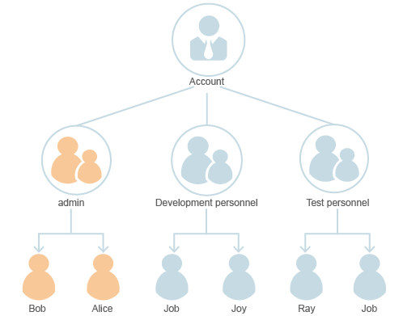

# Quick Start with IAM

An account is a payment entity and has complete access to all services and resources in the account. To ensure account security, you are advised to create a security administrator to perform routine management tasks.

If a user needs to access resources in your account, you can use the security administrator to create an IAM user and a user group with the minimum permissions, and then add the user to the user group so that the user has the permissions of the user group. The user can use the created IAM user account and their own security credentials \(username/password\) to access resources in your account based on their permissions, avoiding sharing your account and password with other users and reducing security risks.

## Example

The following is an example of how to use IAM.

An account includes three groups of users with different responsibilities. Each responsibility corresponds to a user group: security administrator group \(**admin**\), development personnel group, and test personnel group. Each group can contain multiple users, and a user can belong to multiple groups.

**Figure  1**  User management model  

1.  Use your account to create a security administrator  **Bob**  and add  **Bob**  to the default user group  **admin**.
2.  Use  **Bob**  to create another security administrator named  **Alice**, and add  **Alice**  to the default  **admin**  user group.
3.  Use a security administrator \(**Bob**  or  **Alice**\) to create the  **Development personnel**  and  **Test personnel**  user groups and grant the required minimum permissions to each group.
4.  Use a security administrator \(**Bob**  or  **Alice**\) to create development personnel users named  **Job**  and  **Joy**  and add them to the  **Development personnel**  user group, and then to create test personnel users named  **Ray**  and  **Job**  and add them to the  **Test personnel**  user group.
5.  Users \(**Job**,  **Joy**, and  **Ray**\) log in to the system.

    > **NOTE:**   
    >Security administrators and users are all IAM users and have different permissions based on the user groups to which they belong. They all have their own security credentials \(username/password\) to log in to the system.  

