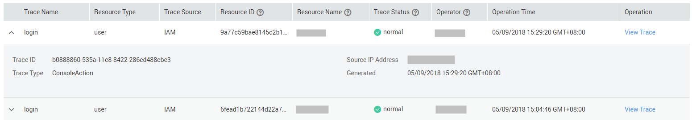

# Viewing Audit Logs

After you enable CTS, the system starts recording operations on IAM. Operation records for the last 7 days are stored on the CTS console.

## Viewing IAM Audit Logs

1.  Log in to the management console.
2.  Click  **Service List**  in the upper part of the page and select  **Cloud Trace Service**  under  **Management & Deployment**.
3.  Choose  **Trace List**  in the navigation pane on the left.
4.  Click  **Filter**  in the upper right corner of the event list to set the operation event conditions.

    The following four filters are available:

    -   **Trace Source**,  **Resource Type**, and  **Search By**
        -   Select the filter from the drop-down list. Select  **IAM**  for  **Trace Source**  from the drop-down list box.
        -   When you select  **Trace name**  for  **Search By**, you also need to select a specific trace name.
        -   When you select  **Resource ID**  for  **Search By**, you also need to select or enter a specific resource ID.
        -   When you select  **Resource name**  for  **Search By**, you also need to select or enter a specific resource name.

    -   **Operator**: Select a specific operator \(a user rather than tenant\).
    -   **Trace Status**: Available options include  **All trace statuses**,  **normal**,  **warning**, and  **incident**. You can only select one of them.
    -   You can specify start time and end time query traces during a time period.

5.  Click  **Query**  to view the corresponding operation event.
6.  Expand the details, as shown in  [Figure 1](#fig17669149112013).

    **Figure  1**  Expanding trace details  
    

7.  Click  **View Trace**  in the  **Operation**  column. On the displayed  **View Trace**  dialog box shown in  [Figure 2](#fig9310171012116), the trace structure details are displayed.

    **Figure  2**  Viewing events  
    

