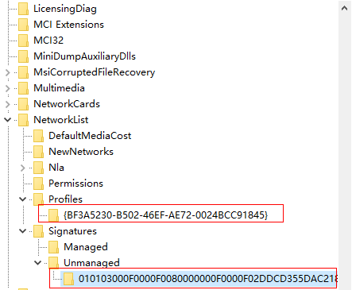

# How Do I Delete Redundant Network Connections to a Windows ECS?

## Method 1

1.  Press  **Win+R**. In the displayed dialog box, enter  **regedit**  and press  **Enter**  to open the registry editor.
2.  Open the following registry key:

    **HKEY\_LOCAL\_MACHINE\\SOFTWARE\\Microsoft\\Windows NT\\CurrentVersion\\NetworkList\\ProfilesProfiles**  may contain multiple subitems, and the subitem names contain digits and letters. Click each subitem in sequence and query the  **Data**  column of  **ProfileName**  in the right pane.

3.  Double-click  **ProfileName**  and set  **Value Data**  to the name of the network to be changed.
4.  Restart the ECS for the modification to take effect.

## Method 2

1.  Press  **Win+R**. In the displayed dialog box, enter  **regedit**  and press  **Enter**  to open the registry editor.
2.  Open the following registry keys:

    HKEY\_LOCAL\_MACHINE\\SOFTWARE\\Microsoft\\Windows NT\\CurrentVersion\\NetworkList\\Profiles

    HKEY\_LOCAL\_MACHINE\\SOFTWARE\\Microsoft\\Windows NT\\CurrentVersion\\NetworkList\\Signatures\\Unmanaged

3.  Delete the directories shown in the following figure:

    **Figure  1**  Registry directory  
    

