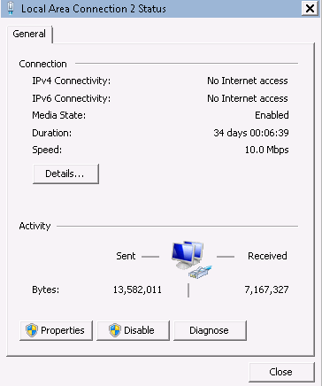
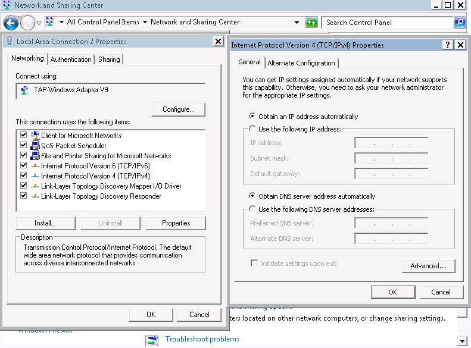

# Setting the NIC to DHCP \(Windows\)

## Scenarios

If a private image is created from an ECS or external image file and the VM where the ECS or external image file is located is configured with a static IP address, you need to change the NIC attribute to DHCP so that the new ECSs created from the private image can dynamically obtain an IP address.

This section uses Windows Server 2008 R2 as an example to describe how to configure DHCP. For details about how to configure DHCP on ECSs running other OSs, see the relevant OS documentation.

> **NOTE:**   
>When registering an external image file as a private image, configure DHCP on the VM where the external image file is located. You are advised to configure DHCP on the VM and then export the image file.  

## Prerequisites

You have logged in to the ECS used to create a Windows private image.

For details about how to log in to the ECS, see  _Elastic Cloud Server User Guide_.

## Procedure

1.  On the ECS, choose  **Start**  \>  **Control Panel**.
2.  Click  **Network and Internet Connections**.
3.  Click  **Network and Sharing Center**.

    **Figure  1**  Network and Sharing Center  
    

4.  Select the connection configured with the static IP address. For example, click  **Local Area Connection 2**.

    **Figure  2**  Local Area Connection 2 Status  
    

5.  Click  **Properties**  and select the configured Internet protocol version.
6.  On the  **General**  tab, select  **Obtain an IP address automatically**  and  **Obtain DNS server address automatically**  and click  **OK**.  [Figure 3](#en-us_topic_0029124575_fig32561684193046)  shows the dialog box for configuring the IP address obtaining mode.

    > **NOTE:**   
    >You are advised to record the original network information so that you can restore the network if necessary.  

    **Figure  3**  Configuring the IP address obtaining mode  
    

    The system will automatically obtain an IP address.

