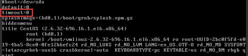

# What Should I Do If an ECS Starts Slowly?

## Symptom

If an ECS starts slowly, you can change the default timeout duration to speed up the startup.

## Solution

1.  Log in to the ECS.
2.  Run the following command to switch to user  **root**:

    **sudo su**

3.  Run the following command to query the version of the GRUB file:

    **rpm -qa | grep grub**

    **Figure  1**  Querying the GRUB file version  
    

4.  Set  **timeout**  in the GRUB file to  **0**.
    -   If the GRUB file version is earlier than 2:

        Open  **/boot/grub/grub.cfg**  or  **/boot/grub/menu.lst**  and set  **timeout**  to  **0**.

    -   If the GRUB file version is 2:

        Open  **/boot/grub2/grub.cfg**  and set the value of  **timeout**  to  **0**.

        **Figure  2**  Modifying the timeout duration  
        

