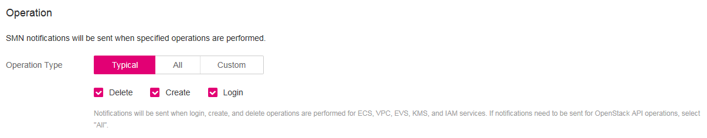
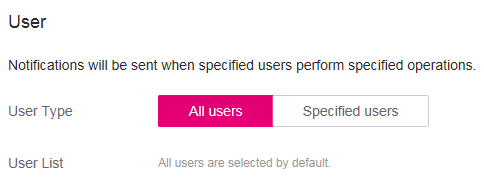

# Configuring SMN

## Scenario

This section describes how to configure the Simple Message Notification \(SMN\) function on the Cloud Trace Service \(CTS\) console.

Decryption will fail if the CMK used has been scheduled for deletion. You will receive messages about the decryption failure on terminals \(SMS, email, HTTP, or HTTPS\) if the SMN function has been configured in CTS.

## Prerequisites

-   You have obtained an account and its password for logging in to the management console.
-   CTS has been enabled.
-   You have subscribed to SMN.

## Procedure

1.  Log in to the management console.
2.  Click    in the upper left corner of the management console and select a region or project.
3.  Choose  **Management & Deployment**  \>  **Cloud Trace Service**  to go to the CTS console.
4.  In the navigation tree on the left, click  **Tracker**.
5.  If the desired tracker is not enabled, click  **Enable**. In the dialog box that is displayed, click  **OK**  to enable the tracker. If the tracker is already enabled, skip this step.
6.  In the navigation tree on the left, click  **Key Event Notifications**. The  **Key Event Notifications**  page is displayed.
7.  Click  **Create Key Event Notification**  at the upper right corner of the page. The creation page is displayed.
8.  In the  **Basic Information**  area, enter a notification name. See  [Figure 1](#fig197519401153)  for details.

    **Figure  1**  Configuring basic information  
    

9.  Select operation types in the  **Operation**  area. See  [Figure 2](#fig103085242037)  for details.

    **Figure  2**  Selecting operation types  
    

    **Table  1**  Parameters for operation types

    
    <table><thead align="left"><tr id="row975324001110"><th class="cellrowborder" valign="top" width="17%" id="mcps1.2.4.1.1">
<strong id="b781913712291">Parameter</strong>

    </th>
    <th class="cellrowborder" valign="top" width="56.99999999999999%" id="mcps1.2.4.1.2">
<strong id="b842352706193336">Description</strong>

    </th>
    <th class="cellrowborder" valign="top" width="26%" id="mcps1.2.4.1.3">
<strong id="b1666133143013">Example Value</strong>

    </th>
    </tr>
    </thead>
    <tbody><tr id="row1277234051113"><td class="cellrowborder" valign="top" width="17%" headers="mcps1.2.4.1.1 ">
Operation Type

    </td>
    <td class="cellrowborder" valign="top" width="56.99999999999999%" headers="mcps1.2.4.1.2 ">
SMN sends messages to users when deletion, creation, or login operations are performed on CMKs.

    </td>
    <td class="cellrowborder" valign="top" width="26%" headers="mcps1.2.4.1.3 ">
Delete

    </td>
    </tr>
    </tbody>
    </table>

10. In the  **User**  area, specify the user who performs the specified operations. See  [Figure 3](#fig58261115592)  for details.

    > **NOTE:**   
    >-   You can select  **All users**  so that SMN notifications are sent when specified operations are performed by any user.  
    >-   You can also select  **Specified users**  and add users to the  **User List**. Then SMN notifications are sent when the specified operations are performed by specified users.  

    **Figure  3**  Specifying users  
    

11. In the  **Topic**  area, configure whether to send notifications. See  [Figure 4](#fig14611311075)  for details.

    **Figure  4**  Configuring SMN topic  
    

    **Table  2**  Parameters for configuring the SMN notification

    
    <table><thead align="left"><tr id="row1794875018140"><th class="cellrowborder" valign="top" width="17%" id="mcps1.2.4.1.1">
<strong>Parameter</strong>

    </th>
    <th class="cellrowborder" valign="top" width="61%" id="mcps1.2.4.1.2">
<strong id="b1569808375">Description</strong>

    </th>
    <th class="cellrowborder" valign="top" width="22%" id="mcps1.2.4.1.3">
<strong id="b842352706113752">Configuration</strong>

    </th>
    </tr>
    </thead>
    <tbody><tr id="row1994915091417"><td class="cellrowborder" valign="top" width="17%" headers="mcps1.2.4.1.1 ">
Send Notification

    </td>
    <td class="cellrowborder" valign="top" width="61%" headers="mcps1.2.4.1.2 ">
Specifies whether notifications will be sent.

    <ul id="ul99495502145"><li>Select <strong id="b842352706105958">Yes</strong> to activate notification.</li><li>Select <strong id="b84235270611036">No</strong> to deactivate notification.</li></ul>
    </td>
    <td class="cellrowborder" valign="top" width="22%" headers="mcps1.2.4.1.3 ">
Yes

    </td>
    </tr>
    <tr id="row1294955011411"><td class="cellrowborder" valign="top" width="17%" headers="mcps1.2.4.1.1 ">
SMN Topic

    </td>
    <td class="cellrowborder" valign="top" width="61%" headers="mcps1.2.4.1.2 ">
You can select an existing topic or click <strong id="b84235270618437">Topic</strong> to create a topic.

    
For details about topics, see the <i><cite id="citec6d4c7dd347a4853a8892f68f2d2d7b6095641">Simple Message Notification User Guide</cite></i>.

    </td>
    <td class="cellrowborder" valign="top" width="22%" headers="mcps1.2.4.1.3 ">
KMS

    </td>
    </tr>
    </tbody>
    </table>

12. Click  **OK**. The SMN notification is configured.

