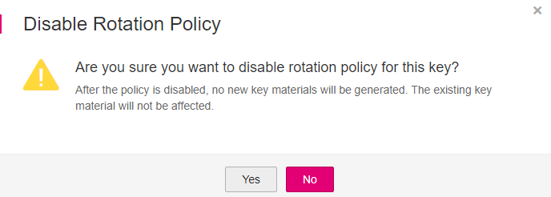
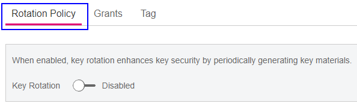

# Disabling Key Rotation

## Scenario

This section describes how to disable rotation for a key on the KMS console.

## Prerequisites

-   You have obtained an account and its password for logging in to the management console.
-   The CMK is in  **Enabled**  status.
-   The  **Origin**  of the CMK is  **KMS**.
-   Key rotation has been enabled.

## Procedure

1.  Log in to the management console.
2.  Click    in the upper left corner of the management console and select a region or project.
3.  Choose  **Security**  \>  **Key Management Service**. The  **Key Management Service**  page is displayed.
4.  Click the alias of the desired CMK to view its details.
5.  Click  **Rotation Policy**. The dialog box is displayed, as shown in  [Figure 1](#fig68513241314).

    **Figure  1**  CMK rotation details  
    

6.  Click    to disable key rotation.
7.  In the displayed  **Disable Rotation Policy**  dialog box, click  **Yes**.

    **Figure  2**  Disabling key rotation  
    

8.  Check the rotation status, as shown in  [Figure 3](#fig1580712501294).

    **Figure  3**  Key rotation  
    

