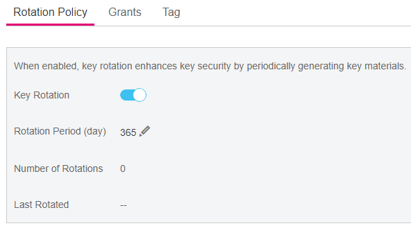

# Enabling Key Rotation

## Scenario

This section describes how to enable rotation for a key on the KMS console.

By default, automatic key rotation is disabled for a CMK. Every time you enable key rotation, KMS automatically rotates CMKs based on the rotation period you set.

## Prerequisites

-   You have obtained an account and its password for logging in to the management console.
-   The CMK is in  **Enabled**  status.
-   The  **Origin**  of the CMK is  **KMS**.

## Procedure

1.  Log in to the management console.
2.  Click    in the upper left corner of the management console and select a region or project.
3.  Choose  **Security**  \>  **Key Management Service**. The  **Key Management Service**  page is displayed.
4.  Click the alias of the desired CMK to view its details.
5.  Click  **Rotate Key**. The dialog box is displayed, as shown in  [Figure 1](#fig947023217481).

    **Figure  1**  CMK rotation  
    

6.  Click    to set the  **Key Rotation**  status to  , as shown in  [Figure 2](#f6e50215e22ef49a99f916988074aa83e).  [Table 1](#ta8cb67818b87411dad53061d32313de1)  provides more details.

    **Figure  2**  Enabling key rotation  
    

    **Table  1**  Description of the parameters for enabling rotation for a CMK

    
    <table><thead align="left"><tr id="r2849aa0f01444575a794decd8e844b36"><th class="cellrowborder" valign="top" width="30.819999999999997%" id="mcps1.2.3.1.1">
<strong>Parameter</strong>

    </th>
    <th class="cellrowborder" valign="top" width="69.17999999999999%" id="mcps1.2.3.1.2">
<strong id="b842352706135554">Description</strong>

    </th>
    </tr>
    </thead>
    <tbody><tr id="rfaa8341df94b422ebe77d8086f4cc34d"><td class="cellrowborder" valign="top" width="30.819999999999997%" headers="mcps1.2.3.1.1 ">
CMK rotation

    </td>
    <td class="cellrowborder" valign="top" width="69.17999999999999%" headers="mcps1.2.3.1.2 ">
Rotation switch. The default status is .

    
: disabled

    
: enabled

    
After rotation is enabled, the CMK will be rotated based on your set period.

    
 NOTE: 

KMS does not rotate a disabled CMK for which rotation has been enabled.

    
KMS rotates it when it is enabled again. If it has been longer than the rotation period since the CMK was rotated last time, KMS will rotate the CMK within 24 hours.

    

    </td>
    </tr>
    <tr id="ra3a0100b49124ed4b3f49738aba25ff5"><td class="cellrowborder" valign="top" width="30.819999999999997%" headers="mcps1.2.3.1.1 ">
Rotation Period (day)

    </td>
    <td class="cellrowborder" valign="top" width="69.17999999999999%" headers="mcps1.2.3.1.2 ">
Rotation period (day). The value is an integer ranging from 30 to 365. The default value is <strong id="b842352706114030">365</strong>.

    
Set the period based on how often a CMK is used. If it is frequently used, set a short period; otherwise, set a long one.

    </td>
    </tr>
    </tbody>
    </table>

7.  Click  **Enable Rotation**. The page displaying the rotation details is displayed, as shown in  [Figure 3](#fccf4ddb4cc4543259b743554d6dbb7af).

    **Figure  3**  CMK rotation details  
    

    > **NOTE:**   
    >You can click    to change the rotation period. After the period is changed, KMS rotates the CMK by the new period.  

