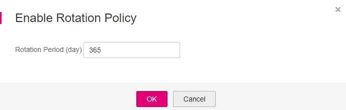

# Enabling Key Rotation

## Scenario

This section describes how to enable rotation for a key on the KMS console.

By default, automatic key rotation is disabled for a CMK. Every time you enable key rotation, KMS automatically rotates CMKs based on the rotation period you set.

## Prerequisites

-   You have obtained an account and its password for logging in to the management console.
-   The CMK is in  **Enabled**  status.
-   The  **Origin**  of the CMK is  **KMS**.

## Procedure

1.  Log in to the management console.
2.  Click    in the upper left corner of the management console and select a region or project.
3.  Choose  **Security**  \>  **Key Management Service**. The  **Key Management Service**  page is displayed.
4.  Click the alias of the desired CMK to view its details.
5.  Click  **Rotation Policy**.

    **Figure  1**  Key rotation  
    

6.  Click    to enable key rotation.
7.  In the  **Enable Rotation Policy**  dialog box, set the rotation period and click  **OK**.

    **Figure  2**  Setting the rotation period  
    

    Set the rotation period \(unit: day\) to an integer in the range 30 to 365. The default value is  **365**.

    After the setting takes effect, the new rotation period starts.

    If the CMK is frequently used, you are advised to set a short rotation period for it; otherwise, set a long one.

8.  After rotation is enabled, the rotation details will be displayed, as shown in  [Figure 3](#fig68513241314).

    **Figure  3**  CMK rotation details  
    

    After rotation is enabled, the CMK will be rotated based on your set period.

    > **NOTE:**   
    >-   KMS does not rotate a disabled CMK for which rotation has been enabled.  
    >-   KMS rotates it when it is enabled again. If it has been longer than the rotation period since the CMK was rotated last time, KMS will rotate the CMK within 24 hours.  
    >-   You can click    to change the rotation period. After the period is changed, KMS rotates the CMK based on the new period, which starts from the day when the change takes effect.  

