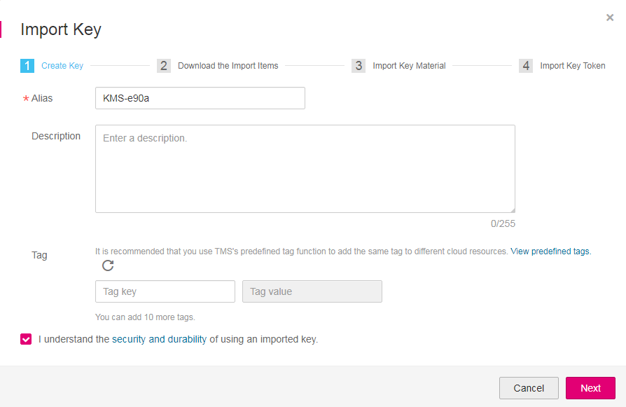
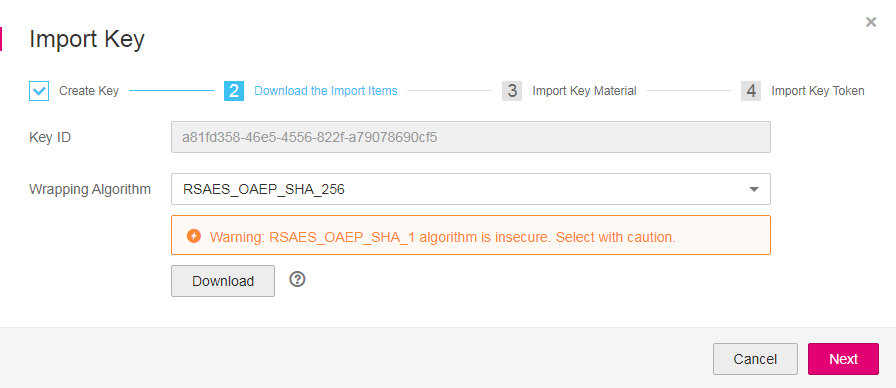
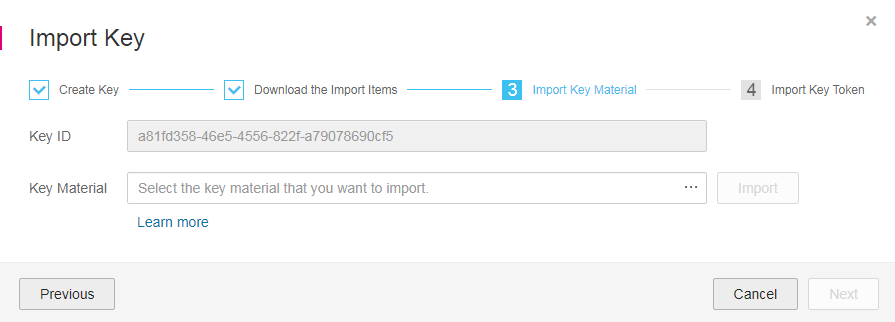
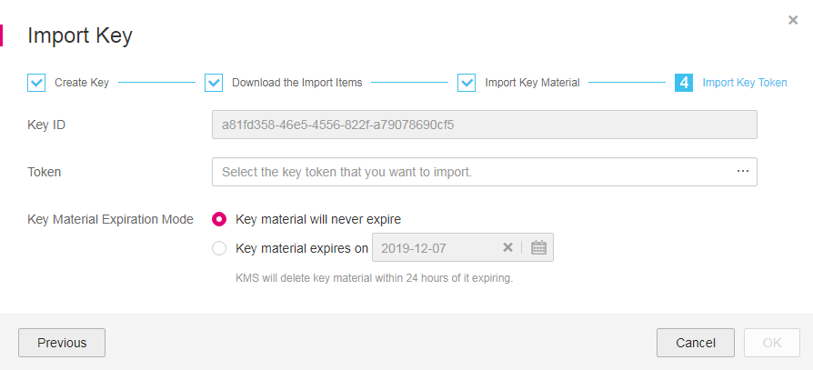

# Importing Key Material<a name="en-us_topic_0101786407"></a>

## Scenario<a name="s58d9973253974f4a834c3c3f489b3647"></a>

If you want to use your own key material instead of the KMS-generated material, you can use the console to import your key material to KMS. CMKs created using imported material and KMS-generated material are managed together by KMS.

This section describes how to import key material through KMS Console.

> **NOTE:**   
>-   A CMK with imported material works in the same way as one using KMS-generated material, that is, you enable and disable them as well as schedule their deletion and cancel their scheduled deletion in the same way.  
>-   You can only import 256-bit symmetric keys.  

## Prerequisites<a name="s91ec804cce684feb9145931106945537"></a>

-   You have obtained an account and its password for logging in to the management console.
-   You have prepared the key material to be imported.

## Procedure<a name="s2bad3e38692d4acf9d146979bf6eff16"></a>

1.  Log in to the management console.
2.  Click    in the upper left corner of the management console and select a region or project.
3.  Choose  **Security**  \>  **Key Management Service**. The  **Key Management Service**  page is displayed.
4.  In the upper right corner, click  **Import Key**. The  **Import Key**  dialog box is displayed.
5.  On the page that is displayed, enter an alias and description of the key.

    **Figure  1**  Creating a CMK<a name="fd922917947b241c895a549143f2ee6cc"></a>  
    

6.  \(Optional\) Add tags as needed, and enter the tag key and tag value.

    > **NOTE:**   
    >-   When a CMK has been created without any tag, you can add a tag to the CMK later as necessary. Click the alias of the CMK. The page with key details is displayed. Then you can add tags to the CMK.  
    >-   The same tag \(including tag key and tag value\) can be used for different CMKs. However, under the same CMK, one tag key can have only one tag value.  
    >-   A maximum of 10 tags can be added for one CMK.  
    >-   If you want to delete a tag to be added when adding multiple tags, you can click  **Delete**  in the row where the tag to be added is located to delete the tag.  

7.  Click  **security and durability**  to read and confirm information regarding the security and durability of the imported key.
8.  Select  **I understand the security and durability of using an imported key**, and create a CMK whose key material is empty.
9.  Click  **Next**  to go to the  **Download the Import Items**  step. Select a key-wrapping algorithm according to  [Table 1](#t7d6edba5e4dc4db1976cc2675499f0f0).

    **Figure  2**  Obtaining the wrapping key and import token<a name="f44fe09368bc64bd0910dd26b98665b56"></a>  
    

    **Table  1**  Key wrapping algorithms

    <a name="t7d6edba5e4dc4db1976cc2675499f0f0"></a>
    <table><thead align="left"><tr id="r467cc1b6214b437eb793071dd03967f4"><th class="cellrowborder" valign="top" width="23.232323232323235%" id="mcps1.2.4.1.1"><p id="a89a612f5c27c46409f58ef5d104f2a16"><a name="a89a612f5c27c46409f58ef5d104f2a16"></a><a name="a89a612f5c27c46409f58ef5d104f2a16"></a><strong id="b84235270623233"><a name="b84235270623233"></a><a name="b84235270623233"></a>Algorithm</strong></p>
    </th>
    <th class="cellrowborder" valign="top" width="35.35353535353536%" id="mcps1.2.4.1.2"><p id="a770fdb8324ca47fb88cc27032a80617c"><a name="a770fdb8324ca47fb88cc27032a80617c"></a><a name="a770fdb8324ca47fb88cc27032a80617c"></a><strong id="b842352706135554"><a name="b842352706135554"></a><a name="b842352706135554"></a>Description</strong></p>
    </th>
    <th class="cellrowborder" valign="top" width="41.41414141414141%" id="mcps1.2.4.1.3"><p id="a3411da3a7b164bc6811656972c174b1a"><a name="a3411da3a7b164bc6811656972c174b1a"></a><a name="a3411da3a7b164bc6811656972c174b1a"></a><strong id="b842352706113752"><a name="b842352706113752"></a><a name="b842352706113752"></a>Configuration</strong></p>
    </th>
    </tr>
    </thead>
    <tbody><tr id="r79256fcce0374817a732d3a7e0ad848c"><td class="cellrowborder" valign="top" width="23.232323232323235%" headers="mcps1.2.4.1.1 "><p id="a249e6f48230b40d3ac768c9f7837e7a4"><a name="a249e6f48230b40d3ac768c9f7837e7a4"></a><a name="a249e6f48230b40d3ac768c9f7837e7a4"></a>RSAES_OAEP_SHA_256</p>
    </td>
    <td class="cellrowborder" valign="top" width="35.35353535353536%" headers="mcps1.2.4.1.2 "><p id="a951d2b1bfdd2431098c1578626701d91"><a name="a951d2b1bfdd2431098c1578626701d91"></a><a name="a951d2b1bfdd2431098c1578626701d91"></a>RSA encryption algorithm that uses OAEP and has the <strong id="b84235270623646"><a name="b84235270623646"></a><a name="b84235270623646"></a>SHA-256</strong> hash function</p>
    </td>
    <td class="cellrowborder" rowspan="3" valign="top" width="41.41414141414141%" headers="mcps1.2.4.1.3 "><p id="a2839caeefa8b4556bb713fb3904366b2"><a name="a2839caeefa8b4556bb713fb3904366b2"></a><a name="a2839caeefa8b4556bb713fb3904366b2"></a>Choose an algorithm from the drop-down list box.</p>
    <a name="oe641991bab82434da75be6f9720ebcb5"></a><a name="oe641991bab82434da75be6f9720ebcb5"></a><ol id="oe641991bab82434da75be6f9720ebcb5"><li>If the HSMs support the <strong id="b842352706193733"><a name="b842352706193733"></a><a name="b842352706193733"></a>RSAES_OAEP_SHA_256</strong> algorithm, use <strong id="b842352706193740"><a name="b842352706193740"></a><a name="b842352706193740"></a>RSAES_OAEP_SHA_256</strong> to encrypt the key material.</li><li>If the HSMs do not support OAEP, use <strong id="b842352706193758"><a name="b842352706193758"></a><a name="b842352706193758"></a>RSAES_PKCS1_V1_5</strong> to encrypt the key material.</li></ol>
    <div class="notice" id="note1412913280102"><a name="note1412913280102"></a><a name="note1412913280102"></a><span class="noticetitle"> NOTICE: </span><div class="noticebody"><p id="p51291128181018"><a name="p51291128181018"></a><a name="p51291128181018"></a>The <strong id="b842352706193812"><a name="b842352706193812"></a><a name="b842352706193812"></a>RSAES_OAEP_SHA_1</strong> encryption algorithm is no longer secure. Exercise caution when performing this operation.</p>
    </div></div>
    </td>
    </tr>
    <tr id="row237612125258"><td class="cellrowborder" valign="top" headers="mcps1.2.4.1.1 "><p id="ab0773bb3786040a08b2bc4a39e5bbef1"><a name="ab0773bb3786040a08b2bc4a39e5bbef1"></a><a name="ab0773bb3786040a08b2bc4a39e5bbef1"></a>RSAES_PKCS1_V1_5</p>
    </td>
    <td class="cellrowborder" valign="top" headers="mcps1.2.4.1.2 "><p id="en-us_topic_0087368090_p312312309330"><a name="en-us_topic_0087368090_p312312309330"></a><a name="en-us_topic_0087368090_p312312309330"></a>RSA encryption algorithm (v1.5) of Public-Key Cryptography Standards number 1 (PKCS #1)</p>
    </td>
    </tr>
    <tr id="r58725f7e44024bcfb18658b7e8b2a14d"><td class="cellrowborder" valign="top" headers="mcps1.2.4.1.1 "><p id="a4e5566df2154435aa49a10ba166ad396"><a name="a4e5566df2154435aa49a10ba166ad396"></a><a name="a4e5566df2154435aa49a10ba166ad396"></a>RSAES_OAEP_SHA_1</p>
    </td>
    <td class="cellrowborder" valign="top" headers="mcps1.2.4.1.2 "><p id="ada3b43ddccc94a6e9152d90288dec44f"><a name="ada3b43ddccc94a6e9152d90288dec44f"></a><a name="ada3b43ddccc94a6e9152d90288dec44f"></a>RSA encryption algorithm that uses Optimal Asymmetric Encryption Padding (OAEP) and has the <strong id="b84235270623628"><a name="b84235270623628"></a><a name="b84235270623628"></a>SHA-1</strong> hash function</p>
    </td>
    </tr>
    </tbody>
    </table>

10. <a name="lc2cb9f68855a42a089a31c63f7975d25"></a>Click  **Download**. The following files are downloaded:  **wrappingKey**,  **importToken**, and  **README**. These are displayed in  [Figure 3](#f269bed6da96f473e84cc76bc0c12fcd5).

    **Figure  3**  Downloaded files<a name="f269bed6da96f473e84cc76bc0c12fcd5"></a>  
    

    -   **wrappingKey\__CMK ID_\__download time_**  is a wrapping key used to encrypt the key material.
    -   **importToken\__CMK ID_\__download time_**  is an import token used to import key material to KMS.
    -   **README\__CMK ID_\__download time_**  is a description file recording information such as a CMK's serial number, wrapping algorithm, wrapping key name, token file name, and the expiration time of the token file and wrapping key.

        > **NOTICE:**   
        >The wrapping key and import token expire within 24 hours of creation. If they have expired, download them again.  


    Alternatively, you can obtain the wrapping key and import token by calling the API.

    1.  Call the  **get-parameters-for-import**  API to obtain the wrapping key and import token.

        The following example describes how to obtain the wrapping key and import token of a CMK \(ID:  **43f1ffd7-18fb-4568-9575-602e009b7ee8**; encryption algorithm:  **RSAES\_PKCS1\_V1\_5**\).

        **public\_key**: The content of the wrapping key \(Base-64 encoding\) returned after calling the API

        **import\_token**: Content of the import token \(Base-64 encoding\) returned after calling the API

        -   Request example

            ```
            {      
                "key_id": "43f1ffd7-18fb-4568-9575-602e009b7ee8",
                "wrapping_algorithm":"RSAES_PKCS1_V1_5"
            }
            ```

        -   Response example:

            ```
            {
                "key_id": "43f1ffd7-18fb-4568-9575-602e009b7ee8",    
                "public_key":"public key base64 encoded data",
                "import_token":"import token base64 encoded data",
                "expiration_time":1501578672
            }
            ```

    2.  Save the wrapping key, and convert its format according to the following procedure. Only the key material that is encrypted using the converted wrapping key can be imported to the management console.
        1.  Copy the content of the wrapping key  **public\_key**, save it to the  **.txt**  file as  **PublicKey.b64**.
        2.  Run the following command to convert the Base-64 coding of the  **PublicKey.b64**  file to binary data, and save the converted file as  **PublicKey.bin**:

            **openssl** **enc** **-d** **-base64** **-A** **-in** **PublicKey.b64** **-out** **PublicKey.bin**

    3.  Save the import token, copy the content of the  **import\_token**  token, paste it to a  **.txt**  file, and save the file as  **ImportToken.b64**.

11. You use the downloaded  **wrappingKey**  file to encrypt the key material to be imported.
    -   Method 1: Use the downloaded wrapping key to encrypt the key material on your HSM. For details, see the operation guide of your HSM.
    -   Method 2: Use OpenSSL to encrypt the key material.

        > **NOTE:**   
        >If you need to run the  **openssl pkeyutl**  command, the OpenSSL version must be 1.0.2 or later.  

        The following example describes how to use the downloaded wrapping key to encrypt the generated key material \(256-bit symmetric key\). The procedure is as follows:

        1.  Run the following command to generate the key material \(256-bit symmetric key\) and save the generated key material as  **PlaintextKeyMaterial.bin**:

            **openssl** **rand** **-out** _**PlaintextKeyMaterial.bin**_ **32**

        2.  Use the downloaded wrapping key to encrypt the key material and save the encrypted key material as  **EncryptedKeyMaterial.bin**.

            Replace  **_PublicKey.bin_**  in the command with the name of the wrapping key  _wrappingKey\_key ID\_download time_  downloaded in  [10](#lc2cb9f68855a42a089a31c63f7975d25).

            **Table  2**  Encrypting the generated key material using the downloaded wrapping key

            <a name="table995818161062"></a>
            <table><thead align="left"><tr id="row695911161267"><th class="cellrowborder" valign="top" width="28.000000000000004%" id="mcps1.2.3.1.1"><p id="p13959016965"><a name="p13959016965"></a><a name="p13959016965"></a>Wrapping Key Algorithm</p>
            </th>
            <th class="cellrowborder" valign="top" width="72%" id="mcps1.2.3.1.2"><p id="p13959516367"><a name="p13959516367"></a><a name="p13959516367"></a>Key Materials Encryption</p>
            </th>
            </tr>
            </thead>
            <tbody><tr id="row095901616618"><td class="cellrowborder" valign="top" width="28.000000000000004%" headers="mcps1.2.3.1.1 "><p id="p7959131613619"><a name="p7959131613619"></a><a name="p7959131613619"></a>RSAES_OAEP_SHA_256</p>
            </td>
            <td class="cellrowborder" valign="top" width="72%" headers="mcps1.2.3.1.2 "><p id="p152747519815"><a name="p152747519815"></a><a name="p152747519815"></a><strong id="b17491112695410"><a name="b17491112695410"></a><a name="b17491112695410"></a>openssl</strong> <strong id="b124917266549"><a name="b124917266549"></a><a name="b124917266549"></a>pkeyutl</strong></p>
            <p id="p132741351484"><a name="p132741351484"></a><a name="p132741351484"></a><strong id="b939786201916"><a name="b939786201916"></a><a name="b939786201916"></a>-in</strong> <em id="i22741351783"><a name="i22741351783"></a><a name="i22741351783"></a><strong id="b1327435489"><a name="b1327435489"></a><a name="b1327435489"></a>PlaintextKeyMaterial.bin</strong></em></p>
            <p id="p12741511819"><a name="p12741511819"></a><a name="p12741511819"></a><strong id="b19239112291910"><a name="b19239112291910"></a><a name="b19239112291910"></a>-inkey</strong> <strong id="b192401422171912"><a name="b192401422171912"></a><a name="b192401422171912"></a><em id="i102401522131919"><a name="i102401522131919"></a><a name="i102401522131919"></a><i><span class="varname" id="varname182401222191916"><a name="varname182401222191916"></a><a name="varname182401222191916"></a>PublicKey.bin</span></i></em></strong></p>
            <p id="p1274125389"><a name="p1274125389"></a><a name="p1274125389"></a><strong id="b2429027111918"><a name="b2429027111918"></a><a name="b2429027111918"></a>-out</strong> <em id="i10274755812"><a name="i10274755812"></a><a name="i10274755812"></a><strong id="b92741351389"><a name="b92741351389"></a><a name="b92741351389"></a>EncryptedKeyMaterial.bin</strong></em></p>
            <p id="p152759513818"><a name="p152759513818"></a><a name="p152759513818"></a><strong id="b104811331191912"><a name="b104811331191912"></a><a name="b104811331191912"></a>-keyform</strong> <strong id="b8482031141920"><a name="b8482031141920"></a><a name="b8482031141920"></a>der</strong></p>
            <p id="p1727515485"><a name="p1727515485"></a><a name="p1727515485"></a><strong id="b1227517514820"><a name="b1227517514820"></a><a name="b1227517514820"></a>-pubin</strong> <strong id="b4275352814"><a name="b4275352814"></a><a name="b4275352814"></a>-encrypt</strong></p>
            <p id="p923941411719"><a name="p923941411719"></a><a name="p923941411719"></a><strong id="b79791848191917"><a name="b79791848191917"></a><a name="b79791848191917"></a>-pkeyopt</strong> <strong id="b64337537193"><a name="b64337537193"></a><a name="b64337537193"></a>rsa_padding_mode:oaep</strong> <strong id="b14433853111914"><a name="b14433853111914"></a><a name="b14433853111914"></a>-pkeyopt rsa_oaep_md:sha256</strong></p>
            </td>
            </tr>
            <tr id="row109597161068"><td class="cellrowborder" valign="top" width="28.000000000000004%" headers="mcps1.2.3.1.1 "><p id="p1195921613615"><a name="p1195921613615"></a><a name="p1195921613615"></a>RSAES_PKCS1_V1_5</p>
            </td>
            <td class="cellrowborder" valign="top" width="72%" headers="mcps1.2.3.1.2 "><p id="p82752055817"><a name="p82752055817"></a><a name="p82752055817"></a><strong id="b136931120229"><a name="b136931120229"></a><a name="b136931120229"></a>openssl</strong> <strong id="b1649410208225"><a name="b1649410208225"></a><a name="b1649410208225"></a>rsautl</strong> <strong id="b134941820192210"><a name="b134941820192210"></a><a name="b134941820192210"></a>-encrypt</strong></p>
            <p id="p92751051189"><a name="p92751051189"></a><a name="p92751051189"></a><strong id="b1635422519229"><a name="b1635422519229"></a><a name="b1635422519229"></a>-in</strong> <em id="i122753512814"><a name="i122753512814"></a><a name="i122753512814"></a><strong id="b1127511514813"><a name="b1127511514813"></a><a name="b1127511514813"></a>PlaintextKeyMaterial.bin</strong></em></p>
            <p id="p827517514812"><a name="p827517514812"></a><a name="p827517514812"></a><strong id="b1227517518818"><a name="b1227517518818"></a><a name="b1227517518818"></a>-pkcs</strong></p>
            <p id="p112751451988"><a name="p112751451988"></a><a name="p112751451988"></a><strong id="b979152912217"><a name="b979152912217"></a><a name="b979152912217"></a>-inkey</strong> <strong id="b979132912224"><a name="b979132912224"></a><a name="b979132912224"></a><em id="i579192922219"><a name="i579192922219"></a><a name="i579192922219"></a><i><span class="varname" id="varname97972913222"><a name="varname97972913222"></a><a name="varname97972913222"></a>PublicKey.bin</span></i></em></strong></p>
            <p id="p92761956813"><a name="p92761956813"></a><a name="p92761956813"></a><strong id="b3380185482215"><a name="b3380185482215"></a><a name="b3380185482215"></a>-keyform</strong> <strong id="b1738035413228"><a name="b1738035413228"></a><a name="b1738035413228"></a>der</strong></p>
            <p id="p1027618517813"><a name="p1027618517813"></a><a name="p1027618517813"></a><strong id="b1527612518820"><a name="b1527612518820"></a><a name="b1527612518820"></a>-pubin</strong></p>
            <p id="p42761251981"><a name="p42761251981"></a><a name="p42761251981"></a><strong id="b9942059182215"><a name="b9942059182215"></a><a name="b9942059182215"></a>-out</strong> <em id="i112761852814"><a name="i112761852814"></a><a name="i112761852814"></a><strong id="b122761853814"><a name="b122761853814"></a><a name="b122761853814"></a>EncryptedKeyMaterial.bin</strong></em></p>
            </td>
            </tr>
            <tr id="row1495916161062"><td class="cellrowborder" valign="top" width="28.000000000000004%" headers="mcps1.2.3.1.1 "><p id="p9959916969"><a name="p9959916969"></a><a name="p9959916969"></a>RSAES_OAEP_SHA_1</p>
            </td>
            <td class="cellrowborder" valign="top" width="72%" headers="mcps1.2.3.1.2 "><p id="p42761658817"><a name="p42761658817"></a><a name="p42761658817"></a><strong id="b33112582313"><a name="b33112582313"></a><a name="b33112582313"></a>openssl</strong> <strong id="b1531117514236"><a name="b1531117514236"></a><a name="b1531117514236"></a>pkeyutl</strong></p>
            <p id="p11276852086"><a name="p11276852086"></a><a name="p11276852086"></a><strong id="b52772810232"><a name="b52772810232"></a><a name="b52772810232"></a>-in</strong> <em id="i52768515819"><a name="i52768515819"></a><a name="i52768515819"></a><strong id="b427618518814"><a name="b427618518814"></a><a name="b427618518814"></a>PlaintextKeyMaterial.bin</strong></em></p>
            <p id="p1027785185"><a name="p1027785185"></a><a name="p1027785185"></a><strong id="b18504131242319"><a name="b18504131242319"></a><a name="b18504131242319"></a>-inkey</strong> <strong id="b850413124232"><a name="b850413124232"></a><a name="b850413124232"></a><em id="i050410125235"><a name="i050410125235"></a><a name="i050410125235"></a><i><span class="varname" id="varname11504312122317"><a name="varname11504312122317"></a><a name="varname11504312122317"></a>PublicKey.bin</span></i></em></strong></p>
            <p id="p1527745881"><a name="p1527745881"></a><a name="p1527745881"></a><strong id="b429211719238"><a name="b429211719238"></a><a name="b429211719238"></a>-out</strong> <em id="i14277155989"><a name="i14277155989"></a><a name="i14277155989"></a><strong id="b10277151781"><a name="b10277151781"></a><a name="b10277151781"></a>EncryptedKeyMaterial.bin</strong></em></p>
            <p id="p172771251080"><a name="p172771251080"></a><a name="p172771251080"></a><strong id="b440012115237"><a name="b440012115237"></a><a name="b440012115237"></a>-keyform</strong> <strong id="b10401221172314"><a name="b10401221172314"></a><a name="b10401221172314"></a>der</strong></p>
            <p id="p1227735586"><a name="p1227735586"></a><a name="p1227735586"></a><strong id="b152777514815"><a name="b152777514815"></a><a name="b152777514815"></a>-pubin</strong> <strong id="b11277651589"><a name="b11277651589"></a><a name="b11277651589"></a>-encrypt</strong></p>
            <p id="p16855188287"><a name="p16855188287"></a><a name="p16855188287"></a><strong id="b128891534192310"><a name="b128891534192310"></a><a name="b128891534192310"></a>-pkeyopt</strong> <strong id="b522913911234"><a name="b522913911234"></a><a name="b522913911234"></a>rsa_padding_mode:oaep</strong> <strong id="b166921440131"><a name="b166921440131"></a><a name="b166921440131"></a>-pkeyopt</strong> <strong id="b3692114017319"><a name="b3692114017319"></a><a name="b3692114017319"></a>rsa_oaep_md:sha1</strong></p>
            </td>
            </tr>
            </tbody>
            </table>


12. Click  **Next**  to go to the  **Import Key Material**  step. Configure the parameters as described in  [Table 3](#ta53da73a8072468e9b86d7fa3a6fd53e).

    **Figure  4**  Importing key material<a name="f1cc46a09c81d4dfaa9808b62618fe4b9"></a>  
    

    **Table  3**  Parameters for importing key material

    <a name="ta53da73a8072468e9b86d7fa3a6fd53e"></a>
    <table><thead align="left"><tr id="r989bb16df63d4b9ca9f10e4a4a44cb2c"><th class="cellrowborder" valign="top" width="22.31%" id="mcps1.2.3.1.1"><p id="a7eac1e350af74ef59e09d9063252796b"><a name="a7eac1e350af74ef59e09d9063252796b"></a><a name="a7eac1e350af74ef59e09d9063252796b"></a><strong>Parameter</strong></p>
    </th>
    <th class="cellrowborder" valign="top" width="77.69%" id="mcps1.2.3.1.2"><p id="aebcfd684c8734c71a7132dbd7cc5465e"><a name="aebcfd684c8734c71a7132dbd7cc5465e"></a><a name="aebcfd684c8734c71a7132dbd7cc5465e"></a><strong id="b842352706112113"><a name="b842352706112113"></a><a name="b842352706112113"></a>Description</strong></p>
    </th>
    </tr>
    </thead>
    <tbody><tr id="rc65d9ddff5b44d41ad16b3c562ab4beb"><td class="cellrowborder" valign="top" width="22.31%" headers="mcps1.2.3.1.1 "><p id="a0f3fbf51160745f4a7aad88f02074b9e"><a name="a0f3fbf51160745f4a7aad88f02074b9e"></a><a name="a0f3fbf51160745f4a7aad88f02074b9e"></a>Key ID</p>
    </td>
    <td class="cellrowborder" valign="top" width="77.69%" headers="mcps1.2.3.1.2 "><p id="en-us_topic_0087368090_p595620423342"><a name="en-us_topic_0087368090_p595620423342"></a><a name="en-us_topic_0087368090_p595620423342"></a>Random ID of a CMK generated during the CMK creation</p>
    </td>
    </tr>
    <tr id="r6e823183e2854549ba6adc1e56e15752"><td class="cellrowborder" valign="top" width="22.31%" headers="mcps1.2.3.1.1 "><p id="a58d27bac09a740ed8918e8f353d04946"><a name="a58d27bac09a740ed8918e8f353d04946"></a><a name="a58d27bac09a740ed8918e8f353d04946"></a>Key material</p>
    </td>
    <td class="cellrowborder" valign="top" width="77.69%" headers="mcps1.2.3.1.2 "><a name="o74d5a0be3c1441ff858367c2054b2c08"></a><a name="o74d5a0be3c1441ff858367c2054b2c08"></a><ol id="o74d5a0be3c1441ff858367c2054b2c08"><li>Use the key material encrypted by the <strong id="b870906643112518"><a name="b870906643112518"></a><a name="b870906643112518"></a>wrappingKey</strong> file downloaded in <a href="#lc2cb9f68855a42a089a31c63f7975d25">10</a>.</li><li>Click <strong id="b842352706153816"><a name="b842352706153816"></a><a name="b842352706153816"></a>Import</strong> to import the key material.</li></ol>
    </td>
    </tr>
    </tbody>
    </table>

13. Click  **Next**  to go to the  **Import Key Token**  step. Configure the parameters as described in  [Table 4](#t1963e04e0ac24f3e8feb0387fa53c844).

    **Figure  5**  Importing a key token<a name="fcc45d7b05348443e9be412ba720b3698"></a>  
    

    **Table  4**  Parameters for importing a key token

    <a name="t1963e04e0ac24f3e8feb0387fa53c844"></a>
    <table><thead align="left"><tr id="re4ed6fb02ab5485ba3984011f881e574"><th class="cellrowborder" valign="top" width="21.37%" id="mcps1.2.3.1.1"><p id="a5496c13c5e964ee091547d001015fecc"><a name="a5496c13c5e964ee091547d001015fecc"></a><a name="a5496c13c5e964ee091547d001015fecc"></a><strong>Parameter</strong></p>
    </th>
    <th class="cellrowborder" valign="top" width="78.63%" id="mcps1.2.3.1.2"><p id="af73f81883ff74672a7e333b014246525"><a name="af73f81883ff74672a7e333b014246525"></a><a name="af73f81883ff74672a7e333b014246525"></a><strong id="b25681222"><a name="b25681222"></a><a name="b25681222"></a>Description</strong></p>
    </th>
    </tr>
    </thead>
    <tbody><tr id="rd7abf3b6ad7f4e2d9d07aeeddc35e4da"><td class="cellrowborder" valign="top" width="21.37%" headers="mcps1.2.3.1.1 "><p id="aef70d95b7f204fcfa353e41b8ea296a7"><a name="aef70d95b7f204fcfa353e41b8ea296a7"></a><a name="aef70d95b7f204fcfa353e41b8ea296a7"></a>Key ID</p>
    </td>
    <td class="cellrowborder" valign="top" width="78.63%" headers="mcps1.2.3.1.2 "><p id="ad33135e212f94f19b99d1b319fd87061"><a name="ad33135e212f94f19b99d1b319fd87061"></a><a name="ad33135e212f94f19b99d1b319fd87061"></a>Random ID of a CMK generated during the CMK creation</p>
    </td>
    </tr>
    <tr id="rb42edc51bd4a440385f7cc6b4cf4086a"><td class="cellrowborder" valign="top" width="21.37%" headers="mcps1.2.3.1.1 "><p id="a303739653f7e4383beda20bef95c3480"><a name="a303739653f7e4383beda20bef95c3480"></a><a name="a303739653f7e4383beda20bef95c3480"></a>Token</p>
    </td>
    <td class="cellrowborder" valign="top" width="78.63%" headers="mcps1.2.3.1.2 "><p id="aef02fde7a08e45bd8f424792f804c9ee"><a name="aef02fde7a08e45bd8f424792f804c9ee"></a><a name="aef02fde7a08e45bd8f424792f804c9ee"></a>Select the <strong id="b1348634517614"><a name="b1348634517614"></a><a name="b1348634517614"></a>importToken</strong> downloaded in <a href="#lc2cb9f68855a42a089a31c63f7975d25">10</a>.</p>
    </td>
    </tr>
    <tr id="r49407940e2aa417099bea2e5c56df916"><td class="cellrowborder" valign="top" width="21.37%" headers="mcps1.2.3.1.1 "><p id="a84a8c4fd582e48059745322152002a58"><a name="a84a8c4fd582e48059745322152002a58"></a><a name="a84a8c4fd582e48059745322152002a58"></a>Key material expiration mode</p>
    </td>
    <td class="cellrowborder" valign="top" width="78.63%" headers="mcps1.2.3.1.2 "><a name="ub9886d22df6a4449a1ac84dd4235954c"></a><a name="ub9886d22df6a4449a1ac84dd4235954c"></a><ul id="ub9886d22df6a4449a1ac84dd4235954c"><li><strong id="b842352706103347"><a name="b842352706103347"></a><a name="b842352706103347"></a>Key material will never expire</strong>: This option specifies that key material will not expire after import.</li><li><strong id="b842352706113046"><a name="b842352706113046"></a><a name="b842352706113046"></a>Key material expires on</strong>: This option specifies the expiration time of the key material. By default, the key material expires in 24 hours after import.<p id="afb1a0dca6cc4485e841430ce054f5b3c"><a name="afb1a0dca6cc4485e841430ce054f5b3c"></a><a name="afb1a0dca6cc4485e841430ce054f5b3c"></a>When the key material expires, KMS will delete them in 24 hours, making the CMK unusable and the CMK status <strong id="b842352706113430"><a name="b842352706113430"></a><a name="b842352706113430"></a>Pending import</strong>.</p>
    </li></ul>
    </td>
    </tr>
    </tbody>
    </table>

14. Click  **OK**. When the  **Key  _Key\_alias_  imported successfully**  message is displayed in the upper right corner, the material is imported.

    > **NOTICE:**   
    >Key material can be successfully imported when it matches the corresponding CMK ID and token.  

    Your imported material is displayed in the list of CMKs. The default status of an imported CMK is  **Enabled**.


