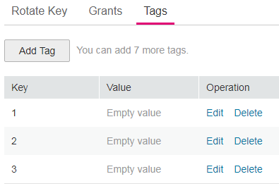

# Modifying Tag Values

## Scenario

This section describes how to modify tag values on the KMS management console.

## Prerequisites

You have obtained an account and its password for logging in to the management console.

## Procedure

1.  Log in to the management console.
2.  Click    in the upper left corner of the management console and select a region or project.
3.  Choose  **Security**  \>  **Key Management Service**. The  **Key Management Service**  page is displayed.
4.  Click the alias of the desired CMK to view its details.
5.  Click  **Tags**  to go to the tag management page, as shown in  [Figure 1](#f87ed1f69fc8247c08f791d0b85d28fdb).

    **Figure  1**  Managing tags  
    

6.  Click  **Edit**  of the target tag, and the  **Edit Tag**  dialog box is displayed, as shown in  [Figure 2](#f05b5c9d487704bcfb0667edecea735cb).

    **Figure  2**  Editing a tag  
    

7.  In the  **Edit Tag**  dialog box, enter a tag value, and click  **OK**  to complete the editing.

