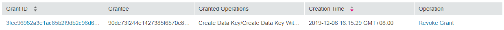
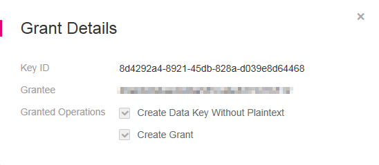

# Querying a Grant

## Scenario

This section describes how to view the details about a grant, such as the grant ID, grantee user ID, granted operation, and creation time.

## Prerequisites

-   You have obtained an account and its password for logging in to the management console.
-   You have created a grant.

## Procedure

1.  Log in to the management console.
2.  Click    in the upper left corner of the management console and select a region or project.
3.  Choose  **Security**  \>  **Key Management Service**. The  **Key Management Service**  page is displayed.
4.  Click the alias of the desired CMK to view its details.
5.  Information about the CMK and grants created on it are displayed,  [Figure 1](#fig26845936115420)  shows example grant information.

    **Figure  1**  Querying a grant  
    

    [Table 1](#table41279785172331)  provides more details.

    **Table  1**  Parameter description

    
    <table><thead align="left"><tr id="row17212539172331"><th class="cellrowborder" valign="top" width="21.43%" id="mcps1.2.3.1.1">
<strong>Parameter</strong>

    </th>
    <th class="cellrowborder" valign="top" width="78.57%" id="mcps1.2.3.1.2">
<strong id="b842352706193336">Description</strong>

    </th>
    </tr>
    </thead>
    <tbody><tr id="row26851533113637"><td class="cellrowborder" valign="top" width="21.43%" headers="mcps1.2.3.1.1 ">
Grant ID

    </td>
    <td class="cellrowborder" valign="top" width="78.57%" headers="mcps1.2.3.1.2 ">
Randomly generated unique identification of a grant

    </td>
    </tr>
    <tr id="row33403013172331"><td class="cellrowborder" valign="top" width="21.43%" headers="mcps1.2.3.1.1 ">
Grantee

    </td>
    <td class="cellrowborder" valign="top" width="78.57%" headers="mcps1.2.3.1.2 ">
ID of an authorized user.

    </td>
    </tr>
    <tr id="row17910458172331"><td class="cellrowborder" valign="top" width="21.43%" headers="mcps1.2.3.1.1 ">
Granted Operations

    </td>
    <td class="cellrowborder" valign="top" width="78.57%" headers="mcps1.2.3.1.2 ">
Authorized operations (such as <strong id="b842352706112139">Create Data Key</strong>) on the CMK

    </td>
    </tr>
    <tr id="row26076305172331"><td class="cellrowborder" valign="top" width="21.43%" headers="mcps1.2.3.1.1 ">
Creation Time

    </td>
    <td class="cellrowborder" valign="top" width="78.57%" headers="mcps1.2.3.1.2 ">
Creation time of the grant

    </td>
    </tr>
    </tbody>
    </table>

6.  Click a grant ID to view the grant details,  [Figure 2](#fig962432095216)  shows example grant information.

    **Figure  2**  Viewing grant details  
    

