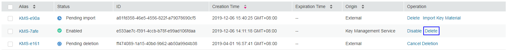
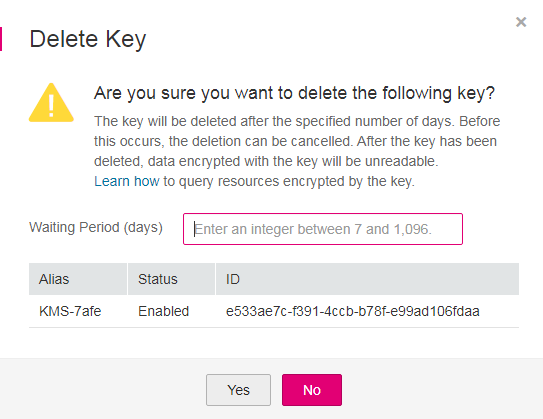
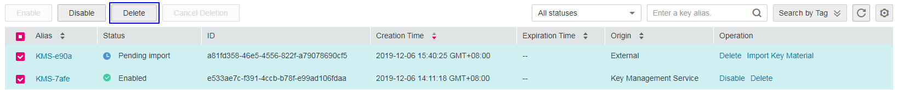
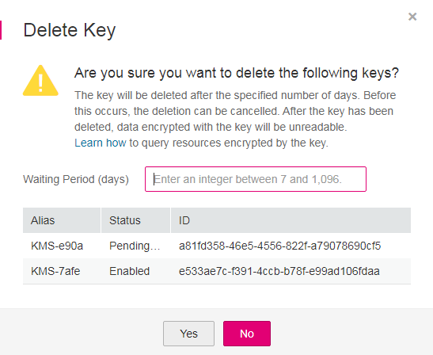

# Scheduling the Deletion of One or Multiple CMKs

## Scenario

This section describes how to use the management console to schedule the deletion of one or multiple unwanted CMKs.

If deletion is scheduled for a CMK, the deletion will not take effect immediately. Instead, it will take effect after a waiting period of 7 to 1096 days. Before the specified deletion date, you can cancel the deletion if you want to use the CMK. Once the scheduled deletion has taken effect, the CMK will be deleted permanently and you will not be able to decrypt data encrypted by it. Therefore, you are advised to exercise caution when performing this operation.

Before deleting the CMK, confirm that it is not in use and will not be used.

-   You can configure the SMN notification function to receive notifications when OBS fails to use the CMK to decrypt data before the deletion date. If you want to use the CMK again, cancel its deletion on the console. For SMN configuration instructions, see  [Configuring SMN](configuring-smn.md).
-   You can choose  **Storage**  \>  **Elastic Volume Service**  to go to the EVS page. In the search bar, select  **KMS key ID**  and enter the CMK ID to check whether the CMK to be deleted is being used by EVS.
-   You can choose  **Computing**  \>  **Image Management Service**  to go to the IMS page. Select the  **Private Image**  tab. In the search bar, select  **KMS key ID**  and enter the CMK ID to check whether the CMK to be deleted is being used by IMS.
-   You can choose  **Storage**  \>  **Scalable File Service**  to go to the SFS page. In the search bar, select  **KMS key ID**  and enter the CMK ID to check whether the CMK to be deleted is being used by SFS.
-   You can choose  **Database**  \>  **Relational Database Service**  to view the database instance list, and click the name of the target database instance. On the details page of the database instance, check whether the key to be deleted is in use.

> **NOTE:**   
>Default Master Keys created by KMS cannot be scheduled for deletion.  

## Prerequisites

-   You have obtained an account and its password for logging in to the management console.
-   The CMK to be deleted is in  **Enabled**,  **Disabled**, or  **Pending Import**  status.

## Procedure

-   Scheduling the deletion for one CMK

1.  Log in to the management console.
2.  Click    in the upper left corner of the management console and select a region or project.
3.  Choose  **Security**  \>  **Key Management Service**. The  **Key Management Service**  page is displayed.
4.  In the row containing the desired CMK, click  **Delete**.

    **Figure  1**  Scheduling the deletion for one CMK  
    

5.  In the dialog box that is displayed, enter the number of days after which you want the deletion to take effect.

    **Figure  2**  Scheduling a deletion time  
    

6.  Click  **Yes**  to schedule the deletion.

-   Scheduling the deletion for multiple CMKs

1.  Log in to the management console.
2.  Click    in the upper left corner of the management console and select a region or project.
3.  Choose  **Security**  \>  **Key Management Service**. The  **Key Management Service**  page is displayed.
4.  In the list of CMKs, select desired CMKs and click  **Delete**.

    **Figure  3**  Scheduling the deletion of multiple CMKs  
    

5.  In the dialog box that is displayed, enter the number of days after which you want the deletion to take effect.

    **Figure  4**  Scheduling the deletion time  
    

6.  Click  **Yes**  to schedule the deletion for multiple keys.

-   **[Configuring SMN](configuring-smn.md)**  

