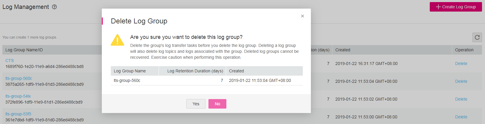

# Deleting a Log Group

## Scenarios

This section describes how to delete a log group.

> **NOTE:**   
>Deleted log groups cannot be recovered. Therefore, exercise caution when performing this deletion operation.  

## Prerequisites

-   You have obtained a username and password for logging in to the management console.
-   You have deleted the log transfer tasks associated with the target log group.

## Procedure

1.  Log in to the management console.
2.  In the upper left corner of the management console, select the target region and project.
3.  Click  **Service List**  and choose  **Management & Deployment**  \>  **Log Tank Service**.
4.  In the log group list, locate the target log group and click  **Delete**  in the  **Operation**  column.
5.  Click  **Yes**.

    **Figure  1**  Delete Log Group  
    

