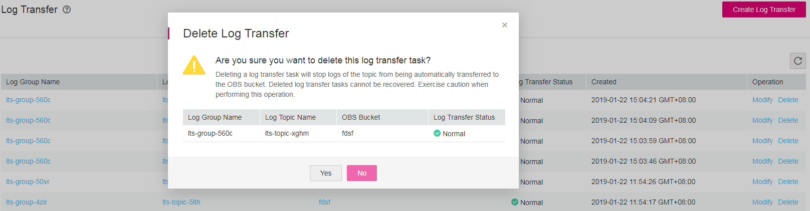

# Deleting a Log Transfer Task

## Scenarios

This section describes how to delete a log transfer task.

> **NOTE:**   
>-   Deleting log transfer tasks will stop transferring any logs. Therefore, exercise caution when performing this deletion operation.  
>-   After a log transfer task is deleted, the logs that have been transferred to your OBS bucket will be continually stored.  

## Prerequisites

-   You have created a log group.
-   You have created a log topic.
-   You have configured a log transfer task.

## Procedure

1.  Log in to the management console.
2.  In the upper left corner of the management console, select the target region and project.
3.  Click  **Service List**  and choose  **Management & Deployment**  \>  **Log Tank Service**.
4.  In the navigation pane on the left, choose  **Log Transfer**.
5.  In the log group list, locate the target log group and click  **Delete**  in the  **Operation**  column.

    The  **Delete Log Transfer**  dialog box is displayed.

    **Figure  1**  Delete Log Transfer  
    

6.  Click  **Yes**.

